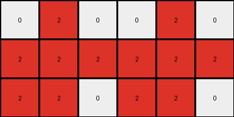
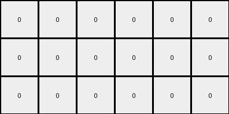

# 28bf18c6 • 009 • refine_dreamer

---

Previous Code:
```python
"""
1.  **Identify:** Locate all pixels with a value of '2' (red) in the input grid.
2.  **Extract and Replicate**: Create copies of red pixels.
3. **Resize:** create a new blank grid which is height of the bottom three rows of the input and the width that is sum of leftmost and rightmost non zero column indices.
4.  **Fill**: Fill the new grid: if the input pixel value is '2', place a '2' else place '0'
5. **Replicate row 1**: copy all values from the first row to complete the new row.
6.  **Fill Top Row**: Scan across the filled row. Whereever there is a 2, copy to top row.
"""

import numpy as np

def transform(input_grid):
    # Create a NumPy array from the input grid
    input_array = np.array(input_grid)

    # 3. Resize: create a new blank grid which is height of the bottom three rows of the input
    #    and the width that is sum of leftmost and rightmost non-zero column indices.
    
    rows, cols = input_array.shape
    non_zero_cols = np.where(np.any(input_array != 0, axis=0))[0]
    if non_zero_cols.size > 0:  # Check if there are any non-zero columns
        leftmost_col = non_zero_cols[0]
        rightmost_col = non_zero_cols[-1]
        new_width = rightmost_col - leftmost_col + 1
    else:
      return []
    
    output_grid = np.zeros((3, new_width*2), dtype=int) # doubled


    # 4. Fill: Fill the new grid: if the input pixel value is '2', place a '2' else place '0'
    # Copy bottom three rows using slice
    start_row = rows-3
    
    output_grid[0:3, 0:new_width] = input_array[start_row:rows,leftmost_col:rightmost_col+1]


    # 5. Replicate row 1: copy all values from the first row to complete the new row.
    output_grid[0:3,new_width:] = output_grid[0:3, 0:new_width]
    output_grid[0:3,:] = np.where(output_grid[0:3,:]==2,2,0) #clear zeros

    # 6. Fill Top Row: Scan across the filled row. Wherever there is a 2, copy to top row.
    # This is done as part of filling above

    return output_grid.tolist()
```

Train Set Results:

## Example 1:

Input:
```
0 0 0 0 0 0 0 0
0 8 8 0 0 0 0 0
0 0 8 0 0 0 0 0
0 8 8 8 0 0 0 0
0 0 0 0 0 0 0 0
0 0 0 0 0 0 0 0
0 0 0 0 0 0 0 0
0 0 0 0 0 0 0 0
```
Expected Output:
```
8 8 0 8 8 0
0 8 0 0 8 0
8 8 8 8 8 8
```
Transformed Output:
```
0 0 0 0 0 0
0 0 0 0 0 0
0 0 0 0 0 0
```

match: False
pixels_off: 12
size_correct: True
color_palette_correct: True
correct_pixel_counts: False

## Example 2:

Input:
```
0 0 0 0 0 0 0 0
0 0 0 0 0 0 0 0
0 0 0 0 0 0 0 0
0 0 0 0 0 0 0 0
0 0 0 0 0 0 0 0
0 0 0 2 0 0 0 0
0 0 2 2 2 0 0 0
0 0 2 2 0 0 0 0
```
Expected Output:
```
0 2 0 0 2 0
2 2 2 2 2 2
2 2 0 2 2 0
```
Transformed Output:
```
0 2 0 0 2 0
2 2 2 2 2 2
2 2 0 2 2 0
```

match: True
pixels_off: 0
size_correct: True
color_palette_correct: True
correct_pixel_counts: True

## Example 3:

Input:
```
0 0 0 0 0 0 0 0
0 0 0 0 0 1 1 0
0 0 0 0 1 0 0 0
0 0 0 0 0 1 0 0
0 0 0 0 0 0 0 0
0 0 0 0 0 0 0 0
0 0 0 0 0 0 0 0
0 0 0 0 0 0 0 0
```
Expected Output:
```
0 1 1 0 1 1
1 0 0 1 0 0
0 1 0 0 1 0
```
Transformed Output:
```
0 0 0 0 0 0
0 0 0 0 0 0
0 0 0 0 0 0
```

match: False
pixels_off: 8
size_correct: True
color_palette_correct: True
correct_pixel_counts: False
**INSTRUCTIONS**

The code above was generated based on observations from the first training
example

we have tested the transform function on each of the task example inputs and
compared with the expected output

review each of the examples provided and the results and consider how the
natural language program should be updated to accommodate this new knowledge

respond with the following deliverables:

- general assessment of the information provided and strategy for resolving the
  errors
- gather metrics about each of the examples and results - use code_execution to
  develop accurate reports on your assumptions
- a YAML block documenting facts - Focus on identifying objects, their properties, and the actions performed on them.
- a natural language program - Be as clear and concise as possible, providing a complete description of the transformation rule.


your responses should be considered as information in a report - not a
conversation
