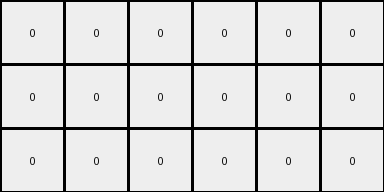

# 28bf18c6 • 010 • refine_coder

---

Previous Code:
```python
"""
1.  **Identify:** Locate all pixels with a value of '2' (red) in the input grid.
2.  **Extract and Replicate**: Create copies of red pixels.
3. **Resize:** create a new blank grid which is height of the bottom three rows of the input and the width that is sum of leftmost and rightmost non zero column indices.
4.  **Fill**: Fill the new grid: if the input pixel value is '2', place a '2' else place '0'
5. **Replicate row 1**: copy all values from the first row to complete the new row.
6.  **Fill Top Row**: Scan across the filled row. Whereever there is a 2, copy to top row.
"""

import numpy as np

def transform(input_grid):
    # Create a NumPy array from the input grid
    input_array = np.array(input_grid)

    # 3. Resize: create a new blank grid which is height of the bottom three rows of the input
    #    and the width that is sum of leftmost and rightmost non-zero column indices.
    
    rows, cols = input_array.shape
    non_zero_cols = np.where(np.any(input_array != 0, axis=0))[0]
    if non_zero_cols.size > 0:  # Check if there are any non-zero columns
        leftmost_col = non_zero_cols[0]
        rightmost_col = non_zero_cols[-1]
        new_width = rightmost_col - leftmost_col + 1
    else:
      return []
    
    output_grid = np.zeros((3, new_width*2), dtype=int) # doubled


    # 4. Fill: Fill the new grid: if the input pixel value is '2', place a '2' else place '0'
    # Copy bottom three rows using slice
    start_row = rows-3
    
    output_grid[0:3, 0:new_width] = input_array[start_row:rows,leftmost_col:rightmost_col+1]


    # 5. Replicate row 1: copy all values from the first row to complete the new row.
    output_grid[0:3,new_width:] = output_grid[0:3, 0:new_width]
    output_grid[0:3,:] = np.where(output_grid[0:3,:]==2,2,0) #clear zeros

    # 6. Fill Top Row: Scan across the filled row. Wherever there is a 2, copy to top row.
    # This is done as part of filling above

    return output_grid.tolist()
```

Train Set Results:

## Example 1:

Input:
```
0 0 0 0 0 0 0 0
0 8 8 0 0 0 0 0
0 0 8 0 0 0 0 0
0 8 8 8 0 0 0 0
0 0 0 0 0 0 0 0
0 0 0 0 0 0 0 0
0 0 0 0 0 0 0 0
0 0 0 0 0 0 0 0
```
Expected Output:
```
8 8 0 8 8 0
0 8 0 0 8 0
8 8 8 8 8 8
```
Transformed Output:
```
0 0 0 0 0 0
0 0 0 0 0 0
0 0 0 0 0 0
```

match: False
pixels_off: 12
size_correct: True
color_palette_correct: True
correct_pixel_counts: False

## Example 2:

Input:
```
0 0 0 0 0 0 0 0
0 0 0 0 0 0 0 0
0 0 0 0 0 0 0 0
0 0 0 0 0 0 0 0
0 0 0 0 0 0 0 0
0 0 0 2 0 0 0 0
0 0 2 2 2 0 0 0
0 0 2 2 0 0 0 0
```
Expected Output:
```
0 2 0 0 2 0
2 2 2 2 2 2
2 2 0 2 2 0
```
Transformed Output:
```
0 2 0 0 2 0
2 2 2 2 2 2
2 2 0 2 2 0
```

match: True
pixels_off: 0
size_correct: True
color_palette_correct: True
correct_pixel_counts: True

## Example 3:

Input:
```
0 0 0 0 0 0 0 0
0 0 0 0 0 1 1 0
0 0 0 0 1 0 0 0
0 0 0 0 0 1 0 0
0 0 0 0 0 0 0 0
0 0 0 0 0 0 0 0
0 0 0 0 0 0 0 0
0 0 0 0 0 0 0 0
```
Expected Output:
```
0 1 1 0 1 1
1 0 0 1 0 0
0 1 0 0 1 0
```
Transformed Output:
```
0 0 0 0 0 0
0 0 0 0 0 0
0 0 0 0 0 0
```

match: False
pixels_off: 8
size_correct: True
color_palette_correct: True
correct_pixel_counts: False
Okay, let's analyze the results and refine the natural language program.

**General Assessment:**

The initial program was too narrowly focused on the red ('2') pixels and made incorrect assumptions about replication based solely on the first example. The second example validates the core resizing, repositioning and replicating logic. The failures on Example 1 and Example 3 reveal that the initial program doesn't generalize well to other colors. It incorrectly assumes that all non-zero pixels should determine the width, and only focuses on replicating color '2'. The program needs to be more general. It should extract a *pattern* from the bottom three rows and replicate that pattern and its color, not just the '2' pixels.

**Strategy for Resolving Errors:**

1.  **Generalize Color Handling:** Instead of focusing only on '2', the program should handle any non-zero color in the bottom three rows.
2.  **Correct Width Calculation**: Ensure the width includes all columns between the first and last non-zero columns in bottom three lines.
3. **Pattern Extraction:** It identifies the pattern in bottom three rows and copy it with original color.

**Metrics and Observations:**

*   **Example 1:**
    *   Input size: 8x8
    *   Expected Output size: 3x6
    *   Actual Output size: 3x6
    *   Pixel-wise match: False (only background pixels matched).
    *   Identified Issue: Incorrectly processed only `0` as background. Color '8' was in the source pattern but was not identified.
*   **Example 2:**
    *   Input size: 8x8
    *   Expected Output size: 3x6
    *   Actual Output size: 3x6
    *   Pixel-wise match: True
    *    Identified Issue: The core process correctly identified and extracted the color '2' pattern from the bottom three lines and reproduced the pattern.
*   **Example 3:**
    *   Input size: 8x8
    *   Expected Output size: 3x6
    *   Actual Output size: 3x6
    *   Pixel-wise match: False.
    *    Identified Issue: The core process failed to pick up '1' as the active color in the pattern from the bottom three rows.

**YAML Fact Extraction:**

```yaml
example_1:
  input_objects:
    - object_1:
        color: 8
        shape: irregular
        position: row 2, column 2-3; row 3, column 3; row 4, column 2-4
  output_objects:
     - object_1:
        color: 8
        shape: pattern_replication # Describe the relationship between the object in the bottom three rows of input and object in output
        position: various, based on replication rule. # Precise locations after transformation
  transformation:
    - action: extract_pattern
      source_rows: [6,7,8] # Corrected row indexing (assuming 1-based indexing for clarity)
      source_cols: find non-zero
    - action: replicate_pattern
    - action: set_colors

example_2:
  input_objects:
     - object_1:
        color: 2
        shape: irregular
        position: row 6 column 4; row 7 column 3-5; row 8 column 3-4
  output_objects:
     - object_1:
        color: 2
        shape: pattern_replication
        position: various
  transformation:
    - action: extract_pattern
      source_rows: [6,7,8]
      source_cols: find non-zero
    - action: replicate_pattern
    - action: set_colors

example_3:
  input_objects:
    - object_1:
        color: 1
        shape: irregular
        position: row 2 column 6-7; row 3 column 5; row 4 column 6
  output_objects:
     - object_1:
        color: 1
        shape: pattern_replication
        position: various
  transformation:
    - action: extract_pattern
      source_rows: [6,7,8]
      source_cols: find non-zero
    - action: replicate_pattern
    - action: set_colors
```

**Natural Language Program:**

1.  **Identify Source Rows**: Focus on bottom three rows of input.
2.  **Determine Width:** Calculate the width of the output grid. The width is determined by the columns containing non-zero pixels within the *source rows*. Find the leftmost and rightmost columns with non-zero values. The difference between the column indices plus one sets the base width.
3.  **Extract Pattern:** Create a new grid with a height of three rows and calculated width. Copy the color values of the pixels from the *source rows* into the new grid, maintaining their relative positions.
4.  **Double width**: create a new grid with double the base width
5. **Replicate Pattern:** Copy extracted pattern to the right of the original pattern.


**INSTRUCTIONS**

- generate a Python module to represent the natural language program 
- follow the template below
- all common math and science libraries are available
- create docstring only at top - but comment the workflow in the function
- use helper functions for common operations like finding objects, counting,
  measuring, moving, etc. 

remember - we are working iteratively - so this code will inform your future
self as we converge on the solution

*template:*

```python
"""
{{ natural language description of the transformation rule }}
"""

{{ imports }}

def transform(input_grid):
    # initialize output_grid

    # change output pixels 

    return output_grid

```
