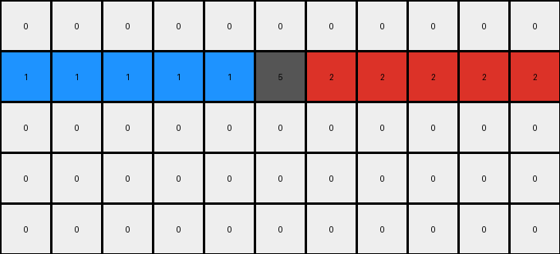
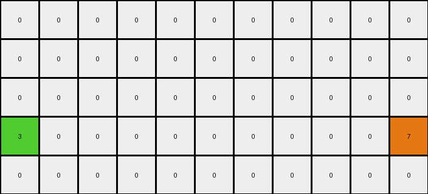

# 29c11459 • 003 • refine_dreamer

---


Previous Code:
```python
"""
1.  **Identify the Target Row:** Find the row (in this case, row 1) containing both a blue pixel (1) and a red pixel (2).
2.  **Locate Start and End:** Identify the column indices of the blue pixel (start) and the red pixel (end) on that row.
3.  **Connect with a line:** Connect the blue pixel to the center, connect the end pixel to the center
4.  **Connect at center**: Add a pixel of color grey at the center.
"""

import numpy as np

def find_pixels_by_color(grid, color):
    """Finds the coordinates of all pixels of a given color."""
    return np.argwhere(grid == color)

def transform(input_grid):
    # initialize output_grid
    output_grid = np.copy(input_grid)
    rows, cols = input_grid.shape

    # Find the row containing both blue (1) and red (2) pixels
    blue_pixels = find_pixels_by_color(input_grid, 1)
    red_pixels = find_pixels_by_color(input_grid, 2)

    target_row = -1
    for b_row, _ in blue_pixels:
        for r_row, _ in red_pixels:
            if b_row == r_row:
                target_row = b_row
                break
        if target_row != -1:
            break

    if target_row == -1:
        return output_grid  # No such row found

    # Locate Start and End
    blue_cols = [col for row, col in blue_pixels if row == target_row]
    red_cols = [col for row, col in red_pixels if row == target_row]

    if not blue_cols or not red_cols:
      return output_grid
    
    start_col = min(blue_cols)
    end_col = max(red_cols)
    
    center_col = (cols -1) // 2

    #connect blue to center
    for col in range(start_col, center_col):
      output_grid[target_row, col] = 1

    #connect red to center
    for col in range(center_col + 1, end_col + 1):
      output_grid[target_row, col] = 2

    # place grey pixel
    output_grid[target_row, center_col] = 5
    

    return output_grid
```

Train Set Results:

## Example 1:

Input:
```
0 0 0 0 0 0 0 0 0 0 0
1 0 0 0 0 0 0 0 0 0 2
0 0 0 0 0 0 0 0 0 0 0
0 0 0 0 0 0 0 0 0 0 0
0 0 0 0 0 0 0 0 0 0 0
```
Expected Output:
```
0 0 0 0 0 0 0 0 0 0 0
1 1 1 1 1 5 2 2 2 2 2
0 0 0 0 0 0 0 0 0 0 0
0 0 0 0 0 0 0 0 0 0 0
0 0 0 0 0 0 0 0 0 0 0
```
Transformed Output:
```
0 0 0 0 0 0 0 0 0 0 0
1 1 1 1 1 5 2 2 2 2 2
0 0 0 0 0 0 0 0 0 0 0
0 0 0 0 0 0 0 0 0 0 0
0 0 0 0 0 0 0 0 0 0 0
```

match: True
pixels_off: 0
size_correct: True
color_palette_correct: True
correct_pixel_counts: True

## Example 2:

Input:
```
0 0 0 0 0 0 0 0 0 0 0
0 0 0 0 0 0 0 0 0 0 0
0 0 0 0 0 0 0 0 0 0 0
3 0 0 0 0 0 0 0 0 0 7
0 0 0 0 0 0 0 0 0 0 0
```
Expected Output:
```
0 0 0 0 0 0 0 0 0 0 0
0 0 0 0 0 0 0 0 0 0 0
0 0 0 0 0 0 0 0 0 0 0
3 3 3 3 3 5 7 7 7 7 7
0 0 0 0 0 0 0 0 0 0 0
```
Transformed Output:
```
0 0 0 0 0 0 0 0 0 0 0
0 0 0 0 0 0 0 0 0 0 0
0 0 0 0 0 0 0 0 0 0 0
3 0 0 0 0 0 0 0 0 0 7
0 0 0 0 0 0 0 0 0 0 0
```

match: False
pixels_off: 9
size_correct: True
color_palette_correct: True
correct_pixel_counts: False

**INSTRUCTIONS**

The code above was generated based on observations from the first training
example

we have tested the transform function on each of the task example inputs and
compared with the expected output

review each of the examples provided and the results and consider how the
natural language program should be updated to accommodate this new knowledge

respond with the following deliverables:

- general assessment of the information provided and strategy for resolving the
  errors
- gather metrics about each of the examples and results - use code_execution to
  develop accurate reports on your assumptions
- a YAML block documenting facts - Focus on identifying objects, their properties, and the actions performed on them.
- a natural language program - Be as clear and concise as possible, providing a complete description of the transformation rule.


your responses should be considered as information in a report - not a
conversation
