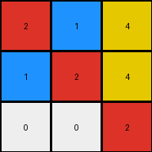
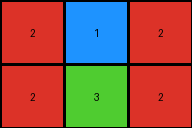

# 2dee498d • 003 • refine_dreamer

---


Previous Code:
```python
"""
Extracts the central 3x3 subgrid from the input grid.
"""

import numpy as np

def get_center(grid):
    """Calculates the center coordinates of a grid."""
    rows, cols = grid.shape
    center_row = rows // 2
    center_col = cols // 2
    return center_row, center_col

def extract_3x3(grid, center_row, center_col):
    """Extracts a 3x3 subgrid centered at the given coordinates."""
    return grid[center_row-1:center_row+2, center_col-1:center_col+2]

def transform(input_grid):
    """Extracts the central 3x3 subgrid."""
    # Convert input to numpy array
    input_grid = np.array(input_grid)

    # Get the center coordinates
    center_row, center_col = get_center(input_grid)

    # Extract the 3x3 subgrid
    output_grid = extract_3x3(input_grid, center_row, center_col)

    return output_grid.tolist()
```

Train Set Results:

## Example 1:

Input:
```
4 5 1 1 5 4 4 5 1
5 5 5 5 5 5 5 5 5
1 5 4 4 5 1 1 5 4
```
Expected Output:
```
4 5 1
5 5 5
1 5 4
```
Transformed Output:
```
1 5 4
5 5 5
4 5 1
```

match: False
pixels_off: 4
size_correct: True
color_palette_correct: True
correct_pixel_counts: True

## Example 2:

Input:
```
2 0 0 1 2 0 0 1 2 0 0 1
4 2 1 4 4 2 1 4 4 2 1 4
4 1 2 4 4 1 2 4 4 1 2 4
1 0 0 2 1 0 0 2 1 0 0 2
```
Expected Output:
```
2 0 0 1
4 2 1 4
4 1 2 4
1 0 0 2
```
Transformed Output:
```
2 1 4
1 2 4
0 0 2
```

match: False
pixels_off: None
size_correct: False
color_palette_correct: True
correct_pixel_counts: False

## Example 3:

Input:
```
2 1 2 1 2 1
2 3 2 3 2 3
```
Expected Output:
```
2 1
2 3
```
Transformed Output:
```
2 1 2
2 3 2
```

match: False
pixels_off: None
size_correct: False
color_palette_correct: True
correct_pixel_counts: False

**INSTRUCTIONS**

The code above was generated based on observations from the first training
example

we have tested the transform function on each of the task example inputs and
compared with the expected output

review each of the examples provided and the results and consider how the
natural language program should be updated to accommodate this new knowledge

respond with the following deliverables:

- general assessment of the information provided and strategy for resolving the
  errors
- gather metrics about each of the examples and results - use code_execution to
  develop accurate reports on your assumptions
- a YAML block documenting facts - Focus on identifying objects, their properties, and the actions performed on them.
- a natural language program - Be as clear and concise as possible, providing a complete description of the transformation rule.


your responses should be considered as information in a report - not a
conversation
