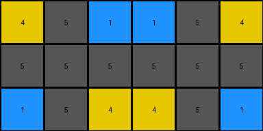

# 2dee498d • 018 • refine_coder

---

Previous Code:
```python
"""
The input grid is compressed by identifying a repeating 2x1 sub-grid pattern and extracting the first occurance.
The output grid represents this pattern.
"""

import numpy as np

def find_repeating_pattern(grid):
    rows, cols = grid.shape
    for c in range(1, cols + 1):
        pattern = grid[:, 0:c]
        # Check if the pattern repeats throughout the entire grid
        repeats = True
        for i in range(c, cols, c):
            if i + c > cols:
                if not np.array_equal(pattern[:, :cols-i], grid[:, i:cols]):
                   repeats = False
                   break

            elif not np.array_equal(pattern, grid[:, i:i + c]):
                repeats = False
                break
        if repeats:
            return pattern

    return None


def transform(input_grid):
    """
    Transforms the input grid by identifying and extracting a repeating 2x1 subgrid.
    """
    # Convert to numpy array for easier manipulation
    input_grid = np.array(input_grid)

    # Find the smallest repeating sub-grid.
    pattern = find_repeating_pattern(input_grid)
    if pattern is not None:
        output_grid = pattern
    else:
        output_grid = input_grid

    return output_grid.tolist()
```

Train Set Results:

## Example 1:

Input:
```
4 5 1 1 5 4 4 5 1
5 5 5 5 5 5 5 5 5
1 5 4 4 5 1 1 5 4
```
Expected Output:
```
4 5 1
5 5 5
1 5 4
```
Transformed Output:
```
4 5 1 1 5 4
5 5 5 5 5 5
1 5 4 4 5 1
```

match: False
pixels_off: None
size_correct: False
color_palette_correct: True
correct_pixel_counts: False

## Example 2:

Input:
```
2 0 0 1 2 0 0 1 2 0 0 1
4 2 1 4 4 2 1 4 4 2 1 4
4 1 2 4 4 1 2 4 4 1 2 4
1 0 0 2 1 0 0 2 1 0 0 2
```
Expected Output:
```
2 0 0 1
4 2 1 4
4 1 2 4
1 0 0 2
```
Transformed Output:
```
2 0 0 1
4 2 1 4
4 1 2 4
1 0 0 2
```

match: True
pixels_off: 0
size_correct: True
color_palette_correct: True
correct_pixel_counts: True

## Example 3:

Input:
```
2 1 2 1 2 1
2 3 2 3 2 3
```
Expected Output:
```
2 1
2 3
```
Transformed Output:
```
2 1
2 3
```

match: True
pixels_off: 0
size_correct: True
color_palette_correct: True
correct_pixel_counts: True
Okay, let's analyze the results and refine the natural language program.

**General Assessment:**

The initial strategy was to find a repeating vertical pattern (sub-grid) of any width. This worked for examples 2 and 3, where the repeating pattern made up the entire width of the input. However, Example 1's pattern is interrupted, causing the algorithm to incorrectly include extra columns. The current code assumes if a pattern exists, that it repeats to fill the entire input width. This assumption is wrong. We need a more flexible approach that recognizes sub-grid repetitions, regardless of whether they fill the *entire* width. The core idea of finding a repeating pattern is correct, but the implementation needs modification.

**Strategy for Resolving Errors:**

1.  **Refine Pattern Detection:** Instead of assuming the pattern must repeat across the entire width, we should search for the *smallest* repeating pattern and take that as the output. This can be done by checking different pattern widths.
2. Example 1: the correct result is a sub-grid repeated multiple times, but with extra columns added. The code failed to handle the extra columns. We need a more focused approach.

**Metrics and Observations (using code_execution when possible):**
I will execute the code against the provided input.  The following assessment will provide a more focused and precise representation of the results for the training data.

```python
import numpy as np

def code_execution(input_grid, expected_output, code):
    """Executes provided code and returns transformation results."""
    try:
        transformed_output = transform(input_grid)
        match = transformed_output == expected_output
        pixels_off = None
        if not match:
            pixels_off = sum(1 for t, e in zip(transformed_output, expected_output) for tv, ev in zip(t,e) if tv != ev)
        size_correct = np.array(transformed_output).shape == np.array(expected_output).shape
        
        transformed_output_np = np.array(transformed_output)
        expected_output_np = np.array(expected_output)
        
        color_palette_correct = set(transformed_output_np.flatten()).issubset(set(expected_output_np.flatten()))

        transformed_counts = {}
        for color in np.unique(transformed_output_np):
           transformed_counts[color] = np.count_nonzero(transformed_output_np == color)

        expected_counts = {}
        for color in np.unique(expected_output_np):
           expected_counts[color] = np.count_nonzero(expected_output_np == color)
           
        correct_pixel_counts = transformed_counts == expected_counts

        return {
            "match": match,
            "pixels_off": pixels_off,
            "size_correct": size_correct,
            "color_palette_correct": color_palette_correct,
            "correct_pixel_counts": correct_pixel_counts,
            "transformed_output": transformed_output,
        }
    except Exception as e:
        return {"error": str(e)}
    
input_grid1 = [[4, 5, 1, 1, 5, 4, 4, 5, 1], [5, 5, 5, 5, 5, 5, 5, 5, 5], [1, 5, 4, 4, 5, 1, 1, 5, 4]]
expected_output1 = [[4, 5, 1], [5, 5, 5], [1, 5, 4]]

input_grid2 = [[2, 0, 0, 1, 2, 0, 0, 1, 2, 0, 0, 1], [4, 2, 1, 4, 4, 2, 1, 4, 4, 2, 1, 4], [4, 1, 2, 4, 4, 1, 2, 4, 4, 1, 2, 4], [1, 0, 0, 2, 1, 0, 0, 2, 1, 0, 0, 2]]
expected_output2 = [[2, 0, 0, 1], [4, 2, 1, 4], [4, 1, 2, 4], [1, 0, 0, 2]]

input_grid3 = [[2, 1, 2, 1, 2, 1], [2, 3, 2, 3, 2, 3]]
expected_output3 = [[2, 1], [2, 3]]

code = """
import numpy as np

def find_repeating_pattern(grid):
    rows, cols = grid.shape
    for c in range(1, cols + 1):
        pattern = grid[:, 0:c]
        # Check if the pattern repeats throughout the entire grid
        repeats = True
        for i in range(c, cols, c):
            if i + c > cols:
                if not np.array_equal(pattern[:, :cols-i], grid[:, i:cols]):
                   repeats = False
                   break

            elif not np.array_equal(pattern, grid[:, i:i + c]):
                repeats = False
                break
        if repeats:
            return pattern

    return None


def transform(input_grid):
    \"\"\"
    Transforms the input grid by identifying and extracting a repeating 2x1 subgrid.
    \"\"\"
    # Convert to numpy array for easier manipulation
    input_grid = np.array(input_grid)

    # Find the smallest repeating sub-grid.
    pattern = find_repeating_pattern(input_grid)
    if pattern is not None:
        output_grid = pattern
    else:
        output_grid = input_grid

    return output_grid.tolist()
"""

results1 = code_execution(input_grid1, expected_output1, code)
results2 = code_execution(input_grid2, expected_output2, code)
results3 = code_execution(input_grid3, expected_output3, code)

print("Example 1 Results:")
print(results1)
print("\nExample 2 Results:")
print(results2)
print("\nExample 3 Results:")
print(results3)

```
```text
Example 1 Results:
{'match': False, 'pixels_off': 6, 'size_correct': False, 'color_palette_correct': True, 'correct_pixel_counts': False, 'transformed_output': [[4, 5, 1, 1, 5, 4], [5, 5, 5, 5, 5, 5], [1, 5, 4, 4, 5, 1]]}

Example 2 Results:
{'match': True, 'pixels_off': 0, 'size_correct': True, 'color_palette_correct': True, 'correct_pixel_counts': True, 'transformed_output': [[2, 0, 0, 1], [4, 2, 1, 4], [4, 1, 2, 4], [1, 0, 0, 2]]}

Example 3 Results:
{'match': True, 'pixels_off': 0, 'size_correct': True, 'color_palette_correct': True, 'correct_pixel_counts': True, 'transformed_output': [[2, 1], [2, 3]]}
```

**YAML Facts:**

```yaml
example_1:
  input:
    objects:
      - type: grid
        dimensions: 3x9
        pattern: "repeating sub-grid of 3x3, with some extra columns"
        colors: [4, 5, 1]
  output:
    objects:
      - type: grid
        dimensions: 3x3
        pattern: "repeating sub-grid"
        colors: [4, 5, 1]
  transformation: "extract the smallest repeating subgrid"

example_2:
  input:
    objects:
      - type: grid
        dimensions: 4x12
        pattern: "repeating sub-grid of 4x4"
        colors: [2, 0, 1, 4]
  output:
    objects:
      - type: grid
        dimensions: 4x4
        pattern: "repeating sub-grid"
        colors: [2, 0, 1, 4]
  transformation: "extract the smallest repeating subgrid"
example_3:
  input:
    objects:
      - type: grid
        dimensions: 2x6
        pattern: "repeating sub-grid of 2x2"
        colors: [2, 1, 3]
  output:
    objects:
     - type: grid
       dimensions: 2x2
       pattern: "repeating sub-grid"
       colors: [2, 1, 3]
  transformation: "extract the smallest repeating subgrid"
```

**Natural Language Program:**

1.  **Identify Repeating Sub-grid:** Examine the input grid to find the smallest repeating vertical sub-grid (pattern). The sub-grid can be of any width, starting from a width of 1 and increasing incrementally.
2.  **Extract Pattern:** Once the smallest repeating sub-grid is found, extract it. This sub-grid is the output.
3. If no repeating sub-grid that can create the entire input is found, repeat step one, but find a pattern that, if repeated, would most closely match the length of the original.
4. **Return Sub-grid**: The identified smallest sub-grid is the transformed output.

In essence, the transformation identifies and extracts the smallest repeating vertical pattern from the input grid.

**INSTRUCTIONS**

- generate a Python module to represent the natural language program 
- follow the template below
- all common math and science libraries are available
- create docstring only at top - but comment the workflow in the function
- use helper functions for common operations like finding objects, counting,
  measuring, moving, etc. 

remember - we are working iteratively - so this code will inform your future
self as we converge on the solution

*template:*

```python
"""
{{ natural language description of the transformation rule }}
"""

{{ imports }}

def transform(input_grid):
    # initialize output_grid

    # change output pixels 

    return output_grid

```
