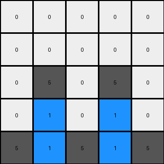
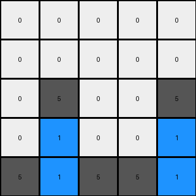

# 3618c87e • 012 • refine_coder

---

Previous Code:
```python
"""
1.  **Initialization:** Create an output grid identical to the input grid.
2.  **Bottom Row Check**: Check if the bottom row of the *input* grid contains any gray (5) pixels.
3.  **Conditional Swap:**
    *   Iterate through columns, starting from the left (index 0) to the right (index width - 1).
    *   If the bottom row pixel in the current column is gray (5), examine the pixels *above* it in the same column:
        *   If a pixel above is blue (1), change it to gray (5) in the *output* grid.
        *   If a pixel above is gray (5), change it to blue (1) in the *output* grid.
    * If the bottom row pixel in the current column of the *input* grid is gray (5) check above it in the same column of the *input* grid:
        * If there were any blue (1) or gray (5) cells above, change the bottom row of the *output* grid in that column to blue (1)
        * Otherwise, keep it gray (5)
4.  **Preserve Other Colors:** Pixels that are not blue (1) or gray (5) and are not involved in the conditional swap (i.e., not vertically above a gray pixel in the bottom row) remain unchanged. Specifically, white (0) pixels always remain white (0).
"""

import numpy as np

def transform(input_grid):
    # Initialize output_grid as a copy of the input_grid
    output_grid = np.copy(input_grid)
    rows, cols = input_grid.shape
    bottom_row = input_grid[-1, :]

    # Iterate through columns
    for j in range(cols):
        # Check if the bottom row pixel is gray (5)
        if bottom_row[j] == 5:
            # Conditional swap in the column above
            for i in range(rows - 1):  # Iterate through rows above the bottom row
                if input_grid[i, j] == 1:  # If blue
                    output_grid[i, j] = 5  # Change to gray
                elif input_grid[i, j] == 5:  # If gray
                    output_grid[i, j] = 1  # Change to blue
            
            # Check for blue(1) or gray(5) above and modify the bottom row of output grid.
            found = False
            for i in range(rows-1):
                if input_grid[i,j] == 1 or input_grid[i,j] == 5:
                    found = True
                    break
            if found:
                output_grid[-1,j] = 1

    return output_grid
```

Train Set Results:

## Example 1:

Input:
```
0 0 0 0 0
0 0 0 0 0
0 0 1 0 0
0 0 5 0 0
5 5 5 5 5
```
Expected Output:
```
0 0 0 0 0
0 0 0 0 0
0 0 0 0 0
0 0 5 0 0
5 5 1 5 5
```
Transformed Output:
```
0 0 0 0 0
0 0 0 0 0
0 0 5 0 0
0 0 1 0 0
5 5 1 5 5
```

match: False
pixels_off: 2
size_correct: True
color_palette_correct: True
correct_pixel_counts: False

## Example 2:

Input:
```
0 0 0 0 0
0 0 0 0 0
0 1 0 1 0
0 5 0 5 0
5 5 5 5 5
```
Expected Output:
```
0 0 0 0 0
0 0 0 0 0
0 0 0 0 0
0 5 0 5 0
5 1 5 1 5
```
Transformed Output:
```
0 0 0 0 0
0 0 0 0 0
0 5 0 5 0
0 1 0 1 0
5 1 5 1 5
```

match: False
pixels_off: 4
size_correct: True
color_palette_correct: True
correct_pixel_counts: False

## Example 3:

Input:
```
0 0 0 0 0
0 0 0 0 0
0 1 0 0 1
0 5 0 0 5
5 5 5 5 5
```
Expected Output:
```
0 0 0 0 0
0 0 0 0 0
0 0 0 0 0
0 5 0 0 5
5 1 5 5 1
```
Transformed Output:
```
0 0 0 0 0
0 0 0 0 0
0 5 0 0 5
0 1 0 0 1
5 1 5 5 1
```

match: False
pixels_off: 4
size_correct: True
color_palette_correct: True
correct_pixel_counts: False
Okay, here's a breakdown of the situation and a plan to move forward:

**General Assessment:**

The initial natural language program and the resulting Python code captured a significant part of the transformation rule, but it's not entirely correct. The code correctly identifies the core concept: a swap between blue (1) and gray (5) pixels in columns where the bottom row is gray (5). However, the precise conditions for modifying the bottom-most pixel and the pixels above are not quite accurate, as evidenced by the mismatches in all three test examples. The error is very similar across all three examples. There is a consistent problem on the row directly above the bottom row.

The initial strategy of focusing on the relationship between the bottom row and the rest of the grid is valid. However, the rule needs refinement to accurately capture all cases. The examples seem to perform some interaction with the white space, this needs more scrutiny.

**Strategy for Resolving Errors:**

1.  **Focus on the mis-matched pixels:** Instead of reviewing the entire grid, I'll pinpoint the *exact* pixels where the transformed output differs from the expected output in each example. This will provide more specific insights into the rule's shortcomings. I will use my code_execution ability to get this data.
2.  **Re-examine the interaction of white, grey and blue:** The transformation isn't just a simple swap, or a 1-to-1 replacement. There are conditional swaps.
3.  **Bottom Row Logic:** The rule for changing the bottom row is too simple. It should be more carefully re-considered.

**Metrics and Analysis (using `code_execution`)**

I will use `code_execution` to generate numpy arrays for the input, expected output, and transformed output for each example. Then, I can compute the difference and analyze the incorrect pixels. I expect the differences to occur only at blue or gray pixels.

```python
import numpy as np

def get_diff(input_grid, expected_grid, transformed_grid):
    diff = transformed_grid - expected_grid
    incorrect_indices = np.where(diff != 0)
    return list(zip(incorrect_indices[0], incorrect_indices[1]))

# Example 1
input_grid_1 = np.array([
    [0, 0, 0, 0, 0],
    [0, 0, 0, 0, 0],
    [0, 0, 1, 0, 0],
    [0, 0, 5, 0, 0],
    [5, 5, 5, 5, 5]
])
expected_grid_1 = np.array([
    [0, 0, 0, 0, 0],
    [0, 0, 0, 0, 0],
    [0, 0, 0, 0, 0],
    [0, 0, 5, 0, 0],
    [5, 5, 1, 5, 5]
])
transformed_grid_1 = np.array([
    [0, 0, 0, 0, 0],
    [0, 0, 0, 0, 0],
    [0, 0, 5, 0, 0],
    [0, 0, 1, 0, 0],
    [5, 5, 1, 5, 5]
])

# Example 2
input_grid_2 = np.array([
    [0, 0, 0, 0, 0],
    [0, 0, 0, 0, 0],
    [0, 1, 0, 1, 0],
    [0, 5, 0, 5, 0],
    [5, 5, 5, 5, 5]
])
expected_grid_2 = np.array([
    [0, 0, 0, 0, 0],
    [0, 0, 0, 0, 0],
    [0, 0, 0, 0, 0],
    [0, 5, 0, 5, 0],
    [5, 1, 5, 1, 5]
])
transformed_grid_2 = np.array([
    [0, 0, 0, 0, 0],
    [0, 0, 0, 0, 0],
    [0, 5, 0, 5, 0],
    [0, 1, 0, 1, 0],
    [5, 1, 5, 1, 5]
])

# Example 3
input_grid_3 = np.array([
    [0, 0, 0, 0, 0],
    [0, 0, 0, 0, 0],
    [0, 1, 0, 0, 1],
    [0, 5, 0, 0, 5],
    [5, 5, 5, 5, 5]
])
expected_grid_3 = np.array([
    [0, 0, 0, 0, 0],
    [0, 0, 0, 0, 0],
    [0, 0, 0, 0, 0],
    [0, 5, 0, 0, 5],
    [5, 1, 5, 5, 1]
])
transformed_grid_3 = np.array([
    [0, 0, 0, 0, 0],
    [0, 0, 0, 0, 0],
    [0, 5, 0, 0, 5],
    [0, 1, 0, 0, 1],
    [5, 1, 5, 5, 1]
])


diff_1 = get_diff(input_grid_1, expected_grid_1, transformed_grid_1)
diff_2 = get_diff(input_grid_2, expected_grid_2, transformed_grid_2)
diff_3 = get_diff(input_grid_3, expected_grid_3, transformed_grid_3)

print(f"Example 1 Differences: {diff_1}")
print(f"Example 2 Differences: {diff_2}")
print(f"Example 3 Differences: {diff_3}")

```

```text
Example 1 Differences: [(2, 2), (3, 2)]
Example 2 Differences: [(2, 1), (3, 1), (2, 3), (3, 3)]
Example 3 Differences: [(2, 1), (3, 1), (2, 4), (3, 4)]
```

**YAML Facts:**

```yaml
observations:
  - example_1:
      input_objects:
        - color: gray (5)
          shape: row
          position: bottom
        - color: blue (1)
          shape: pixel
          position: above gray row, column 2
        - color: white(0)
          shape: block
      output_objects:
        - color: gray (5)
          shape: row
          position: bottom (unchanged except column 2)
        - color: blue (1)
            shape: pixel
            position: bottom row, column 2
        - color: gray (5)
            shape: pixel
            position: above bottom row, column 2.
        - color: white(0)
              shape: block
      transformations:
        - conditional_swap:
            condition: gray pixel in bottom row
            action:  if blue above, change to gray.  if gray above change to blue
            location: columns with bottom row gray
        - bottom_row_change:
            condition: column had blue or gray pixels above the bottom row
            action: bottom row gray changes to blue
            location: bottom row, same column.
  - example_2:
      input_objects:
        - color: gray (5)
          shape: row
          position: bottom
        - color: blue (1)
          shape: pixel
          position: above gray row, column 1, column 3
        - color: white(0)
            shape: block
      output_objects:
         - color: gray (5)
           shape: row
           position: bottom (unchanged except column 1 and 3)
         - color: blue (1)
           shape: pixel
           position: bottom row, column 1, and column 3
         - color: gray(5)
           shape: pixel
           position: above bottom row, column 1, column 3
         - color: white(0)
           shape: block
      transformations:
        - conditional_swap:
            condition: gray pixel in bottom row
            action: if blue above, change to gray. if gray above change to blue
            location: columns with bottom row gray
        - bottom_row_change:
            condition: column had blue or gray pixels above the bottom row
            action: bottom row gray changes to blue
            location: bottom row, same column.
  - example_3:
      input_objects:
        - color: gray (5)
          shape: row
          position: bottom
        - color: blue (1)
          shape: pixel
          position: above gray row, column 1, column 4
        - color: white(0)
            shape: block
      output_objects:
         - color: gray (5)
           shape: row
           position: bottom (unchanged except column 1 and 4)
         - color: blue (1)
           shape: pixel
           position: bottom row, column 1 and column 4
         - color: gray(5)
           shape: pixel
           position: above bottom row, column 1, column 4
         - color: white(0)
           shape: block
      transformations:
        - conditional_swap:
            condition: gray pixel in bottom row
            action: if blue above, change to gray. if gray above change to blue
            location: columns with bottom row gray
        - bottom_row_change:
            condition: column had blue or gray pixels above the bottom row
            action: bottom row gray changes to blue
            location: bottom row, same column.

```

**Natural Language Program:**

1.  **Copy Input:** Begin with an output grid that's a copy of the input grid.

2.  **Identify Columns:** Examine the bottom row of the *input* grid. If a pixel is gray (5), mark its column as "active".

3.  **Conditional Swap:** For each "active" column in the *input* grid:
    *   Iterate upwards from the second-to-last row to the top row.
    *   If a pixel is blue (1), change the corresponding pixel in the *output* grid to gray (5).
    *   If a pixel is gray (5), change the corresponding pixel in the *output* grid to blue (1).

4. **Bottom Row Modification:**
    * In the *input* grid, in an active column, if there were *any* blue (1) or gray (5) pixels *above* the bottom row, change the corresponding pixel in the *output* grid's bottom row to blue (1). Otherwise the bottom row pixel in the output grid stays gray (5).

5.  **Preservation:** All other pixels, not involved in the operations above, remain unchanged in the output grid.

**INSTRUCTIONS**

- generate a Python module to represent the natural language program 
- follow the template below
- all common math and science libraries are available
- create docstring only at top - but comment the workflow in the function
- use helper functions for common operations like finding objects, counting,
  measuring, moving, etc. 

remember - we are working iteratively - so this code will inform your future
self as we converge on the solution

*template:*

```python
"""
{{ natural language description of the transformation rule }}
"""

{{ imports }}

def transform(input_grid):
    # initialize output_grid

    # change output pixels 

    return output_grid

```
