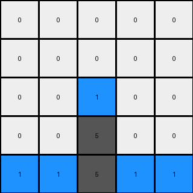
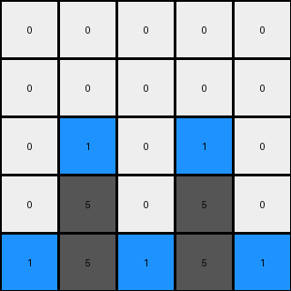
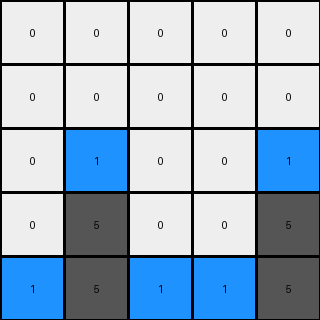

# 3618c87e • 015 • refine_dreamer

---


Previous Code:
```python
"""
The transformation rule is as follows:
1. The first three rows of the input grid are copied to the output grid without changes.
2. In the fourth row (index 3), gray (5) pixels remain unchanged.
3. In the fifth row (index 4):
    - Gray pixels in row 4 of the input become blue pixels in row 4 of the output.
    - Blue pixels in row 2 (index 2) of the input become gray pixels in row 4 of the output.
"""

import numpy as np

def transform(input_grid):
    """Transforms the input grid according to the observed rule."""
    output_grid = np.copy(input_grid)  # Initialize output as a copy

    rows = input_grid.shape[0]
    cols = input_grid.shape[1]

    # Iterate through the input grid, applying transformation logic
    for i in range(rows):
        for j in range(cols):
            if i == 3: #row 4
                # gray remains grey
                pass
            elif i == 4: #row 5
                #grey becomes blue
                if input_grid[i,j] == 5:
                    output_grid[i,j] = 1
                # blue in input row 3, becomes grey in output row 5
                if input_grid[2,j] == 1:
                    output_grid[i,j] = 5
    return output_grid
```

Train Set Results:

## Example 1:

Input:
```
0 0 0 0 0
0 0 0 0 0
0 0 1 0 0
0 0 5 0 0
5 5 5 5 5
```
Expected Output:
```
0 0 0 0 0
0 0 0 0 0
0 0 0 0 0
0 0 5 0 0
5 5 1 5 5
```
Transformed Output:
```
0 0 0 0 0
0 0 0 0 0
0 0 1 0 0
0 0 5 0 0
1 1 5 1 1
```

match: False
pixels_off: 6
size_correct: True
color_palette_correct: True
correct_pixel_counts: False

## Example 2:

Input:
```
0 0 0 0 0
0 0 0 0 0
0 1 0 1 0
0 5 0 5 0
5 5 5 5 5
```
Expected Output:
```
0 0 0 0 0
0 0 0 0 0
0 0 0 0 0
0 5 0 5 0
5 1 5 1 5
```
Transformed Output:
```
0 0 0 0 0
0 0 0 0 0
0 1 0 1 0
0 5 0 5 0
1 5 1 5 1
```

match: False
pixels_off: 7
size_correct: True
color_palette_correct: True
correct_pixel_counts: False

## Example 3:

Input:
```
0 0 0 0 0
0 0 0 0 0
0 1 0 0 1
0 5 0 0 5
5 5 5 5 5
```
Expected Output:
```
0 0 0 0 0
0 0 0 0 0
0 0 0 0 0
0 5 0 0 5
5 1 5 5 1
```
Transformed Output:
```
0 0 0 0 0
0 0 0 0 0
0 1 0 0 1
0 5 0 0 5
1 5 1 1 5
```

match: False
pixels_off: 7
size_correct: True
color_palette_correct: True
correct_pixel_counts: False

**INSTRUCTIONS**

The code above was generated based on observations from the first training
example

we have tested the transform function on each of the task example inputs and
compared with the expected output

review each of the examples provided and the results and consider how the
natural language program should be updated to accommodate this new knowledge

respond with the following deliverables:

- general assessment of the information provided and strategy for resolving the
  errors
- gather metrics about each of the examples and results - use code_execution to
  develop accurate reports on your assumptions
- a YAML block documenting facts - Focus on identifying objects, their properties, and the actions performed on them.
- a natural language program - Be as clear and concise as possible, providing a complete description of the transformation rule.


your responses should be considered as information in a report - not a
conversation
