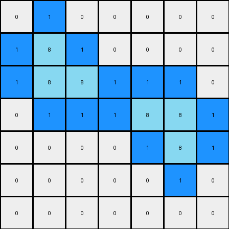

# 3aa6fb7a • 009 • refine_dreamer

---


Previous Code:
```python
"""
Identifies azure (8) pixels in the input grid and adds blue (1) pixels adjacent
to them, replacing white (0) pixels.
"""

import numpy as np

def get_adjacent_positions(grid, row, col):
    # type: (np.ndarray, int, int) -> list
    """Returns a list of valid adjacent positions (up, down, left, right) to a given cell."""
    rows, cols = grid.shape
    adjacent_positions = []
    if row > 0:
        adjacent_positions.append((row - 1, col))  # Up
    if row < rows - 1:
        adjacent_positions.append((row + 1, col))  # Down
    if col > 0:
        adjacent_positions.append((row, col - 1))  # Left
    if col < cols - 1:
        adjacent_positions.append((row, col + 1))  # Right
    return adjacent_positions

def transform(input_grid):
    # type: (np.ndarray) -> np.ndarray
    """Transforms the input grid by adding blue pixels adjacent to azure pixels."""

    # Initialize output_grid as a copy of the input_grid
    output_grid = np.copy(input_grid)
    rows, cols = input_grid.shape

    # Iterate through each cell in the grid
    for row in range(rows):
        for col in range(cols):
            # Check if the current cell is azure (8)
            if input_grid[row, col] == 8:
                # Get adjacent positions
                adjacent_cells = get_adjacent_positions(input_grid, row, col)
                # Check adjacent cells
                for r, c in adjacent_cells:
                    # If an adjacent cell is white (0), change it to blue (1) in the output_grid
                    if output_grid[r, c] == 0:
                        output_grid[r, c] = 1

    return output_grid
```

Train Set Results:

## Example 1:

Input:
```
0 0 0 0 0 0 0
0 8 0 0 0 0 0
0 8 8 0 0 0 0
0 0 0 0 8 8 0
0 0 0 0 0 8 0
0 0 0 0 0 0 0
0 0 0 0 0 0 0
```
Expected Output:
```
0 0 0 0 0 0 0
0 8 1 0 0 0 0
0 8 8 0 0 0 0
0 0 0 0 8 8 0
0 0 0 0 1 8 0
0 0 0 0 0 0 0
0 0 0 0 0 0 0
```
Transformed Output:
```
0 1 0 0 0 0 0
1 8 1 0 0 0 0
1 8 8 1 1 1 0
0 1 1 1 8 8 1
0 0 0 0 1 8 1
0 0 0 0 0 1 0
0 0 0 0 0 0 0
```

match: False
pixels_off: 12
size_correct: True
color_palette_correct: True
correct_pixel_counts: False

## Example 2:

Input:
```
0 0 0 0 8 8 0
0 0 0 0 0 8 0
0 0 8 0 0 0 0
0 0 8 8 0 0 0
0 0 0 0 0 0 0
0 0 0 0 8 0 0
0 0 0 8 8 0 0
```
Expected Output:
```
0 0 0 0 8 8 0
0 0 0 0 1 8 0
0 0 8 1 0 0 0
0 0 8 8 0 0 0
0 0 0 0 0 0 0
0 0 0 1 8 0 0
0 0 0 8 8 0 0
```
Transformed Output:
```
0 0 0 1 8 8 1
0 0 1 0 1 8 1
0 1 8 1 0 1 0
0 1 8 8 1 0 0
0 0 1 1 1 0 0
0 0 0 1 8 1 0
0 0 1 8 8 1 0
```

match: False
pixels_off: 14
size_correct: True
color_palette_correct: True
correct_pixel_counts: False

**INSTRUCTIONS**

The code above was generated based on observations from the first training
example

we have tested the transform function on each of the task example inputs and
compared with the expected output

review each of the examples provided and the results and consider how the
natural language program should be updated to accommodate this new knowledge

respond with the following deliverables:

- general assessment of the information provided and strategy for resolving the
  errors
- gather metrics about each of the examples and results - use code_execution to
  develop accurate reports on your assumptions
- a YAML block documenting facts - Focus on identifying objects, their properties, and the actions performed on them.
- a natural language program - Be as clear and concise as possible, providing a complete description of the transformation rule.


your responses should be considered as information in a report - not a
conversation
