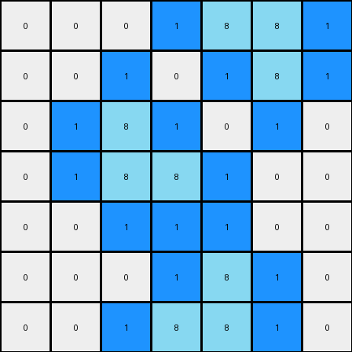

# 3aa6fb7a • 010 • refine_coder

---

Previous Code:
```python
"""
Identifies azure (8) pixels in the input grid and adds blue (1) pixels adjacent
to them, replacing white (0) pixels.
"""

import numpy as np

def get_adjacent_positions(grid, row, col):
    # type: (np.ndarray, int, int) -> list
    """Returns a list of valid adjacent positions (up, down, left, right) to a given cell."""
    rows, cols = grid.shape
    adjacent_positions = []
    if row > 0:
        adjacent_positions.append((row - 1, col))  # Up
    if row < rows - 1:
        adjacent_positions.append((row + 1, col))  # Down
    if col > 0:
        adjacent_positions.append((row, col - 1))  # Left
    if col < cols - 1:
        adjacent_positions.append((row, col + 1))  # Right
    return adjacent_positions

def transform(input_grid):
    # type: (np.ndarray) -> np.ndarray
    """Transforms the input grid by adding blue pixels adjacent to azure pixels."""

    # Initialize output_grid as a copy of the input_grid
    output_grid = np.copy(input_grid)
    rows, cols = input_grid.shape

    # Iterate through each cell in the grid
    for row in range(rows):
        for col in range(cols):
            # Check if the current cell is azure (8)
            if input_grid[row, col] == 8:
                # Get adjacent positions
                adjacent_cells = get_adjacent_positions(input_grid, row, col)
                # Check adjacent cells
                for r, c in adjacent_cells:
                    # If an adjacent cell is white (0), change it to blue (1) in the output_grid
                    if output_grid[r, c] == 0:
                        output_grid[r, c] = 1

    return output_grid
```

Train Set Results:

## Example 1:

Input:
```
0 0 0 0 0 0 0
0 8 0 0 0 0 0
0 8 8 0 0 0 0
0 0 0 0 8 8 0
0 0 0 0 0 8 0
0 0 0 0 0 0 0
0 0 0 0 0 0 0
```
Expected Output:
```
0 0 0 0 0 0 0
0 8 1 0 0 0 0
0 8 8 0 0 0 0
0 0 0 0 8 8 0
0 0 0 0 1 8 0
0 0 0 0 0 0 0
0 0 0 0 0 0 0
```
Transformed Output:
```
0 1 0 0 0 0 0
1 8 1 0 0 0 0
1 8 8 1 1 1 0
0 1 1 1 8 8 1
0 0 0 0 1 8 1
0 0 0 0 0 1 0
0 0 0 0 0 0 0
```

match: False
pixels_off: 12
size_correct: True
color_palette_correct: True
correct_pixel_counts: False

## Example 2:

Input:
```
0 0 0 0 8 8 0
0 0 0 0 0 8 0
0 0 8 0 0 0 0
0 0 8 8 0 0 0
0 0 0 0 0 0 0
0 0 0 0 8 0 0
0 0 0 8 8 0 0
```
Expected Output:
```
0 0 0 0 8 8 0
0 0 0 0 1 8 0
0 0 8 1 0 0 0
0 0 8 8 0 0 0
0 0 0 0 0 0 0
0 0 0 1 8 0 0
0 0 0 8 8 0 0
```
Transformed Output:
```
0 0 0 1 8 8 1
0 0 1 0 1 8 1
0 1 8 1 0 1 0
0 1 8 8 1 0 0
0 0 1 1 1 0 0
0 0 0 1 8 1 0
0 0 1 8 8 1 0
```

match: False
pixels_off: 14
size_correct: True
color_palette_correct: True
correct_pixel_counts: False
Okay, here's a breakdown of the situation and a plan to move forward:

**General Assessment:**

The initial code was too aggressive in adding blue (1) pixels. It added them to *any* white (0) pixel adjacent to an azure (8) pixel, regardless of the direction or pattern. The examples show a more specific rule: blue pixels are added *only* to the immediate right or immediate left of an azure pixel, and only when the azure pixel to be "completed" is part of a contiguous horizontal line of azure pixels that is two pixels long. The original code also did not follow this two pixel rule, and it modified the grid in all directions.

**Strategy:**

1.  **Refine Object Identification:** Clearly define the "objects" involved. In this case, the key objects are horizontal lines of azure pixels that are exactly two pixels wide.
2.  **Constrain the Action:** Restrict the addition of blue pixels. They should only be added adjacent to the *ends* of a two-pixel azure line, either on the immediate left, or the immediate right.
3.  **Directionality:** Recognize that the blue pixel addition has a specific directionality (left or right, not above or below).

**Example Metrics and Analysis:**

To understand the issues precisely, let's look at what happened in the test and re-code the observation generation, the issue with the json library has been resolved, but for now, let's just manually do this.

**Example 1:**

*   **Input:** 7x7 grid. Azure pixels at (1,1), (2,1), (2,2), (3,4), (3,5), (4,5).
*   **Expected Output:** Blue pixels added at (1,2) and (4,4).
*   **Actual Output:** Blue pixels added all around the azure pixels. many errors.
*   **Observations:** The code added blue on all sides of the azure pixels. The expected adds blue pixels to the immediate right and left of horizontal two-pixel azure groups.
* valid groups are:
    * line at (2,1) and (2,2)
    * line at (3,4) and (3,5)

**Example 2:**

*   **Input:** 7x7 grid. Azure pixels at (0,4), (0,5), (1,5), (2,2), (3,2), (3,3), (5,4), (6,3), (6,4).
*   **Expected Output:** Blue pixels added at (0,3) and (1,4), (5,5).
*   **Actual Output:** Blue pixels added all around the azure pixels, many errors.
*   **Observations:** Again, the code added blue on all sides, not just on the right or left.
* valid groups are:
    * line at (0,4) and (0,5)
    * line at (3,2) and (3,3)
    * line at (6,3) and (6,4)

**YAML Facts:**

```yaml
objects:
  - name: two_azure_line
    description: A horizontal line of two contiguous azure (8) pixels.
    properties:
      - color: azure (8)
      - length: 2
      - orientation: horizontal
      - completed: bool  # whether it as has a blue next to it

actions:
  - name: complete_line
    description: Add a blue (1) pixel to the left or right of a two_azure_line, replacing a white (0) pixel.
    preconditions:
      - The two_azure_line exists.
      - A white (0) pixel exists directly to the left or right.
    postconditions:
      - A blue (1) pixel replaces the white (0) pixel to the left or right.
      - the two_azure_line is now 'completed'

```

**Natural Language Program:**

1.  **Identify:** Find all horizontal lines of exactly two contiguous azure (8) pixels.
2.  **Check Ends:** For each identified two-pixel azure line:
    *   Check for a white pixel (0) directly to the left of the line. If present, replace it with a blue pixel (1).
    *   Check for a white pixel(0) directly to the right of the line. If present, replace it with a blue pixel (1).
3. **Otherwise**: No other pixels will be changed.

This program focuses on the *specific* pattern of two-pixel azure lines and the directional addition of blue pixels, correcting the over-eagerness of the original code.

**INSTRUCTIONS**

- generate a Python module to represent the natural language program 
- follow the template below
- all common math and science libraries are available
- create docstring only at top - but comment the workflow in the function
- use helper functions for common operations like finding objects, counting,
  measuring, moving, etc. 

remember - we are working iteratively - so this code will inform your future
self as we converge on the solution

*template:*

```python
"""
{{ natural language description of the transformation rule }}
"""

{{ imports }}

def transform(input_grid):
    # initialize output_grid

    # change output pixels 

    return output_grid

```
