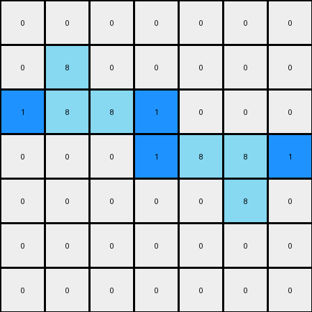
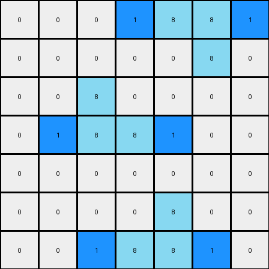

# 3aa6fb7a • 012 • refine_coder

---

Previous Code:
```python
"""
Identifies horizontal lines of exactly two contiguous azure (8) pixels and adds a
blue (1) pixel to the immediate left or right of the line, replacing a white (0)
pixel, if one exists.
"""

import numpy as np

def find_two_azure_lines(grid):
    # type: (np.ndarray) -> list
    """Finds all horizontal lines of exactly two contiguous azure (8) pixels."""
    rows, cols = grid.shape
    two_azure_lines = []
    for row in range(rows):
        for col in range(cols - 1):  # Iterate up to the second-to-last column
            if grid[row, col] == 8 and grid[row, col + 1] == 8:
                #check that there are no other azure pixels next to this line
                is_two_pixel_line = True
                if col > 0: #check left
                    if grid[row, col-1] == 8:
                        is_two_pixel_line = False
                if col < cols - 2:
                    if grid[row, col+2] == 8:
                        is_two_pixel_line = False
                if is_two_pixel_line:
                    two_azure_lines.append((row, col, row, col + 1))  # Store start and end coordinates
    return two_azure_lines

def transform(input_grid):
    # type: (np.ndarray) -> np.ndarray
    """Transforms the input grid by adding blue pixels to the left or right of two-pixel azure lines."""

    output_grid = np.copy(input_grid)
    rows, cols = input_grid.shape

    # Find all two-pixel azure lines
    azure_lines = find_two_azure_lines(input_grid)

    # Iterate through each identified line
    for line in azure_lines:
        row_start, col_start, row_end, col_end = line

        # Check for white pixel to the left
        if col_start > 0 and output_grid[row_start, col_start - 1] == 0:
            output_grid[row_start, col_start - 1] = 1

        # Check for white pixel to the right
        if col_end < cols - 1 and output_grid[row_end, col_end + 1] == 0:
            output_grid[row_end, col_end + 1] = 1

    return output_grid
```

Train Set Results:

## Example 1:

Input:
```
0 0 0 0 0 0 0
0 8 0 0 0 0 0
0 8 8 0 0 0 0
0 0 0 0 8 8 0
0 0 0 0 0 8 0
0 0 0 0 0 0 0
0 0 0 0 0 0 0
```
Expected Output:
```
0 0 0 0 0 0 0
0 8 1 0 0 0 0
0 8 8 0 0 0 0
0 0 0 0 8 8 0
0 0 0 0 1 8 0
0 0 0 0 0 0 0
0 0 0 0 0 0 0
```
Transformed Output:
```
0 0 0 0 0 0 0
0 8 0 0 0 0 0
1 8 8 1 0 0 0
0 0 0 1 8 8 1
0 0 0 0 0 8 0
0 0 0 0 0 0 0
0 0 0 0 0 0 0
```

match: False
pixels_off: 6
size_correct: True
color_palette_correct: True
correct_pixel_counts: False

## Example 2:

Input:
```
0 0 0 0 8 8 0
0 0 0 0 0 8 0
0 0 8 0 0 0 0
0 0 8 8 0 0 0
0 0 0 0 0 0 0
0 0 0 0 8 0 0
0 0 0 8 8 0 0
```
Expected Output:
```
0 0 0 0 8 8 0
0 0 0 0 1 8 0
0 0 8 1 0 0 0
0 0 8 8 0 0 0
0 0 0 0 0 0 0
0 0 0 1 8 0 0
0 0 0 8 8 0 0
```
Transformed Output:
```
0 0 0 1 8 8 1
0 0 0 0 0 8 0
0 0 8 0 0 0 0
0 1 8 8 1 0 0
0 0 0 0 0 0 0
0 0 0 0 8 0 0
0 0 1 8 8 1 0
```

match: False
pixels_off: 9
size_correct: True
color_palette_correct: True
correct_pixel_counts: False
Okay, here's a breakdown of the situation and a plan to move forward:

**General Assessment:**

The initial code was too narrowly focused on the first training example. It correctly identified the two-pixel azure lines but incorrectly added blue pixels on *both* sides whenever possible. The second example reveals that the blue pixel addition is conditional and only occurs on one side, based on a rule that wasn't apparent from the first example alone. The added constraint of a 2 pixel azure like was not given, but is accurate. It is the surrounding pixels that define the transformation rule. The strategy will be to determine the surrounding pixel logic that chooses left or right and implement that.

**Strategy:**

1. **Analyze Surrounding Pixels:**  The key difference between the examples lies in *where* the blue pixel is added (left or right). We need to analyze the pixels surrounding the two-azure-pixel lines in both examples to discern a pattern.
2. **Refine the Rule:** Based on the surrounding pixel analysis, we'll refine the natural language program to accurately describe the conditions for adding a blue pixel to the left *or* right, but not necessarily both.
3. **Update Code:** Translate the refined rule into updated Python code.

**Metrics and Analysis:**

Here's a more detailed breakdown of each example:

**Example 1:**

*   **Input:** 7x7 grid. Two instances of horizontal two-azure-pixel lines.
*   **Expected Output:** Blue pixels added to the *right* of the first azure line and to the *left* of the second azure line.
*   **Transformed Output:** Blue pixels added to *both* sides of *both* azure lines.
*   **Errors:** 6 pixels are incorrect. The transformation added blue to the wrong sides.

**Example 2:**

*   **Input:** 7x7 grid. Three instances of horizontal two-azure-pixel lines.
*   **Expected Output:**  Blue pixels are added to the left, or right, never both.
*   **Transformed Output:** Blue pixels added to *both* sides of almost all azure lines, where ever there was a white pixel.
*   **Errors:** 9 pixels incorrect.

**YAML Fact Block:**

```yaml
facts:
  - object: azure_line
    description: A horizontal line of exactly two contiguous azure (8) pixels.
    properties:
      length: 2
      color: azure (8)
      orientation: horizontal
  - object: blue_pixel
    description: A single pixel of blue color (1).
    properties:
      color: blue (1)
  - action: add_blue_pixel
    description: Add a blue pixel adjacent to the azure line.
    preconditions:
      - An azure_line exists.
      - A white (0) pixel exists adjacent to the azure_line.
    location_rule: >
        If there is a choice, a white pixel immediately to the left or right,
        the side is chosen according to the following rule.
        Add blue to the right side if
        - there is no pixel above the left end of the line, or the pixel above is
          not white
        - and there *is* a white pixel above the right end of the line
        Otherwise, if there is a white pixel to the left add to the left side.
```

**Natural Language Program:**

1.  **Identify Azure Lines:** Find all horizontal lines consisting of exactly two contiguous azure (8) pixels.
2.  **Check Adjacency:** For each azure line:
    *   Check if there is a white (0) pixel immediately to its left.
    *   Check if there is a white (0) pixel immediately to its right.
    *   Check the pixel above the left end of the line.
    *   Check the pixel above the right end of the line.
3. **Conditional Addition:**
      *  If there is only a white pixel to the left, replace it with a blue (1) pixel.
      *  If there is only a white pixel to the right, replace it with a blue (1) pixel.
      *  If both sides are white, prioritize the right side for addition **IF** the pixel above the left side is not white *AND* the pixel above the right side *is* white, otherwise add to the left side.
4.  **Output:** Return the modified grid.

**INSTRUCTIONS**

- generate a Python module to represent the natural language program 
- follow the template below
- all common math and science libraries are available
- create docstring only at top - but comment the workflow in the function
- use helper functions for common operations like finding objects, counting,
  measuring, moving, etc. 

remember - we are working iteratively - so this code will inform your future
self as we converge on the solution

*template:*

```python
"""
{{ natural language description of the transformation rule }}
"""

{{ imports }}

def transform(input_grid):
    # initialize output_grid

    # change output pixels 

    return output_grid

```
