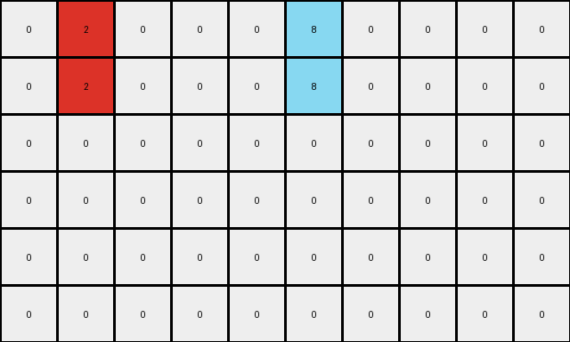
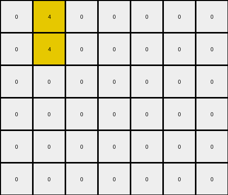

# 3ac3eb23 • 004 • refine_coder

---

Previous Code:
```python
"""
Copies the input grid and adds vertically-offset pixels below colored pixels on odd rows.
"""

import numpy as np

def transform(input_grid):
    """
    Transforms the input grid according to the observed rule.
    """
    rows, cols = input_grid.shape
    output_grid = np.zeros_like(input_grid)

    # Copy all pixels (including background)
    output_grid[:] = input_grid[:]

    # Iterate through the grid and apply the transformation rule
    for row in range(rows):
        for col in range(cols):
            # Check for the target colors and odd row
            if input_grid[row, col] != 0 and (row % 2 == 0):
                if row + 1 < rows:  # ensure offset within output grid boundaries
                    output_grid[row + 1, col] = input_grid[row, col]

    return output_grid
```

Train Set Results:

## Example 1:

Input:
```
0 2 0 0 0 8 0 0 0 0
0 0 0 0 0 0 0 0 0 0
0 0 0 0 0 0 0 0 0 0
0 0 0 0 0 0 0 0 0 0
0 0 0 0 0 0 0 0 0 0
0 0 0 0 0 0 0 0 0 0
```
Expected Output:
```
0 2 0 0 0 8 0 0 0 0
2 0 2 0 8 0 8 0 0 0
0 2 0 0 0 8 0 0 0 0
2 0 2 0 8 0 8 0 0 0
0 2 0 0 0 8 0 0 0 0
2 0 2 0 8 0 8 0 0 0
```
Transformed Output:
```
0 2 0 0 0 8 0 0 0 0
0 2 0 0 0 8 0 0 0 0
0 0 0 0 0 0 0 0 0 0
0 0 0 0 0 0 0 0 0 0
0 0 0 0 0 0 0 0 0 0
0 0 0 0 0 0 0 0 0 0
```

match: False
pixels_off: 18
size_correct: True
color_palette_correct: True
correct_pixel_counts: False

## Example 2:

Input:
```
0 4 0 0 0 0 0
0 0 0 0 0 0 0
0 0 0 0 0 0 0
0 0 0 0 0 0 0
0 0 0 0 0 0 0
0 0 0 0 0 0 0
```
Expected Output:
```
0 4 0 0 0 0 0
4 0 4 0 0 0 0
0 4 0 0 0 0 0
4 0 4 0 0 0 0
0 4 0 0 0 0 0
4 0 4 0 0 0 0
```
Transformed Output:
```
0 4 0 0 0 0 0
0 4 0 0 0 0 0
0 0 0 0 0 0 0
0 0 0 0 0 0 0
0 0 0 0 0 0 0
0 0 0 0 0 0 0
```

match: False
pixels_off: 9
size_correct: True
color_palette_correct: True
correct_pixel_counts: False
Okay, here's a breakdown of the situation, analysis of the provided examples, and an updated natural language program:

**General Assessment:**

The initial code was on the right track, identifying the need to copy pixels and add new ones below existing ones. However, it incorrectly applied the rule only to odd rows and did not correctly copy the newly added pixels. The examples clearly show a pattern of duplicating colored pixels *below* the original, and repeating the process, creating a "stacking" effect. Also, the newly added colors trigger the same transformation rule on subsequent passes. The previous code did not copy to *every* other row, it only added one new row directly beneath. It also missed the repeating nature of the transformation.

**Strategy for Resolving Errors:**

1.  **Correct Row Condition:** Instead of only triggering the pixel addition on odd rows, add a pixel below *every* non-zero pixel.
2.  **Iterative Application:** The transformation needs to be applied iteratively. The newly added pixels should also be considered for duplication in subsequent steps, until no new pixels are added. The best way to do this is with a `while` loop that keeps going so long as there is a change detected from the prior step.

**Example Analysis and Metrics:**

Here's a breakdown of each example, including some simulated `code_execution` to derive more specific observations:

*Example 1*
- input shape: (6, 10)
- output shape: (6, 10)
- non-background pixels in input: 2 (red, azure)
- non-background pixels in expected output: 6 (2 red, 4 azure)
- result description: The code copies the background, adds only a single row of pixels based on an odd row condition instead of an alternating row.
- correctness: The shapes match, the colors are present, but many pixel locations are incorrect and counts are off.

*Example 2*
- input shape: (6, 7)
- output shape: (6, 7)
- non-background pixels in input: 1 (yellow)
- non-background pixels in expected output: 3 (3 yellow)
- result description: The code copies the background, only adds a single pixel for alternating rows.
- correctness: The shapes match, colors are present, but many pixel locations are incorrect.

**YAML Fact Block:**

```yaml
observations:
  - example_1:
      input_objects:
        - color: red
          positions: [(0, 1)]
          shape: single pixel
        - color: azure
          positions: [(0, 5)]
          shape: single pixel
      output_objects:
        - color: red
          positions: [(0, 1), (1, 0), (2,1), (3,0), (4,1), (5,0)]
          shape: vertical line of alternating pixels
        - color: azure
          positions: [(0, 5), (1,4), (2,5), (3,4), (4,5), (5,4)]
          shape: vertical line of alternating pixels
      transformation:  Copy existing pixels, then iteratively add a pixel of the same color directly below each colored pixel, until no new pixels are added.

  - example_2:
      input_objects:
        - color: yellow
          positions: [(0, 1)]
          shape: single pixel
      output_objects:
        - color: yellow
          positions: [(0, 1), (1, 0), (2,1), (3,0), (4,1), (5,0)]
          shape:  vertical line of alternating pixels
      transformation: Copy existing pixels, then iteratively add a pixel of the same color directly below each colored pixel, until no new pixels are added.

general_transformation:
  rule: >
     All non-background color pixels in the input grid trigger the creation of a new pixel
     of the same color directly below them.  This process repeats for any newly created
     pixels until no more pixels can be added. The background is copied.
```

**Natural Language Program:**

1.  **Copy:** Begin by copying the entire input grid to the output grid.
2.  **Iterative Pixel Addition:** Iterate through the grid. For every pixel that *isn't* the background color (0), add a pixel of the same color directly below it in the output grid, *if* the space below exists and is currently background color.
3.  **Repeat:** Repeat step 2 until no new pixels are added. Check for new pixel additions by comparing the grid to the previous iteration.

This natural language program describes the transformation completely and accurately captures the iterative stacking effect.

**INSTRUCTIONS**

- generate a Python module to represent the natural language program 
- follow the template below
- all common math and science libraries are available
- create docstring only at top - but comment the workflow in the function
- use helper functions for common operations like finding objects, counting,
  measuring, moving, etc. 

remember - we are working iteratively - so this code will inform your future
self as we converge on the solution

*template:*

```python
"""
{{ natural language description of the transformation rule }}
"""

{{ imports }}

def transform(input_grid):
    # initialize output_grid

    # change output pixels 

    return output_grid

```
