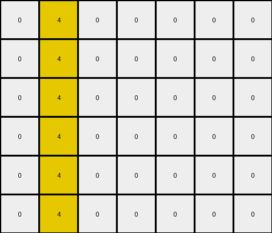

# 3ac3eb23 • 005 • refine_dreamer

---

Previous Code:
```python
"""
Copies the input grid and iteratively adds a pixel of the same color below each colored pixel until no new pixels are added.
"""

import numpy as np

def transform(input_grid):
    """
    Transforms the input grid according to the observed rule.
    """
    output_grid = np.copy(input_grid)
    rows, cols = output_grid.shape
    changed = True

    while changed:
        changed = False
        temp_grid = np.copy(output_grid)  # Work on a copy to avoid immediate self-replication
        for row in range(rows):
            for col in range(cols):
                # Check if the current pixel is not background and the space below is background and exists
                if temp_grid[row, col] != 0 and row + 1 < rows and output_grid[row + 1, col] == 0:
                    output_grid[row + 1, col] = temp_grid[row, col]
                    changed = True  # Mark that a change occurred

    return output_grid
```

Train Set Results:

## Example 1:

Input:
```
0 2 0 0 0 8 0 0 0 0
0 0 0 0 0 0 0 0 0 0
0 0 0 0 0 0 0 0 0 0
0 0 0 0 0 0 0 0 0 0
0 0 0 0 0 0 0 0 0 0
0 0 0 0 0 0 0 0 0 0
```
Expected Output:
```
0 2 0 0 0 8 0 0 0 0
2 0 2 0 8 0 8 0 0 0
0 2 0 0 0 8 0 0 0 0
2 0 2 0 8 0 8 0 0 0
0 2 0 0 0 8 0 0 0 0
2 0 2 0 8 0 8 0 0 0
```
Transformed Output:
```
0 2 0 0 0 8 0 0 0 0
0 2 0 0 0 8 0 0 0 0
0 2 0 0 0 8 0 0 0 0
0 2 0 0 0 8 0 0 0 0
0 2 0 0 0 8 0 0 0 0
0 2 0 0 0 8 0 0 0 0
```

match: False
pixels_off: 18
size_correct: True
color_palette_correct: True
correct_pixel_counts: False

## Example 2:

Input:
```
0 4 0 0 0 0 0
0 0 0 0 0 0 0
0 0 0 0 0 0 0
0 0 0 0 0 0 0
0 0 0 0 0 0 0
0 0 0 0 0 0 0
```
Expected Output:
```
0 4 0 0 0 0 0
4 0 4 0 0 0 0
0 4 0 0 0 0 0
4 0 4 0 0 0 0
0 4 0 0 0 0 0
4 0 4 0 0 0 0
```
Transformed Output:
```
0 4 0 0 0 0 0
0 4 0 0 0 0 0
0 4 0 0 0 0 0
0 4 0 0 0 0 0
0 4 0 0 0 0 0
0 4 0 0 0 0 0
```

match: False
pixels_off: 9
size_correct: True
color_palette_correct: True
correct_pixel_counts: False
**INSTRUCTIONS**

The code above was generated based on observations from the first training
example

we have tested the transform function on each of the task example inputs and
compared with the expected output

review each of the examples provided and the results and consider how the
natural language program should be updated to accommodate this new knowledge

respond with the following deliverables:

- general assessment of the information provided and strategy for resolving the
  errors
- gather metrics about each of the examples and results - use code_execution to
  develop accurate reports on your assumptions
- a YAML block documenting facts - Focus on identifying objects, their properties, and the actions performed on them.
- a natural language program - Be as clear and concise as possible, providing a complete description of the transformation rule.


your responses should be considered as information in a report - not a
conversation
