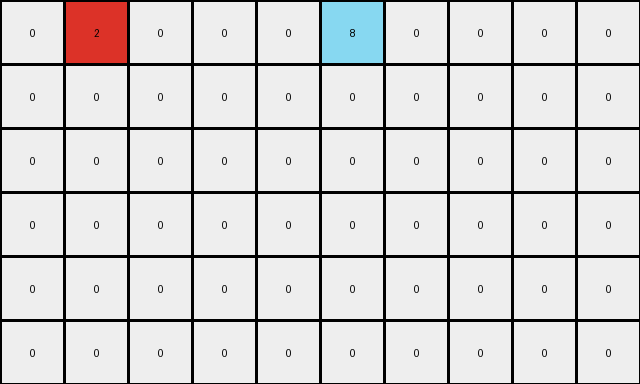
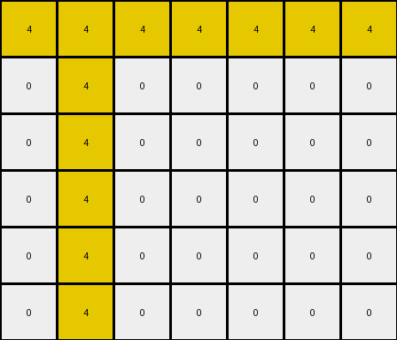

# 3ac3eb23 • 009 • refine_dreamer

---


Previous Code:
```python
"""
The transformation rule involves identifying the location of a single yellow (4) pixel in the input grid and then drawing a horizontal and a vertical line of yellow pixels centered on that location, extending to the edges of the grid.
"""

import numpy as np

def find_seed_pixel(grid, color=4):
    # Find the coordinates of the specified color pixel.
    for r, row in enumerate(grid):
        for c, pixel in enumerate(row):
            if pixel == color:
                return (r, c)
    return None  # Should not happen in this specific task, but good practice.

def transform(input_grid):
    # Initialize output_grid as a copy of the input_grid.
    output_grid = np.copy(input_grid)
    
    # Find the seed pixel (the original yellow pixel).
    seed_location = find_seed_pixel(input_grid)

    if seed_location is None:
        return output_grid # returns the input_grid unchanged
    
    seed_row, seed_col = seed_location

    # Draw the vertical line.
    for r in range(output_grid.shape[0]):
        output_grid[r, seed_col] = 4

    # Draw the horizontal line.
    for c in range(output_grid.shape[1]):
        output_grid[seed_row, c] = 4

    return output_grid
```

Train Set Results:

## Example 1:

Input:
```
0 2 0 0 0 8 0 0 0 0
0 0 0 0 0 0 0 0 0 0
0 0 0 0 0 0 0 0 0 0
0 0 0 0 0 0 0 0 0 0
0 0 0 0 0 0 0 0 0 0
0 0 0 0 0 0 0 0 0 0
```
Expected Output:
```
0 2 0 0 0 8 0 0 0 0
2 0 2 0 8 0 8 0 0 0
0 2 0 0 0 8 0 0 0 0
2 0 2 0 8 0 8 0 0 0
0 2 0 0 0 8 0 0 0 0
2 0 2 0 8 0 8 0 0 0
```
Transformed Output:
```
0 2 0 0 0 8 0 0 0 0
0 0 0 0 0 0 0 0 0 0
0 0 0 0 0 0 0 0 0 0
0 0 0 0 0 0 0 0 0 0
0 0 0 0 0 0 0 0 0 0
0 0 0 0 0 0 0 0 0 0
```

match: False
pixels_off: 16
size_correct: True
color_palette_correct: True
correct_pixel_counts: False

## Example 2:

Input:
```
0 4 0 0 0 0 0
0 0 0 0 0 0 0
0 0 0 0 0 0 0
0 0 0 0 0 0 0
0 0 0 0 0 0 0
0 0 0 0 0 0 0
```
Expected Output:
```
0 4 0 0 0 0 0
4 0 4 0 0 0 0
0 4 0 0 0 0 0
4 0 4 0 0 0 0
0 4 0 0 0 0 0
4 0 4 0 0 0 0
```
Transformed Output:
```
4 4 4 4 4 4 4
0 4 0 0 0 0 0
0 4 0 0 0 0 0
0 4 0 0 0 0 0
0 4 0 0 0 0 0
0 4 0 0 0 0 0
```

match: False
pixels_off: 15
size_correct: True
color_palette_correct: True
correct_pixel_counts: False

**INSTRUCTIONS**

The code above was generated based on observations from the first training
example

we have tested the transform function on each of the task example inputs and
compared with the expected output

review each of the examples provided and the results and consider how the
natural language program should be updated to accommodate this new knowledge

respond with the following deliverables:

- general assessment of the information provided and strategy for resolving the
  errors
- gather metrics about each of the examples and results - use code_execution to
  develop accurate reports on your assumptions
- a YAML block documenting facts - Focus on identifying objects, their properties, and the actions performed on them.
- a natural language program - Be as clear and concise as possible, providing a complete description of the transformation rule.


your responses should be considered as information in a report - not a
conversation
