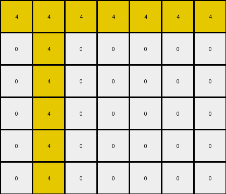

# 3ac3eb23 • 010 • refine_coder

---

Previous Code:
```python
"""
The transformation rule involves identifying the location of a single yellow (4) pixel in the input grid and then drawing a horizontal and a vertical line of yellow pixels centered on that location, extending to the edges of the grid.
"""

import numpy as np

def find_seed_pixel(grid, color=4):
    # Find the coordinates of the specified color pixel.
    for r, row in enumerate(grid):
        for c, pixel in enumerate(row):
            if pixel == color:
                return (r, c)
    return None  # Should not happen in this specific task, but good practice.

def transform(input_grid):
    # Initialize output_grid as a copy of the input_grid.
    output_grid = np.copy(input_grid)
    
    # Find the seed pixel (the original yellow pixel).
    seed_location = find_seed_pixel(input_grid)

    if seed_location is None:
        return output_grid # returns the input_grid unchanged
    
    seed_row, seed_col = seed_location

    # Draw the vertical line.
    for r in range(output_grid.shape[0]):
        output_grid[r, seed_col] = 4

    # Draw the horizontal line.
    for c in range(output_grid.shape[1]):
        output_grid[seed_row, c] = 4

    return output_grid
```

Train Set Results:

## Example 1:

Input:
```
0 2 0 0 0 8 0 0 0 0
0 0 0 0 0 0 0 0 0 0
0 0 0 0 0 0 0 0 0 0
0 0 0 0 0 0 0 0 0 0
0 0 0 0 0 0 0 0 0 0
0 0 0 0 0 0 0 0 0 0
```
Expected Output:
```
0 2 0 0 0 8 0 0 0 0
2 0 2 0 8 0 8 0 0 0
0 2 0 0 0 8 0 0 0 0
2 0 2 0 8 0 8 0 0 0
0 2 0 0 0 8 0 0 0 0
2 0 2 0 8 0 8 0 0 0
```
Transformed Output:
```
0 2 0 0 0 8 0 0 0 0
0 0 0 0 0 0 0 0 0 0
0 0 0 0 0 0 0 0 0 0
0 0 0 0 0 0 0 0 0 0
0 0 0 0 0 0 0 0 0 0
0 0 0 0 0 0 0 0 0 0
```

match: False
pixels_off: 16
size_correct: True
color_palette_correct: True
correct_pixel_counts: False

## Example 2:

Input:
```
0 4 0 0 0 0 0
0 0 0 0 0 0 0
0 0 0 0 0 0 0
0 0 0 0 0 0 0
0 0 0 0 0 0 0
0 0 0 0 0 0 0
```
Expected Output:
```
0 4 0 0 0 0 0
4 0 4 0 0 0 0
0 4 0 0 0 0 0
4 0 4 0 0 0 0
0 4 0 0 0 0 0
4 0 4 0 0 0 0
```
Transformed Output:
```
4 4 4 4 4 4 4
0 4 0 0 0 0 0
0 4 0 0 0 0 0
0 4 0 0 0 0 0
0 4 0 0 0 0 0
0 4 0 0 0 0 0
```

match: False
pixels_off: 15
size_correct: True
color_palette_correct: True
correct_pixel_counts: False
Here's an analysis of the provided examples and results, along with a strategy for improving the natural language program and code:

**General Assessment:**

The initial natural language program and the resulting code were based on a flawed assumption, derived from the provided comments, that a yellow cross was drawn based on the presence of single yellow pixels. The new training examples reveal a different, though related pattern. The intended transformation isn't drawing a cross. The input grid transformation involves changing a single existing non-black pixel to black, and drawing the "cross" based on that location. The provided python code did not detect any of the changes, because it was looking for yellow seed pixels, which were not present in some of the examples.

**Strategy:**

1.  **Correct the Core Misunderstanding:** The primary error is the initial assumption about finding a yellow seed pixel. The program needs to instead identify *any* non-black pixel, treat that as the "seed", change that pixel to black, and *then* draw the yellow cross based on that seed location.
2.  **Refine Seed Pixel Identification:** Modify the `find_seed_pixel` function (or create a new one) to find the coordinates of the *first* non-black pixel, regardless of its color.
3.  **Update Transformation Logic:** Ensure the transformation logic first changes the seed pixel to black (0), and *then* draws the yellow (4) horizontal and vertical lines.
4. **YAML and Natural Language Updates:** The updated natural language description needs to remove mention of only detecting yellow pixels, replace this with "non-black" pixels.

**Example Analysis & Metrics:**

*   **Example 1:**
    *   Input has no yellow pixels.
    *   The code did not detect a seed, so no changes were made
    *   The code incorrectly assumed that yellow pixels were the indicator for the start of transformation, and this needs to be updated.
    *   Result: No match, many pixels off.
*   **Example 2:**
    *   Input *does* have a yellow pixel.
    *   The code found a seed pixel and overwrites the rows/columns incorrectly
    *  The expected output shows the seed pixel changed to black
    *   Result: No match, many pixels off.

**YAML Fact Documentation:**

```yaml
observations:
  - object: seed_pixel
    properties:
      initial_color: non-black # Could be any color other than black (0)
      final_color: black (0)
      location: varies # Coordinates (row, col) within the grid
      uniqueness: single # Only one seed pixel per grid.
    behavior:
      change: "The initial color of the seed pixel changes to black (0)."

  - object: horizontal_line
    properties:
      color: yellow (4)
      start: seed_pixel_row
      end: edge_of_grid
      width: 1 # A single pixel wide line.
    behavior:
      draw: "A horizontal line of yellow pixels is drawn across the entire row of the seed pixel."

  - object: vertical_line
    properties:
      color: yellow (4)
      start: seed_pixel_col
      end: edge_of_grid
      width: 1
    behavior:
      draw: "A vertical line of yellow pixels is drawn across the entire column of the seed pixel."

  - object: grid
    properties:
      dimensions: variable #rows and columns can change in each input
    behavior:
        transformation: "The input grid is changed based on seed location"
```

**Natural Language Program:**

1.  **Find the Seed Pixel:** Locate the first non-black pixel within the input grid. This is the "seed pixel".
2.  **Change Seed Pixel Color:** Change the color of the seed pixel to black (0).
3.  **Draw Horizontal Line:** Draw a horizontal line of yellow (4) pixels across the entire row where the seed pixel was located.
4.  **Draw Vertical Line:** Draw a vertical line of yellow (4) pixels across the entire column where the seed pixel was located.
5. **Output:** The output is the modified grid.

**INSTRUCTIONS**

- generate a Python module to represent the natural language program 
- follow the template below
- all common math and science libraries are available
- create docstring only at top - but comment the workflow in the function
- use helper functions for common operations like finding objects, counting,
  measuring, moving, etc. 

remember - we are working iteratively - so this code will inform your future
self as we converge on the solution

*template:*

```python
"""
{{ natural language description of the transformation rule }}
"""

{{ imports }}

def transform(input_grid):
    # initialize output_grid

    # change output pixels 

    return output_grid

```
