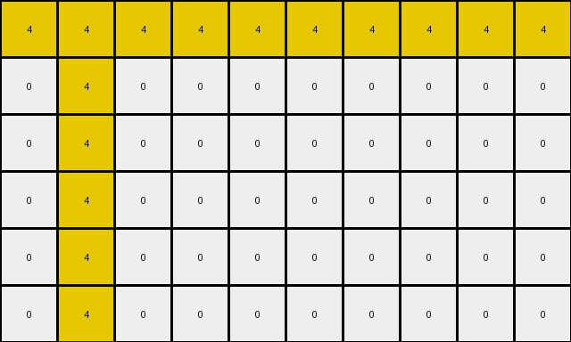
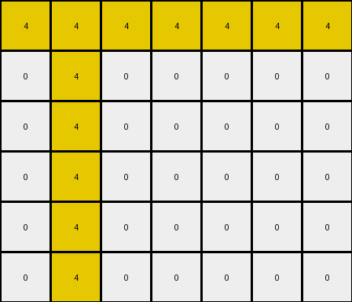

# 3ac3eb23 • 012 • refine_coder

---

Previous Code:
```python
"""
The transformation rule involves identifying the location of the first non-black pixel in the input grid, changing that pixel to black, and then drawing a horizontal and a vertical line of yellow pixels centered on that location, extending to the edges of the grid.
"""

import numpy as np

def find_seed_pixel(grid):
    # Find the coordinates of the first non-black pixel.
    for r, row in enumerate(grid):
        for c, pixel in enumerate(row):
            if pixel != 0:
                return (r, c)
    return None  # Should not happen in this specific task, but good practice.

def transform(input_grid):
    # Initialize output_grid as a copy of the input_grid.
    output_grid = np.copy(input_grid)
    
    # Find the seed pixel (the first non-black pixel).
    seed_location = find_seed_pixel(input_grid)

    if seed_location is None:
        return output_grid # returns the input_grid unchanged
    
    seed_row, seed_col = seed_location

    # Change seed pixel to black
    output_grid[seed_row, seed_col] = 0

    # Draw the vertical line.
    for r in range(output_grid.shape[0]):
        output_grid[r, seed_col] = 4

    # Draw the horizontal line.
    for c in range(output_grid.shape[1]):
        output_grid[seed_row, c] = 4

    return output_grid
```

Train Set Results:

## Example 1:

Input:
```
0 2 0 0 0 8 0 0 0 0
0 0 0 0 0 0 0 0 0 0
0 0 0 0 0 0 0 0 0 0
0 0 0 0 0 0 0 0 0 0
0 0 0 0 0 0 0 0 0 0
0 0 0 0 0 0 0 0 0 0
```
Expected Output:
```
0 2 0 0 0 8 0 0 0 0
2 0 2 0 8 0 8 0 0 0
0 2 0 0 0 8 0 0 0 0
2 0 2 0 8 0 8 0 0 0
0 2 0 0 0 8 0 0 0 0
2 0 2 0 8 0 8 0 0 0
```
Transformed Output:
```
4 4 4 4 4 4 4 4 4 4
0 4 0 0 0 0 0 0 0 0
0 4 0 0 0 0 0 0 0 0
0 4 0 0 0 0 0 0 0 0
0 4 0 0 0 0 0 0 0 0
0 4 0 0 0 0 0 0 0 0
```

match: False
pixels_off: 29
size_correct: True
color_palette_correct: False
correct_pixel_counts: False

## Example 2:

Input:
```
0 4 0 0 0 0 0
0 0 0 0 0 0 0
0 0 0 0 0 0 0
0 0 0 0 0 0 0
0 0 0 0 0 0 0
0 0 0 0 0 0 0
```
Expected Output:
```
0 4 0 0 0 0 0
4 0 4 0 0 0 0
0 4 0 0 0 0 0
4 0 4 0 0 0 0
0 4 0 0 0 0 0
4 0 4 0 0 0 0
```
Transformed Output:
```
4 4 4 4 4 4 4
0 4 0 0 0 0 0
0 4 0 0 0 0 0
0 4 0 0 0 0 0
0 4 0 0 0 0 0
0 4 0 0 0 0 0
```

match: False
pixels_off: 15
size_correct: True
color_palette_correct: True
correct_pixel_counts: False
Okay, let's analyze the results and refine the natural language program.

**General Assessment:**

The initial program correctly identified the concept of finding a "seed" pixel (the first non-black pixel) and drawing lines. However, it's making several mistakes:

1.  **Incorrect Line Color:** It's drawing yellow lines in all cases, while the outputs show lines matching the color of other pixels in the input seed row.
2.  **Incorrect Pixel Placement:** It seems it's using the correct seed pixel to locate the lines but failing to keep pixels from the original input.
3. **Partial lines** The lines drawn are not complete - only part of the canvas.

The strategy to resolve these errors is to:

1.  **Capture non-zero Pixels:** Make sure the colors and positions of the non-zero pixels in the seed row are maintained.
2.  **Color Choice:** The horizontal and vertical lines take on the color of the original pixel at that location.
3.  **Seed Pixel to Black:** Verify the first non-zero pixel is turned black.

**Example Metrics and Analysis:**

Here's a breakdown of each example, focusing on the key errors:

**Example 1:**

*   **Input:** A 6x10 grid with a red pixel (2) at (0,1) and azure pixel (8) at (0, 5).
*   **Expected Output:** Shows that the seed (0,1) changed to black. All values in row 0 are unchanged. A vertical line, colored like the original pixels in the row at those positions, is drawn.
*   **Transformed Output:** Drew yellow horizontal and vertical lines through (0,1).
*   **Errors:**
    *   Incorrect horizontal and vertical line colors (all yellow).
    *    Pixels in seed row replaced with yellow.

**Example 2:**

*   **Input:** A 6x7 grid with a single yellow pixel (4) at (0, 1).
*   **Expected Output:** Shows that the seed (0,1) changed to black. All values in row 0 are unchanged. A vertical line, colored like the original pixels in the row at those positions, is drawn.
*   **Transformed Output:** Drew a yellow vertical line at column 1 and a yellow horizontal line through row 0.
*   **Errors:**
    *   Incorrect vertical line color.
    *   Pixels in seed row all replaced with yellow.

**YAML Fact Block:**

```yaml
observations:
  - example: 1
    input_objects:
      - type: pixel
        color: red
        position: (0, 1)
        original_value: 2
      - type: pixel
        color: azure
        position: (0, 5)
        original_value: 8
    transformation:
      - action: find_seed_pixel
        result: (0, 1)
      - action: change_seed_pixel
        color: black
      - action: preserve_row_pixels
        row_index: 0
      - action: draw_vertical_line
        column_index: 1
        line_color: inherit from original row values

  - example: 2
    input_objects:
      - type: pixel
        color: yellow
        position: (0, 1)
        original_value: 4
    transformation:
      - action: find_seed_pixel
        result: (0, 1)
      - action: change_seed_pixel
        color: black
      - action: preserve_row_pixels
        row_index: 0
      - action: draw_vertical_line
        column_index: 1
        line_color: inherit from original row values

```

**Natural Language Program:**

1.  **Find Seed Pixel:** Locate the first non-black pixel in the input grid. This is the "seed" pixel.
2.  **Blacken Seed:** Change the color of the seed pixel to black (0).
3. **Preserve Row:** The original values of all pixels in the same row as the seed pixel must be unchanged.
4.  **Draw Vertical Line:** Draw a vertical line through the seed pixel's column.
5. **Color Vertical Line:** The color of each pixel in the vertical line is determined by the original pixel color in that row in the input grid. If the original input grid has a non-black pixel at the location of the vertical line, the output grid's pixel in the vertical line will have that same color. If the location is black in the input grid, the output pixel is also black.

**INSTRUCTIONS**

- generate a Python module to represent the natural language program 
- follow the template below
- all common math and science libraries are available
- create docstring only at top - but comment the workflow in the function
- use helper functions for common operations like finding objects, counting,
  measuring, moving, etc. 

remember - we are working iteratively - so this code will inform your future
self as we converge on the solution

*template:*

```python
"""
{{ natural language description of the transformation rule }}
"""

{{ imports }}

def transform(input_grid):
    # initialize output_grid

    # change output pixels 

    return output_grid

```
