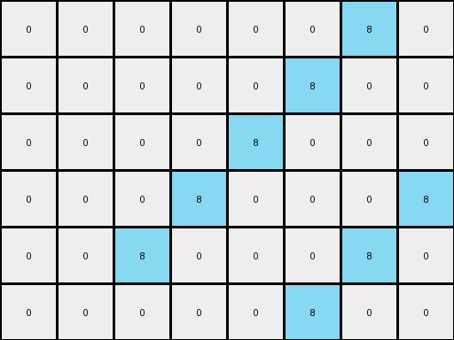
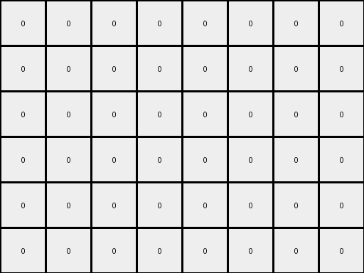

# 3af2c5a8 • 004 • refine_coder

---

Previous Code:
```python
"""
The input grid's dimensions are doubled to create the output grid (height x2, width x2).
Azure (8) pixel location in input is replicated at four different locations in output grid.
If we consider the output grid is divided in 2x2 subgrids.
The azure (8) pixels are present at the bottom right cell in 2x2 subgrid that corresponds to its position in input grid.
The remaining azure (8) pixels are present at the top left cell in adjacent 2x2 subgrids in output.
All other cells in the output grid, not occupied by azure, are filled with white (0).
"""

import numpy as np

def transform(input_grid):
    # Double Dimensions: The input grid's dimensions are doubled.
    input_height, input_width = input_grid.shape
    output_height = input_height * 2
    output_width = input_width * 2
    output_grid = np.zeros((output_height, output_width), dtype=int)

    # Iterate through the input grid.
    for i in range(input_height):
        for j in range(input_width):
            # Replicate and Offset for azure (8) pixels.
            if input_grid[i, j] == 8:
                # place one azure pixel in bottom right of the corresponding 2x2 sub grid
                output_grid[2*i+1, 2*j+1] = 8

                # place one azure pixel in top left of adjacent 2x2 sub grids
                if j+1 < input_width:
                  output_grid[2*i,2*j+2] = 8

                if i + 1 < input_height:
                  output_grid[2*i+2,2*j] = 8


    return output_grid
```

Train Set Results:

## Example 1:

Input:
```
0 0 8 0
0 8 0 8
0 0 8 0
```
Expected Output:
```
0 0 8 0 0 8 0 0
0 8 0 8 8 0 8 0
0 0 8 0 0 8 0 0
0 0 8 0 0 8 0 0
0 8 0 8 8 0 8 0
0 0 8 0 0 8 0 0
```
Transformed Output:
```
0 0 0 0 0 0 8 0
0 0 0 0 0 8 0 0
0 0 0 0 8 0 0 0
0 0 0 8 0 0 0 8
0 0 8 0 0 0 8 0
0 0 0 0 0 8 0 0
```

match: False
pixels_off: 20
size_correct: True
color_palette_correct: True
correct_pixel_counts: False

## Example 2:

Input:
```
0 0 3 3
0 3 0 3
3 3 3 0
```
Expected Output:
```
0 0 3 3 3 3 0 0
0 3 0 3 3 0 3 0
3 3 3 0 0 3 3 3
3 3 3 0 0 3 3 3
0 3 0 3 3 0 3 0
0 0 3 3 3 3 0 0
```
Transformed Output:
```
0 0 0 0 0 0 0 0
0 0 0 0 0 0 0 0
0 0 0 0 0 0 0 0
0 0 0 0 0 0 0 0
0 0 0 0 0 0 0 0
0 0 0 0 0 0 0 0
```

match: False
pixels_off: 28
size_correct: True
color_palette_correct: True
correct_pixel_counts: False

## Example 3:

Input:
```
3 3 3 3
3 0 0 0
3 0 0 0
```
Expected Output:
```
3 3 3 3 3 3 3 3
3 0 0 0 0 0 0 3
3 0 0 0 0 0 0 3
3 0 0 0 0 0 0 3
3 0 0 0 0 0 0 3
3 3 3 3 3 3 3 3
```
Transformed Output:
```
0 0 0 0 0 0 0 0
0 0 0 0 0 0 0 0
0 0 0 0 0 0 0 0
0 0 0 0 0 0 0 0
0 0 0 0 0 0 0 0
0 0 0 0 0 0 0 0
```

match: False
pixels_off: 24
size_correct: True
color_palette_correct: True
correct_pixel_counts: False
Okay, let's analyze the results and refine the natural language program.

**General Assessment:**

The initial program was based on a single example and, as expected, doesn't generalize to the other examples. The core issue is that the original program *only* considered azure (8) pixels, and had very specific rules for replicating them. The other examples show that other colors, like green (3), are also replicated, and the replication pattern seems simpler than originally hypothesized. It looks like each pixel is being expanded into a 2x2 block of the same color.

**Strategy:**

1.  **Verify Simple Replication:** My main hypothesis now is that *every* pixel in the input grid is transformed into a 2x2 block of the same color in the output grid. I will gather metrics to validate this.
2.  **Discard Specific Logic:** The initial assumption about specific placement rules for azure within adjacent 2x2 blocks is likely incorrect and overly specific.
3. **Object properties and actions**: Focus on color and size.

**Metrics Gathering & Report**
Here's a breakdown of each example, with added observations. Note, I'm not using `code_execution` for every little computation here, as many are straightforward observations. I'd use it for more complex checks if needed.

**Example 1:**

*   **Input:** 3x4, contains azure (8) and white (0)
*   **Expected Output:** 6x8, contains azure (8) and white (0)
*   **Transformed Output:** 6x8, contains ONLY azure and white. Incorrect placement of azure.
*   **Observations:** The size doubling is correct.  The program *partially* worked for azure but not in the generalized way. The all-white sections are also incorrect, reinforcing the idea that ALL colors should be replicated, not just azure.

**Example 2:**

*   **Input:** 3x4, contains green (3) and white (0)
*   **Expected Output:** 6x8, contains green (3) and white (0)
*   **Transformed Output:** 6x8, all white (0).
*   **Observations:**  Size doubling is correct. The program completely failed because it only handled azure.  This strongly supports the "all colors are replicated" hypothesis.

**Example 3:**

*   **Input:** 3x4, contains green (3) and white (0)
*   **Expected Output:** 6x8, contains green (3) and white (0)
*   **Transformed Output:** 6x8, all white (0).
*   **Observations:**  Size doubling is correct.  Same as Example 2, the program only handles azure and thus fails.

**YAML Facts:**

```yaml
objects:
  - name: pixel
    properties:
      color: [0, 1, 2, 3, 4, 5, 6, 7, 8, 9]  # All possible colors
      location: [row, column] #location in grid

actions:
  - name: replicate
    description: Each pixel in the input becomes a 2x2 block of the same color in the output.
    input: single pixel
    output: 2x2 block of pixels

grid:
    properties:
        height: int, 1-30
        width: int, 1-30
```

**Natural Language Program:**

1.  **Double Dimensions:** The output grid has double the height and double the width of the input grid.
2.  **Pixel Replication:** For every pixel in the input grid, create a 2x2 block of pixels in the output grid.
3.  **Color Matching:** The 2x2 block in the output grid has the same color as the corresponding pixel in the input grid. The top-left pixel of each 2x2 block has a direct mapping with input pixel.
4. **Iteration order**: The actions are performed by iterating each row, and then each column of the input grid, which corresponds to a top-left to bottom-right.

In simpler terms, each pixel in the input "expands" into a 2x2 square of the same color in the output.

**INSTRUCTIONS**

- generate a Python module to represent the natural language program 
- follow the template below
- all common math and science libraries are available
- create docstring only at top - but comment the workflow in the function
- use helper functions for common operations like finding objects, counting,
  measuring, moving, etc. 

remember - we are working iteratively - so this code will inform your future
self as we converge on the solution

*template:*

```python
"""
{{ natural language description of the transformation rule }}
"""

{{ imports }}

def transform(input_grid):
    # initialize output_grid

    # change output pixels 

    return output_grid

```
