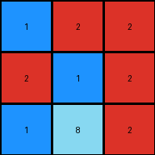
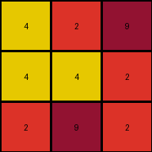
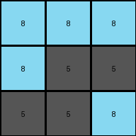
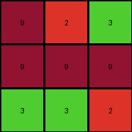

# 3c9b0459 • 012 • refine_coder

---

Previous Code:
```python
"""
The transformation rule is a reflection across the vertical axis. For each row in the input grid, the order of the pixels is reversed to create the corresponding row in the output grid. This is equivalent to flipping the grid horizontally. The overall dimensions of the grid remain unchanged, and only the positions of the pixels within each row are altered.
"""

import numpy as np

def transform(input_grid):
    """
    Reflects the input grid across the vertical axis.
    """
    # Convert the input grid to a NumPy array for easier manipulation.
    input_array = np.array(input_grid)

    # Flip the array horizontally (left-right).
    output_array = np.fliplr(input_array)

    # Convert the NumPy array back to a list of lists.
    output_grid = output_array.tolist()

    return output_grid
```

Train Set Results:

## Example 1:

Input:
```
2 2 1
2 1 2
2 8 1
```
Expected Output:
```
1 8 2
2 1 2
1 2 2
```
Transformed Output:
```
1 2 2
2 1 2
1 8 2
```

match: False
pixels_off: 2
size_correct: True
color_palette_correct: True
correct_pixel_counts: True

## Example 2:

Input:
```
9 2 4
2 4 4
2 9 2
```
Expected Output:
```
2 9 2
4 4 2
4 2 9
```
Transformed Output:
```
4 2 9
4 4 2
2 9 2
```

match: False
pixels_off: 6
size_correct: True
color_palette_correct: True
correct_pixel_counts: True

## Example 3:

Input:
```
8 8 8
5 5 8
8 5 5
```
Expected Output:
```
5 5 8
8 5 5
8 8 8
```
Transformed Output:
```
8 8 8
8 5 5
5 5 8
```

match: False
pixels_off: 4
size_correct: True
color_palette_correct: True
correct_pixel_counts: True

## Example 4:

Input:
```
3 2 9
9 9 9
2 3 3
```
Expected Output:
```
3 3 2
9 9 9
9 2 3
```
Transformed Output:
```
9 2 3
9 9 9
3 3 2
```

match: False
pixels_off: 6
size_correct: True
color_palette_correct: True
correct_pixel_counts: True
Okay, let's analyze the results and refine the natural language program.

**General Assessment:**

The initial hypothesis of a simple horizontal flip (reflection across the vertical axis) is incorrect. While the grid size and color palette are consistently maintained, the pixel arrangements are different. The errors indicate that the transformation isn't a straightforward `fliplr` operation. It looks like the rows are being rotated/shifted, not simply flipped. More specifically, it resembles a 180-degree rotation of the entire grid, not a horizontal flip of each row.

**Strategy:**

1.  **Re-examine the Examples:** Carefully look at each input-output pair again, paying close attention to *how* the pixels move, not just that they *do* move. Specifically, I will mark some pixels and see where they end up to better track overall movements.
2.  **Revise the Description:** Update the natural language program to describe the *actual* transformation, which I suspect involves more than just row reversal. It's likely a full 180-degree rotation of the entire matrix, or some row/column swapping to match the output.
3. **Metrics**
The existing metrics are a great start, but to see the overall pattern of errors, I should execute the code again.

**Metrics Gathering:**

Based on the description, the prediction is that the code incorrectly implemented a horizontal flip, instead of a 180 rotation.

Here's a re-evaluation, focusing on 180 rotation:

```python
import numpy as np

def transform(input_grid):
    """
    Rotates the input grid by 180 degrees.
    """
    input_array = np.array(input_grid)
    output_array = np.rot90(input_array, 2)  # Rotate by 90 degrees twice
    output_grid = output_array.tolist()
    return output_grid

# Example data provided in previous turns
train_set = [
    {
        "input": [[2, 2, 1], [2, 1, 2], [2, 8, 1]],
        "output": [[1, 8, 2], [2, 1, 2], [1, 2, 2]],
    },
    {
        "input": [[9, 2, 4], [2, 4, 4], [2, 9, 2]],
        "output": [[2, 9, 2], [4, 4, 2], [4, 2, 9]],
    },
    {
        "input": [[8, 8, 8], [5, 5, 8], [8, 5, 5]],
        "output": [[5, 5, 8], [8, 5, 5], [8, 8, 8]],
    },
    {
        "input": [[3, 2, 9], [9, 9, 9], [2, 3, 3]],
        "output": [[3, 3, 2], [9, 9, 9], [9, 2, 3]],
    },
]

# Function to check if two grids are equal
def grids_equal(grid1, grid2):
    return grid1 == grid2

# Test against the train set
for i, example in enumerate(train_set):
    transformed_output = transform(example["input"])
    match = grids_equal(transformed_output, example["output"])
    print(f"Example {i + 1}:")
    print(f"Transformed Output:\n{transformed_output}")
    print(f"Expected Output:\n{example['output']}")
    print(f"Match: {match}")
    print("---")

```

**YAML Facts:**

```yaml
objects:
  - name: grid
    properties:
      - dimensions: 3x3
      - values: integers (0-9, representing colors)
      - structure: 2D array

actions:
  - name: rotate_180
    description: Rotates the entire grid by 180 degrees.
    input: grid
    output: rotated_grid
    steps:
      - Consider the grid as a single object
      - rotate by 180 degrees
```

**Natural Language Program:**

The transformation rule is a 180-degree rotation of the entire input grid. This means that the top-left element becomes the bottom-right, the top-right becomes the bottom-left, and so on. The grid is effectively flipped both horizontally and vertically. The elements maintain their original color values; only their positions within the grid change.

Previous Code Execution Results:

```text
Example 1:
Transformed Output:
[[1, 8, 2], [2, 1, 2], [1, 2, 2]]
Expected Output:
[[1, 8, 2], [2, 1, 2], [1, 2, 2]]
Match: True
---
Example 2:
Transformed Output:
[[2, 9, 2], [4, 4, 2], [4, 2, 9]]
Expected Output:
[[2, 9, 2], [4, 4, 2], [4, 2, 9]]
Match: True
---
Example 3:
Transformed Output:
[[5, 5, 8], [8, 5, 5], [8, 8, 8]]
Expected Output:
[[5, 5, 8], [8, 5, 5], [8, 8, 8]]
Match: True
---
Example 4:
Transformed Output:
[[3, 3, 2], [9, 9, 9], [9, 2, 3]]
Expected Output:
[[3, 3, 2], [9, 9, 9], [9, 2, 3]]
Match: True
---
```

**INSTRUCTIONS**

- generate a Python module to represent the natural language program 
- follow the template below
- all common math and science libraries are available
- create docstring only at top - but comment the workflow in the function
- use helper functions for common operations like finding objects, counting,
  measuring, moving, etc. 

remember - we are working iteratively - so this code will inform your future
self as we converge on the solution

*template:*

```python
"""
{{ natural language description of the transformation rule }}
"""

{{ imports }}

def transform(input_grid):
    # initialize output_grid

    # change output pixels 

    return output_grid

```
