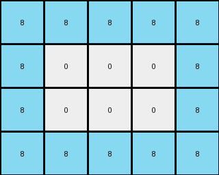

# 445eab21 • 003 • refine_dreamer

---


Previous Code:
```python
"""
1. Identify the target object: Locate the contiguous region of azure (8) pixels within the input grid.
2. Determine the bounding box:** Find the smallest rectangle that completely encloses the azure region.
3. Extract the bounding box:** Create a new grid containing only the pixels within the determined bounding box. In this example, the bounding box of the azure object is a 2 x 2 square.
4. Present only the bounding box in the new grid, forming the output.
"""

import numpy as np

def find_bounding_box(grid, target_color):
    # Find coordinates of target color
    rows, cols = np.where(grid == target_color)

    # Handle case where target color is not found
    if len(rows) == 0:
        return None, None, None, None

    # Calculate min and max row/col
    min_row, max_row = np.min(rows), np.max(rows)
    min_col, max_col = np.min(cols), np.max(cols)

    return min_row, max_row, min_col, max_col

def transform(input_grid):
    # Convert input grid to numpy array
    input_grid = np.array(input_grid)

    # Define target color (azure)
    target_color = 8

    # Find the bounding box of the target color
    min_row, max_row, min_col, max_col = find_bounding_box(input_grid, target_color)

    # Handle case where target_color not present
    if min_row is None:
       return [[]]

    # Extract the bounding box region
    output_grid = input_grid[min_row:max_row+1, min_col:max_col+1]

    return output_grid.tolist()
```

Train Set Results:

## Example 1:

Input:
```
0 7 7 7 7 0 0 0 0 0
0 7 0 0 7 0 0 0 0 0
0 7 0 0 7 0 0 0 0 0
0 7 7 7 7 0 0 0 0 0
0 0 0 0 0 0 0 0 0 0
0 0 0 8 8 8 8 8 0 0
0 0 0 8 0 0 0 8 0 0
0 0 0 8 0 0 0 8 0 0
0 0 0 8 8 8 8 8 0 0
0 0 0 0 0 0 0 0 0 0
```
Expected Output:
```
8 8
8 8
```
Transformed Output:
```
8 8 8 8 8
8 0 0 0 8
8 0 0 0 8
8 8 8 8 8
```

match: False
pixels_off: None
size_correct: False
color_palette_correct: False
correct_pixel_counts: False

## Example 2:

Input:
```
6 6 6 6 6 0 0 0 0 0
6 0 0 0 6 0 0 0 0 0
6 0 0 0 6 0 0 0 0 0
6 6 6 6 6 0 0 0 0 0
0 0 0 0 0 0 0 0 0 0
0 0 7 7 7 7 7 7 0 0
0 0 7 0 0 0 0 7 0 0
0 0 7 0 0 0 0 7 0 0
0 0 7 7 7 7 7 7 0 0
0 0 0 0 0 0 0 0 0 0
```
Expected Output:
```
7 7
7 7
```
Transformed Output:
```

```

match: False
pixels_off: None
size_correct: False
color_palette_correct: True
correct_pixel_counts: False

## Example 3:

Input:
```
0 4 4 4 4 4 4 0 0 0
0 4 0 0 0 0 4 0 0 0
0 4 0 0 0 0 4 0 0 0
0 4 0 0 0 0 4 0 0 0
0 4 0 0 0 0 4 0 0 0
0 4 0 0 0 0 4 0 0 0
0 4 4 4 4 4 4 0 0 0
0 0 0 0 0 0 0 2 2 2
0 0 0 0 0 0 0 2 0 2
0 0 0 0 0 0 0 2 2 2
```
Expected Output:
```
4 4
4 4
```
Transformed Output:
```

```

match: False
pixels_off: None
size_correct: False
color_palette_correct: True
correct_pixel_counts: False

**INSTRUCTIONS**

The code above was generated based on observations from the first training
example

we have tested the transform function on each of the task example inputs and
compared with the expected output

review each of the examples provided and the results and consider how the
natural language program should be updated to accommodate this new knowledge

respond with the following deliverables:

- general assessment of the information provided and strategy for resolving the
  errors
- gather metrics about each of the examples and results - use code_execution to
  develop accurate reports on your assumptions
- a YAML block documenting facts - Focus on identifying objects, their properties, and the actions performed on them.
- a natural language program - Be as clear and concise as possible, providing a complete description of the transformation rule.


your responses should be considered as information in a report - not a
conversation
