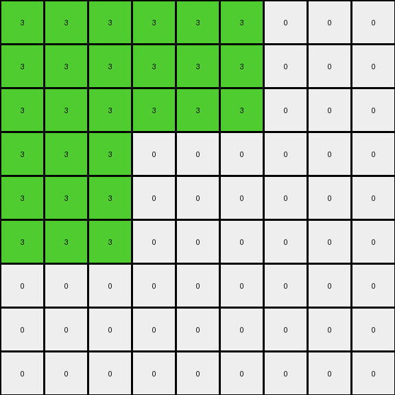

# 4522001f • 004 • refine_coder

---

Previous Code:
```python
"""
The transformation expands the input grid by a factor of 3 in both dimensions. 
It replicates the shape formed by adjacent green (3) pixels in the input to the output, 
with coordinate of the object multiplied by 3.
Other pixels in output is filled by white (0) color.
"""

import numpy as np

def expand_shape(input_grid):
    """
    Identifies the shape formed by adjacent green pixels and its coordinates.
    """
    green_pixels = []
    rows, cols = input_grid.shape
    for r in range(rows):
        for c in range(cols):
            if input_grid[r, c] == 3:
                green_pixels.append((r, c))

    return green_pixels

def transform(input_grid):
    # initialize output_grid
    input_rows, input_cols = input_grid.shape
    output_rows, output_cols = input_rows * 3, input_cols * 3
    output_grid = np.zeros((output_rows, output_cols), dtype=int)

    # Find the green shape
    green_pixels = expand_shape(input_grid)

    # Replicate the green shape in the output grid, scaled by 3.
    for r, c in green_pixels:
        for i in range(3):
            for j in range(3):
                output_grid[r*3 + i, c*3 + j] = 3

    return output_grid
```

Train Set Results:

## Example 1:

Input:
```
3 3 0
3 2 0
0 0 0
```
Expected Output:
```
3 3 3 3 0 0 0 0 0
3 3 3 3 0 0 0 0 0
3 3 3 3 0 0 0 0 0
3 3 3 3 0 0 0 0 0
0 0 0 0 3 3 3 3 0
0 0 0 0 3 3 3 3 0
0 0 0 0 3 3 3 3 0
0 0 0 0 3 3 3 3 0
0 0 0 0 0 0 0 0 0
```
Transformed Output:
```
3 3 3 3 3 3 0 0 0
3 3 3 3 3 3 0 0 0
3 3 3 3 3 3 0 0 0
3 3 3 0 0 0 0 0 0
3 3 3 0 0 0 0 0 0
3 3 3 0 0 0 0 0 0
0 0 0 0 0 0 0 0 0
0 0 0 0 0 0 0 0 0
0 0 0 0 0 0 0 0 0
```

match: False
pixels_off: 29
size_correct: True
color_palette_correct: True
correct_pixel_counts: False

## Example 2:

Input:
```
0 0 0
0 2 3
0 3 3
```
Expected Output:
```
0 0 0 0 0 0 0 0 0
0 3 3 3 3 0 0 0 0
0 3 3 3 3 0 0 0 0
0 3 3 3 3 0 0 0 0
0 3 3 3 3 0 0 0 0
0 0 0 0 0 3 3 3 3
0 0 0 0 0 3 3 3 3
0 0 0 0 0 3 3 3 3
0 0 0 0 0 3 3 3 3
```
Transformed Output:
```
0 0 0 0 0 0 0 0 0
0 0 0 0 0 0 0 0 0
0 0 0 0 0 0 0 0 0
0 0 0 0 0 0 3 3 3
0 0 0 0 0 0 3 3 3
0 0 0 0 0 0 3 3 3
0 0 0 3 3 3 3 3 3
0 0 0 3 3 3 3 3 3
0 0 0 3 3 3 3 3 3
```

match: False
pixels_off: 29
size_correct: True
color_palette_correct: True
correct_pixel_counts: False
Okay, let's analyze the results and refine the natural language program.

**General Assessment:**

The initial code was based on the assumption that only green (3) pixels form the shape to be expanded. The results from the training examples show this is incorrect. The shape expansion isn't limited to green pixels, and the positioning of the expanded shape is also off, and includes a pixel from the input that is near, but not adjacent to other pixels in the shape. It seems the code is expanding *all* green pixels by a factor of 3, not just the connected shapes and is missing the correct placement based on object.

The strategy will be to:

1.  Identify the connected components (objects) in the input grid, regardless of color, with the exception of the background color (0).
2.  Determine a consistent rule for positioning the expanded shape within output. The previous logic of multiplying the original coordinates by 3 doesn't produce expected results, it expands each individual pixel by a scale factor of 3 and produces disconnected expanded shapes, we want to expand the object, as a whole, by a factor of 3.
3. Focus on identifying a bounding box and treat it as a unit.

**Metrics and Observations:**

Here's a breakdown of each example:

*   **Example 1:**
    *   Input Shape: A 2x2 "L" shape formed by green (3) pixels, plus a single red pixel.
    *   Expected Output: The "L" shape is expanded by a factor of 3, and the red pixel is not present.
    *   Actual Output: All green pixels are individually expanded, but not scaled correctly. The positioning is incorrect, and red pixel is missing.
    *   Issues: Incorrect object identification (treats individual pixels as objects instead of the connected component), incorrect scaling (expands each pixel), and incorrect shape expansion.

*   **Example 2:**
    *   Input Shape: An "L" shape formed by green (3) pixels, with an adjacent single red pixel.
    *   Expected Output: The "L" shape is expanded, and the red pixel is not present.
    *   Actual Output: Similar to example 1, all green pixels are expanded by a factor of 3, but the positioning is not correct and the red pixel is missing.
    *   Issues: Same as Example 1.

**YAML Fact Block:**

```yaml
objects:
  - id: 1
    type: connected_component
    color: [2, 3] # color can vary
    description: "An 'L' shaped object, pixels are adjacent"
transformation:
  type: expansion
  factor: 3
  description: "The connected object expands by a factor of 3 in both dimensions."
  notes: >
    "Pixels not part of the 'L' shape are not in output."
```

**Natural Language Program:**

1.  **Identify Objects:** Find all connected components (objects) in the input grid. A connected component is a group of adjacent pixels of the same color (excluding the background color 0). In these examples, the 'L' shaped object.
2.  **Bounding Box:** Determine the bounding box that encompasses the connected object.
3.  **Expansion:** Create a new grid that is 3x the size of the input grid's dimensions.
4.  **Object Replication:** For each identified, scale the objects bounding box by the factor, filling the expanded area, preserving relative positioning. All empty pixels become white.
5. **Ignore other colors:** Pixels in input that are not part of identified objects are not in output.

Revised Description for future coder:

The transformation identifies connected shapes in the input grid and expand the shape formed by this connected set of same color pixels. Each identified shape is expanded by a factor of 3. Pixels in the input that are not part of these identified objects are not included in the output. The output grid dimensions are 3x the input grid. The expanded shape in the output is positioned by scaling the original bounding box by a factor of three.

**INSTRUCTIONS**

- generate a Python module to represent the natural language program 
- follow the template below
- all common math and science libraries are available
- create docstring only at top - but comment the workflow in the function
- use helper functions for common operations like finding objects, counting,
  measuring, moving, etc. 

remember - we are working iteratively - so this code will inform your future
self as we converge on the solution

*template:*

```python
"""
{{ natural language description of the transformation rule }}
"""

{{ imports }}

def transform(input_grid):
    # initialize output_grid

    # change output pixels 

    return output_grid

```
