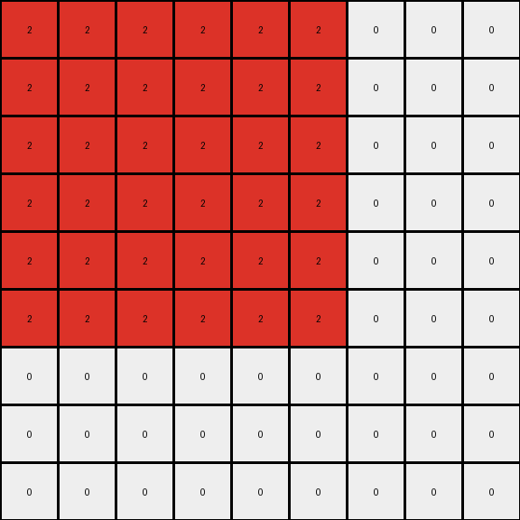

# 4522001f • 005 • refine_dreamer

---

Previous Code:
```python
"""
The transformation identifies connected shapes in the input grid and expand the shape formed by this connected set of same color pixels. Each identified shape is expanded by a factor of 3. Pixels in the input that are not part of these identified objects are not included in the output. The output grid dimensions are 3x the input grid. The expanded shape in the output is positioned by scaling the original bounding box by a factor of three.
"""

import numpy as np
from scipy.ndimage import label, measurements

def get_objects(input_grid):
    """
    Identifies connected components (objects) in the input grid, excluding the background (0).
    Returns a list of bounding boxes for each object.
    """
    labeled_grid, num_objects = label(input_grid != 0)
    bounding_boxes = []
    for i in range(1, num_objects + 1):  # Iterate through object labels (1, 2, ...)
      # create mask for current object
      object_mask = (labeled_grid == i)
      # extract color of this object
      object_color = np.unique(input_grid[object_mask])[0]
      
      # only process if object is not background color
      if object_color != 0:
        # find where object is in input_grid
        coords = np.where(object_mask)
        min_row, min_col = np.min(coords, axis=1)
        max_row, max_col = np.max(coords, axis=1)
        
        bounding_boxes.append(((min_row, min_col), (max_row, max_col), object_color))
    return bounding_boxes

def transform(input_grid):
    # initialize output_grid
    input_rows, input_cols = input_grid.shape
    output_rows, output_cols = input_rows * 3, input_cols * 3
    output_grid = np.zeros((output_rows, output_cols), dtype=int)

    # Find the objects
    objects = get_objects(input_grid)

    # Expand each object by a factor of 3 based on its bounding box.
    for (min_row, min_col), (max_row, max_col), color in objects:

        # scale bounding box of object by factor
        for r in range(min_row * 3, (max_row + 1) * 3):
          for c in range(min_col * 3, (max_col + 1) * 3):
            output_grid[r,c] = color

    return output_grid
```

Train Set Results:

## Example 1:

Input:
```
3 3 0
3 2 0
0 0 0
```
Expected Output:
```
3 3 3 3 0 0 0 0 0
3 3 3 3 0 0 0 0 0
3 3 3 3 0 0 0 0 0
3 3 3 3 0 0 0 0 0
0 0 0 0 3 3 3 3 0
0 0 0 0 3 3 3 3 0
0 0 0 0 3 3 3 3 0
0 0 0 0 3 3 3 3 0
0 0 0 0 0 0 0 0 0
```
Transformed Output:
```
2 2 2 2 2 2 0 0 0
2 2 2 2 2 2 0 0 0
2 2 2 2 2 2 0 0 0
2 2 2 2 2 2 0 0 0
2 2 2 2 2 2 0 0 0
2 2 2 2 2 2 0 0 0
0 0 0 0 0 0 0 0 0
0 0 0 0 0 0 0 0 0
0 0 0 0 0 0 0 0 0
```

match: False
pixels_off: 48
size_correct: True
color_palette_correct: False
correct_pixel_counts: False

## Example 2:

Input:
```
0 0 0
0 2 3
0 3 3
```
Expected Output:
```
0 0 0 0 0 0 0 0 0
0 3 3 3 3 0 0 0 0
0 3 3 3 3 0 0 0 0
0 3 3 3 3 0 0 0 0
0 3 3 3 3 0 0 0 0
0 0 0 0 0 3 3 3 3
0 0 0 0 0 3 3 3 3
0 0 0 0 0 3 3 3 3
0 0 0 0 0 3 3 3 3
```
Transformed Output:
```
0 0 0 0 0 0 0 0 0
0 0 0 0 0 0 0 0 0
0 0 0 0 0 0 0 0 0
0 0 0 2 2 2 2 2 2
0 0 0 2 2 2 2 2 2
0 0 0 2 2 2 2 2 2
0 0 0 2 2 2 2 2 2
0 0 0 2 2 2 2 2 2
0 0 0 2 2 2 2 2 2
```

match: False
pixels_off: 48
size_correct: True
color_palette_correct: False
correct_pixel_counts: False
**INSTRUCTIONS**

The code above was generated based on observations from the first training
example

we have tested the transform function on each of the task example inputs and
compared with the expected output

review each of the examples provided and the results and consider how the
natural language program should be updated to accommodate this new knowledge

respond with the following deliverables:

- general assessment of the information provided and strategy for resolving the
  errors
- gather metrics about each of the examples and results - use code_execution to
  develop accurate reports on your assumptions
- a YAML block documenting facts - Focus on identifying objects, their properties, and the actions performed on them.
- a natural language program - Be as clear and concise as possible, providing a complete description of the transformation rule.


your responses should be considered as information in a report - not a
conversation
