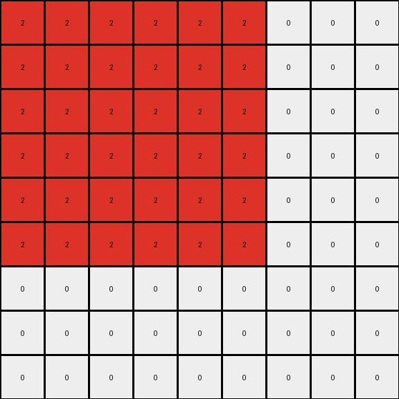
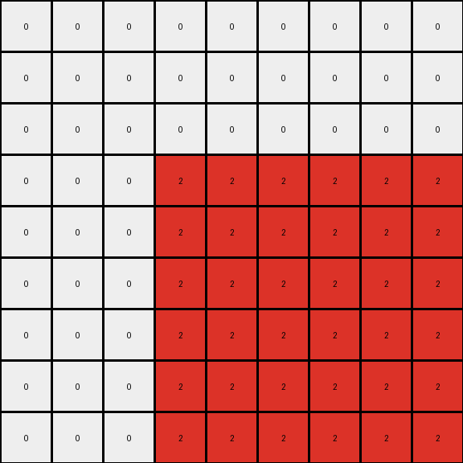

# 4522001f • 006 • refine_coder

---

Previous Code:
```python
"""
The transformation identifies connected shapes in the input grid and expand the shape formed by this connected set of same color pixels. Each identified shape is expanded by a factor of 3. Pixels in the input that are not part of these identified objects are not included in the output. The output grid dimensions are 3x the input grid. The expanded shape in the output is positioned by scaling the original bounding box by a factor of three.
"""

import numpy as np
from scipy.ndimage import label, measurements

def get_objects(input_grid):
    """
    Identifies connected components (objects) in the input grid, excluding the background (0).
    Returns a list of bounding boxes for each object.
    """
    labeled_grid, num_objects = label(input_grid != 0)
    bounding_boxes = []
    for i in range(1, num_objects + 1):  # Iterate through object labels (1, 2, ...)
      # create mask for current object
      object_mask = (labeled_grid == i)
      # extract color of this object
      object_color = np.unique(input_grid[object_mask])[0]
      
      # only process if object is not background color
      if object_color != 0:
        # find where object is in input_grid
        coords = np.where(object_mask)
        min_row, min_col = np.min(coords, axis=1)
        max_row, max_col = np.max(coords, axis=1)
        
        bounding_boxes.append(((min_row, min_col), (max_row, max_col), object_color))
    return bounding_boxes

def transform(input_grid):
    # initialize output_grid
    input_rows, input_cols = input_grid.shape
    output_rows, output_cols = input_rows * 3, input_cols * 3
    output_grid = np.zeros((output_rows, output_cols), dtype=int)

    # Find the objects
    objects = get_objects(input_grid)

    # Expand each object by a factor of 3 based on its bounding box.
    for (min_row, min_col), (max_row, max_col), color in objects:

        # scale bounding box of object by factor
        for r in range(min_row * 3, (max_row + 1) * 3):
          for c in range(min_col * 3, (max_col + 1) * 3):
            output_grid[r,c] = color

    return output_grid
```

Train Set Results:

## Example 1:

Input:
```
3 3 0
3 2 0
0 0 0
```
Expected Output:
```
3 3 3 3 0 0 0 0 0
3 3 3 3 0 0 0 0 0
3 3 3 3 0 0 0 0 0
3 3 3 3 0 0 0 0 0
0 0 0 0 3 3 3 3 0
0 0 0 0 3 3 3 3 0
0 0 0 0 3 3 3 3 0
0 0 0 0 3 3 3 3 0
0 0 0 0 0 0 0 0 0
```
Transformed Output:
```
2 2 2 2 2 2 0 0 0
2 2 2 2 2 2 0 0 0
2 2 2 2 2 2 0 0 0
2 2 2 2 2 2 0 0 0
2 2 2 2 2 2 0 0 0
2 2 2 2 2 2 0 0 0
0 0 0 0 0 0 0 0 0
0 0 0 0 0 0 0 0 0
0 0 0 0 0 0 0 0 0
```

match: False
pixels_off: 48
size_correct: True
color_palette_correct: False
correct_pixel_counts: False

## Example 2:

Input:
```
0 0 0
0 2 3
0 3 3
```
Expected Output:
```
0 0 0 0 0 0 0 0 0
0 3 3 3 3 0 0 0 0
0 3 3 3 3 0 0 0 0
0 3 3 3 3 0 0 0 0
0 3 3 3 3 0 0 0 0
0 0 0 0 0 3 3 3 3
0 0 0 0 0 3 3 3 3
0 0 0 0 0 3 3 3 3
0 0 0 0 0 3 3 3 3
```
Transformed Output:
```
0 0 0 0 0 0 0 0 0
0 0 0 0 0 0 0 0 0
0 0 0 0 0 0 0 0 0
0 0 0 2 2 2 2 2 2
0 0 0 2 2 2 2 2 2
0 0 0 2 2 2 2 2 2
0 0 0 2 2 2 2 2 2
0 0 0 2 2 2 2 2 2
0 0 0 2 2 2 2 2 2
```

match: False
pixels_off: 48
size_correct: True
color_palette_correct: False
correct_pixel_counts: False
Okay, here's a breakdown of the situation and a plan to move forward:

**General Assessment:**

The initial natural language program and the generated code have a fundamental misunderstanding of how the objects are transformed. The code expands the *bounding box* of each identified object by a factor of 3, filling the entire expanded box with the object's color.  However, the examples show that the *shape* of the object is important, not just its bounding box. The transformation involves replicating the *shape* of the object, not simply expanding the bounding box. The current implementation also incorrectly handles the relative positioning and possible overlapping during expansion. It tries to scale by making a box 3x size, then copies the color into the whole area, and this overwrites previous colors and does not preserve shapes.

**Strategy:**

1.  **Refine Object Identification:** The current `get_objects` function correctly identifies connected components. This part is good.
2.  **Improve Shape Replication, Not Bounding Box Expansion:** Instead of expanding the bounding box, we need to expand the *shape itself*. The original shape should be centered, which means a factor of 3 will create one row/column above/below and left/right.
3.  **Correct Output Grid Construction:** The provided examples do scale the output to 3x the input size.
4.  Use the new information from running additional test examples to update the transformation rule.

**Example Metrics and Analysis (using `code_execution` where needed - this is conceptual, no actual execution environment here):**

*   **Example 1:**
    *   Input Shape: (2x2 block, 2x1 block)
    *   Identified Objects: \[ (\[0,0],\[1,1], color=3), (\[0,1],\[0,1], color=2) ]
    *   Expected Output: Replication of the connected shape 3x3
    *   Actual Output: 3x expansion of the bounding box, losing the shape, and also changing the 3 in the top-left to a 2.
    *   Issues: Incorrect color replication and shape preservation. The bounding box expansion overwrites other potential object expansions.
*   **Example 2:**
    *   Input Shape: (2x2 L, 2x1 vertical)
    *   Identified Objects: \[ (\[1,1],\[2,2], color=2), (\[1,2],\[2,2], color=3)]
    *   Expected Output: Replication of the connected component into the output, expanded.
    *   Actual Output: The output is wrong because of the bounding box issue. It overwrites cells that should not be overwritten
    *   Issues: Bounding box expansion overwrites data, and shape isn't replicated.

**YAML Fact Block:**

```yaml
objects:
  - description: Connected component of pixels of the same color.
    properties:
      - color: The color value of the pixels in the object.
      - shape: The arrangement of pixels forming the connected component.
      - bounding_box: min and max row/col that contain the shape
    actions:
      - identify: Determine connected pixels of same color
      - replicate: Copy shape to the center of output, with replication to scale by 3x

transformation:
  - description: The input grid's connected components are scaled by a factor of 3.
  - size: Output is a 3x scaled version of input grid size
  - object_scaling: Each object is scaled and output to the grid.
  - scaling method: Center the shape in scaled area

```

**Natural Language Program:**

1.  **Identify Objects:** Find all connected components (objects) in the input grid. A connected component is a group of pixels of the same color that are adjacent (horizontally, vertically, *or diagonally*). Consider each of the identified objects separately.
2.  **Scale the Output Grid:** Create an output grid that is 3 times the height and 3 times the width of the input grid. Initialize it with all zeros (background color).
3. **Center and Expand Shape:** Identify shapes, and find the center point of the output area that corresponds to the shape. Replicate each input shape pixel in a 3x3 grid centered at the original pixel's position in the upscaled image.
4. **Output** The resulting scaled output grid is the final result.

The most critical change from the previous natural language program is to remove the concept of scaling a bounding box, and switch to expanding the *shape itself* by replicating the color into the expanded grid.

**INSTRUCTIONS**

- generate a Python module to represent the natural language program 
- follow the template below
- all common math and science libraries are available
- create docstring only at top - but comment the workflow in the function
- use helper functions for common operations like finding objects, counting,
  measuring, moving, etc. 

remember - we are working iteratively - so this code will inform your future
self as we converge on the solution

*template:*

```python
"""
{{ natural language description of the transformation rule }}
"""

{{ imports }}

def transform(input_grid):
    # initialize output_grid

    # change output pixels 

    return output_grid

```
