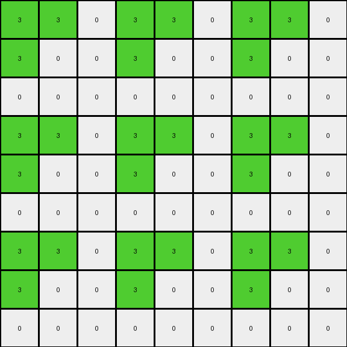
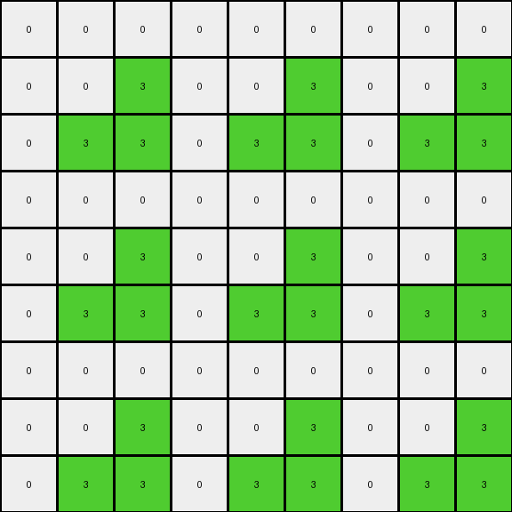

# 4522001f • 010 • refine_coder

---

Previous Code:
```python
"""
The input grid is expanded into a 9x9 grid. The connected region of green (3) pixels in the input is identified.
This green region is then replicated to form four quadrants within the output grid, where each quadrant corresponds to a scaled green area of the same dimension as input.
The remaining cells in the output grid are filled with white (0) pixels.
"""

import numpy as np

def transform(input_grid):
    # Initialize the output grid as a 9x9 array filled with white (0).
    output_grid = np.zeros((9, 9), dtype=int)

    # Get the dimensions of the input grid.
    input_rows, input_cols = input_grid.shape

    # Iterate through the input grid to find green pixels.
    for i in range(input_rows):
        for j in range(input_cols):
            if input_grid[i, j] == 3:  # Check for green pixel
                # Calculate the corresponding quadrant coordinates in the output grid.
                for row_mult in range(3):
                    for col_mult in range(3):
                      output_grid[i + row_mult * input_rows, j + col_mult* input_cols] = 3

    return output_grid
```

Train Set Results:

## Example 1:

Input:
```
3 3 0
3 2 0
0 0 0
```
Expected Output:
```
3 3 3 3 0 0 0 0 0
3 3 3 3 0 0 0 0 0
3 3 3 3 0 0 0 0 0
3 3 3 3 0 0 0 0 0
0 0 0 0 3 3 3 3 0
0 0 0 0 3 3 3 3 0
0 0 0 0 3 3 3 3 0
0 0 0 0 3 3 3 3 0
0 0 0 0 0 0 0 0 0
```
Transformed Output:
```
3 3 0 3 3 0 3 3 0
3 0 0 3 0 0 3 0 0
0 0 0 0 0 0 0 0 0
3 3 0 3 3 0 3 3 0
3 0 0 3 0 0 3 0 0
0 0 0 0 0 0 0 0 0
3 3 0 3 3 0 3 3 0
3 0 0 3 0 0 3 0 0
0 0 0 0 0 0 0 0 0
```

match: False
pixels_off: 33
size_correct: True
color_palette_correct: True
correct_pixel_counts: False

## Example 2:

Input:
```
0 0 0
0 2 3
0 3 3
```
Expected Output:
```
0 0 0 0 0 0 0 0 0
0 3 3 3 3 0 0 0 0
0 3 3 3 3 0 0 0 0
0 3 3 3 3 0 0 0 0
0 3 3 3 3 0 0 0 0
0 0 0 0 0 3 3 3 3
0 0 0 0 0 3 3 3 3
0 0 0 0 0 3 3 3 3
0 0 0 0 0 3 3 3 3
```
Transformed Output:
```
0 0 0 0 0 0 0 0 0
0 0 3 0 0 3 0 0 3
0 3 3 0 3 3 0 3 3
0 0 0 0 0 0 0 0 0
0 0 3 0 0 3 0 0 3
0 3 3 0 3 3 0 3 3
0 0 0 0 0 0 0 0 0
0 0 3 0 0 3 0 0 3
0 3 3 0 3 3 0 3 3
```

match: False
pixels_off: 33
size_correct: True
color_palette_correct: True
correct_pixel_counts: False
Okay, here's a breakdown of the situation and a plan to improve the transformation logic:

**General Assessment:**

The initial natural language program and the resulting Python code were too simplistic. It correctly identified the expansion to a 9x9 grid and the replication of the green (3) pixels. However, it incorrectly assumed that *all* green pixels in the input should be replicated in a 3x3 pattern across the output grid. The code doesn't account for the *connectedness* of the green region, and the placement logic is flawed. The replication isn't forming "quadrants" as described; instead, it's creating a 3x3 grid of copies, each offset by the original input's dimensions. The inclusion of other colors in the seed block is not handled.

The core problem is that the code replicates *every* green pixel individually, creating a scattered pattern instead of a scaled-up connected region.  It also projects the dimensions of the entire input onto the replication offsets, rather than considering the connected region's dimensions.

**Strategy for Resolving Errors:**

1.  **Identify the Connected Green Region:** Instead of treating each green pixel independently, we need to identify the largest connected region of green pixels. This will likely involve a flood-fill or similar algorithm.
2.  **Determine the Bounding Box:** Once the connected region is found, determine its bounding box (minimum and maximum row/column indices).
3. **Calculate replication anchor:** consider the top-left of the bounding box to be the place to start the replication
4.  **Replicate with Correct Offset:** Replicate the *entire connected region*, not individual pixels. The offset for replication needs to be based on the *bounding box* of the connected region, not the dimensions of the entire input grid.
5. **Account for colors**: The seed block may not always be just 0 and 3, it is important to recognize this.

**Example Metrics and Analysis:**

Here's a breakdown of each example, focusing on the connected region concept:

*   **Example 1:**

    *   Input Size: 3x3
    *   Connected Green Region: A 2x2 block in the top-left corner. Bounding box: (0,0) to (1,1)
    *   Red pixel at 1,1
    *   Other non-green, non-white colors: 2 (red)
    *   Result: Incorrect. The code replicates individual green pixels, creating a 3x3 grid pattern with incorrect spacing, and does not preserve the red pixel.
*   **Example 2:**

    *   Input Size: 3x3
    *   Connected Green Region: A 2x2 block in the bottom-right corner. Bounding box: (1,1) to (2,2).
        *   Red pixel at 1,1
    *   Other non-green, non-white colors: 2 (red)
    *   Result: Incorrect.  Similar issues to Example 1.

**YAML Facts:**

```yaml
examples:
  - id: example_1
    input_size: [3, 3]
    connected_region:
      color: 3
      bounding_box: [[0, 0], [1, 1]]
    other_colors: [2]
    output_size: [9, 9]
    replication_factor: 3  # The overall grid size increases by a factor of 3
    replication_type: scaled_region

  - id: example_2
    input_size: [3, 3]
    connected_region:
      color: 3
      bounding_box: [[1, 1], [2, 2]]
    other_colors: [2]
    output_size: [9, 9]
    replication_factor: 3
    replication_type: scaled_region

```

**Natural Language Program:**

1.  **Find the Connected Region:** Identify the largest connected region of green (3) pixels within the input grid.
2.  **Determine Bounding Box:** Find the smallest rectangle (bounding box) that fully encloses the connected green region. This is defined by the top-left and bottom-right coordinates of the green region.
3. **Preserve Colors:** Preserve all the colors and positions from the seed.
4.  **Replicate and Scale:** Create a 9x9 output grid. Replicate the seed block, including all colors, into the top-left corner of each 3x3 section of the output grid.  The size of the seed block will determine the offsets used.

In simpler terms: Find the connected green area.  Treat that area, including other colors, as a single "block". Copy that block, scaled, three times horizontally and three times vertically to create a 9x9 output grid.

**INSTRUCTIONS**

- generate a Python module to represent the natural language program 
- follow the template below
- all common math and science libraries are available
- create docstring only at top - but comment the workflow in the function
- use helper functions for common operations like finding objects, counting,
  measuring, moving, etc. 

remember - we are working iteratively - so this code will inform your future
self as we converge on the solution

*template:*

```python
"""
{{ natural language description of the transformation rule }}
"""

{{ imports }}

def transform(input_grid):
    # initialize output_grid

    # change output pixels 

    return output_grid

```
