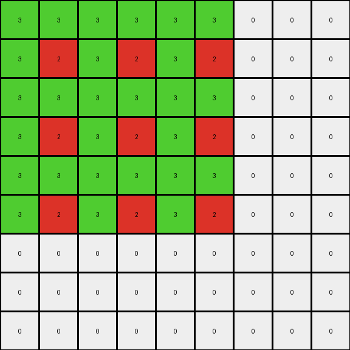
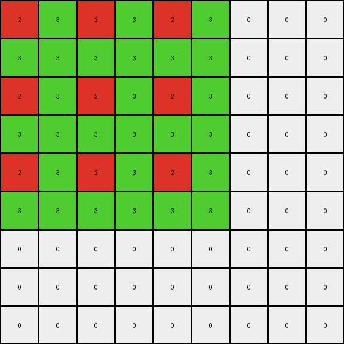

# 4522001f • 011 • refine_dreamer

---

Previous Code:
```python
"""
1. Find the Connected Region: Identify the largest connected region of green (3) pixels within the input grid.
2. Determine Bounding Box: Find the smallest rectangle (bounding box) that fully encloses the connected green region.  This is defined by the top-left and bottom-right coordinates of the green region.
3. Preserve Colors: Preserve all the colors and positions from the seed.
4. Replicate and Scale: Create a 9x9 output grid.  Replicate the seed block, including all colors, into the top-left corner of each 3x3 section of the output grid. The size of the seed block will determine the offsets used.

In simpler terms: Find the connected green area. Treat that area, including other colors, as a single "block". Copy that block, scaled, three times horizontally and three times vertically to create a 9x9 output grid.
"""

import numpy as np

def find_connected_region(grid, start_row, start_col, color):
    """
    Finds a connected region of a given color using a flood-fill approach.

    Args:
        grid: The input grid (numpy array).
        start_row: Starting row index.
        start_col: Starting column index.
        color: The color to search for.

    Returns:
        A set of (row, col) tuples representing the connected region.
    """
    rows, cols = grid.shape
    visited = set()
    to_visit = [(start_row, start_col)]

    while to_visit:
        row, col = to_visit.pop()
        if (row, col) in visited:
            continue
        if 0 <= row < rows and 0 <= col < cols and grid[row, col] == color:
            visited.add((row, col))
            to_visit.extend([
                (row + 1, col),
                (row - 1, col),
                (row, col + 1),
                (row, col - 1),
            ])
    return visited

def find_bounding_box(region):
    """
    Finds the bounding box of a set of points.

    Args:
        region: A set of (row, col) tuples.

    Returns:
        A tuple ((min_row, min_col), (max_row, max_col)).
    """
    if not region:
        return None  # Handle empty region case

    min_row = min(r for r, _ in region)
    min_col = min(c for _, c in region)
    max_row = max(r for r, _ in region)
    max_col = max(c for _, c in region)
    return (min_row, min_col), (max_row, max_col)

def transform(input_grid):
    """
    Transforms the input grid according to the described rules.
    """
    # 1. & 2. Find the Connected Region and its Bounding Box
    rows, cols = input_grid.shape
    green_region = set()
    
    # optimization to find largest connected region - start with all green
    # pixels and union if necessary
    for r in range(rows):
        for c in range(cols):
            if input_grid[r, c] == 3:
                connected_region = find_connected_region(input_grid, r, c, 3)
                if len(connected_region) > len(green_region):
                    green_region = connected_region
    
    if not green_region: # Handle cases with no green pixels
        return np.zeros((9, 9), dtype=int)
        

    (min_row, min_col), (max_row, max_col) = find_bounding_box(green_region)
    
    # determine seed box from green region and include all colors
    seed_box = set()
    for r in range(min_row, max_row+1):
      for c in range(min_col, max_col+1):
        seed_box.add((r,c))
    (min_row, min_col), (max_row, max_col) = find_bounding_box(seed_box)

    # 3. & 4. Replicate and Scale
    output_grid = np.zeros((9, 9), dtype=int)
    seed_height = max_row - min_row + 1
    seed_width = max_col - min_col + 1

    for i in range(3):
        for j in range(3):
            row_offset = i * seed_height
            col_offset = j * seed_width
            for r in range(min_row, max_row + 1):
                for c in range(min_col, max_col + 1):
                    output_row = row_offset + (r - min_row)
                    output_col = col_offset + (c - min_col)
                    if 0 <= output_row < 9 and 0 <= output_col < 9:
                        output_grid[output_row, output_col] = input_grid[r, c]

    return output_grid
```

Train Set Results:

## Example 1:

Input:
```
3 3 0
3 2 0
0 0 0
```
Expected Output:
```
3 3 3 3 0 0 0 0 0
3 3 3 3 0 0 0 0 0
3 3 3 3 0 0 0 0 0
3 3 3 3 0 0 0 0 0
0 0 0 0 3 3 3 3 0
0 0 0 0 3 3 3 3 0
0 0 0 0 3 3 3 3 0
0 0 0 0 3 3 3 3 0
0 0 0 0 0 0 0 0 0
```
Transformed Output:
```
3 3 3 3 3 3 0 0 0
3 2 3 2 3 2 0 0 0
3 3 3 3 3 3 0 0 0
3 2 3 2 3 2 0 0 0
3 3 3 3 3 3 0 0 0
3 2 3 2 3 2 0 0 0
0 0 0 0 0 0 0 0 0
0 0 0 0 0 0 0 0 0
0 0 0 0 0 0 0 0 0
```

match: False
pixels_off: 33
size_correct: True
color_palette_correct: False
correct_pixel_counts: False

## Example 2:

Input:
```
0 0 0
0 2 3
0 3 3
```
Expected Output:
```
0 0 0 0 0 0 0 0 0
0 3 3 3 3 0 0 0 0
0 3 3 3 3 0 0 0 0
0 3 3 3 3 0 0 0 0
0 3 3 3 3 0 0 0 0
0 0 0 0 0 3 3 3 3
0 0 0 0 0 3 3 3 3
0 0 0 0 0 3 3 3 3
0 0 0 0 0 3 3 3 3
```
Transformed Output:
```
2 3 2 3 2 3 0 0 0
3 3 3 3 3 3 0 0 0
2 3 2 3 2 3 0 0 0
3 3 3 3 3 3 0 0 0
2 3 2 3 2 3 0 0 0
3 3 3 3 3 3 0 0 0
0 0 0 0 0 0 0 0 0
0 0 0 0 0 0 0 0 0
0 0 0 0 0 0 0 0 0
```

match: False
pixels_off: 38
size_correct: True
color_palette_correct: False
correct_pixel_counts: False
**INSTRUCTIONS**

The code above was generated based on observations from the first training
example

we have tested the transform function on each of the task example inputs and
compared with the expected output

review each of the examples provided and the results and consider how the
natural language program should be updated to accommodate this new knowledge

respond with the following deliverables:

- general assessment of the information provided and strategy for resolving the
  errors
- gather metrics about each of the examples and results - use code_execution to
  develop accurate reports on your assumptions
- a YAML block documenting facts - Focus on identifying objects, their properties, and the actions performed on them.
- a natural language program - Be as clear and concise as possible, providing a complete description of the transformation rule.


your responses should be considered as information in a report - not a
conversation
