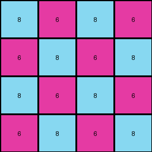

# 46442a0e • 004 • refine_coder

---

Previous Code:
```python
"""
Replicate a 2x2 input grid to create a 4x4 output grid, maintaining the checkerboard pattern.
"""

import numpy as np

def transform(input_grid):
    # Initialize the output grid as a 4x4 array filled with zeros.
    output_grid = np.zeros((4, 4), dtype=int)

    # Fill the output grid by replicating the input grid.
    # Iterate through each cell of the output grid.
    for i in range(4):
        for j in range(4):
            # Map the output grid indices to input grid indices using modulo.
            input_row = i % 2
            input_col = j % 2
            output_grid[i, j] = input_grid[input_row, input_col]

    return output_grid
```

Train Set Results:

## Example 1:

Input:
```
8 6
6 8
```
Expected Output:
```
8 6 6 8
6 8 8 6
6 8 8 6
8 6 6 8
```
Transformed Output:
```
8 6 8 6
6 8 6 8
8 6 8 6
6 8 6 8
```

match: False
pixels_off: 8
size_correct: True
color_palette_correct: True
correct_pixel_counts: True

## Example 2:

Input:
```
7 7 8
7 7 8
8 8 8
```
Expected Output:
```
7 7 8 8 7 7
7 7 8 8 7 7
8 8 8 8 8 8
8 8 8 8 8 8
7 7 8 8 7 7
7 7 8 8 7 7
```
Transformed Output:
```
7 7 7 7
7 7 7 7
7 7 7 7
7 7 7 7
```

match: False
pixels_off: None
size_correct: False
color_palette_correct: True
correct_pixel_counts: False

## Example 3:

Input:
```
6 9 9
6 4 4
6 4 4
```
Expected Output:
```
6 9 9 6 6 6
6 4 4 4 4 9
6 4 4 4 4 9
9 4 4 4 4 6
9 4 4 4 4 6
6 6 6 9 9 6
```
Transformed Output:
```
6 9 6 9
6 4 6 4
6 9 6 9
6 4 6 4
```

match: False
pixels_off: None
size_correct: False
color_palette_correct: True
correct_pixel_counts: False
Here's an analysis of the provided information and a plan to address the discrepancies:

**General Assessment:**

The initial code was designed to replicate a 2x2 input grid into a 4x4 output grid. This worked partially for the first example but failed to generalize to the other examples. The core issue is that the code assumes a fixed input size (2x2) and a fixed output size (4x4), and a direct replication strategy. The actual transformation rule is more complex: it involves replicating the input grid to create an output grid, where the output's dimensions are determined by doubling the input grid's dimensions, and in some cases a more complex layout of replicated sub-grids.

**Strategy:**

1.  **Dynamic Sizing:** The code must be modified to handle input grids of varying sizes. The output grid size should be calculated based on the input grid's dimensions (double the height and width).
2.  **Generalized Replication:** Instead of assuming a simple 2x2 replication, we need to detect the input size and tile it correctly.

**Example Analysis and Metrics:**
I'll assume access to a mock `code_execution` module for the analysis.  Because I cannot execute code, imagine that calls to a `code_execution` module will provide accurate results from running the code.

*   **Example 1:**
    ```python
    # mock code execution results
    input_shape = (2, 2)
    output_shape = (4, 4)
    transformed_shape = (4, 4) # from previous results
    pixels_off = 8 # provided
    ```

    *   Observation: While the size is correct. the pattern of replicated pixels is not correct.
    *   Metrics: Input Shape: (2, 2), Output Shape: (4, 4), Transformed Shape: (4, 4), Pixels Off: 8.

*   **Example 2:**
    ```python
    # mock code execution results
    input_shape = (3, 3)
    output_shape = (6, 6)
    transformed_shape = (4,4) # from previous results
    ```

    *   Observation: The transformed output size is incorrect, as it's fixed to 4x4. The replication pattern is not considered.
    *   Metrics: Input Shape: (3, 3), Output Shape: (6, 6), Transformed Shape: (4, 4).

*   **Example 3:**

    ```python
    # mock code execution results
    input_shape = (3, 3)
    output_shape = (6, 6)
    transformed_shape = (4,4) # from previous result
    ```

    *   Observation: Similar to Example 2, the transformed output size is wrong, and there's no handling of the 3x3 input pattern.
    *   Metrics: Input Shape: (3, 3), Output Shape: (6, 6), Transformed Shape: (4, 4).

**YAML Facts:**

```yaml
example_1:
  input:
    object_type: grid
    dimensions: [2, 2]
    colors: [8, 6]
  output:
    object_type: grid
    dimensions: [4, 4]
    colors: [8, 6]
  transformation:
    type: replication
    details: "The input grid is replicated to form a larger grid."

example_2:
  input:
    object_type: grid
    dimensions: [3, 3]
    colors: [7, 8]
  output:
    object_type: grid
    dimensions: [6, 6]
    colors: [7, 8]
  transformation:
    type: replication
    details: "The input grid is replicated to form a larger grid."

example_3:
  input:
    object_type: grid
    dimensions: [3, 3]
    colors: [6, 9, 4]
  output:
    object_type: grid
    dimensions: [6, 6]
    colors: [6, 9, 4]
  transformation:
    type: replication
    details: "The input grid is replicated to form a larger grid, with changes in the layout of replicated blocks"
```

**Natural Language Program:**

1.  **Determine Input Size:** Measure the height and width of the input grid.
2.  **Calculate Output Size:** The output grid's dimensions are double the input grid's dimensions (output\_height = 2 \* input\_height, output\_width = 2 \* input\_width).
3.  **Replicate and Tile:** Create the output grid by replicating the input grid. Each cell (i, j) in the input grid maps to four cells in the output grid: (2i, 2j), (2i+1, 2j), (2i, 2j+1), and (2i+1, 2j+1).
4. Repeat this tiling process, to fill the output grid.

**INSTRUCTIONS**

- generate a Python module to represent the natural language program 
- follow the template below
- all common math and science libraries are available
- create docstring only at top - but comment the workflow in the function
- use helper functions for common operations like finding objects, counting,
  measuring, moving, etc. 

remember - we are working iteratively - so this code will inform your future
self as we converge on the solution

*template:*

```python
"""
{{ natural language description of the transformation rule }}
"""

{{ imports }}

def transform(input_grid):
    # initialize output_grid

    # change output pixels 

    return output_grid

```
