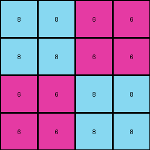
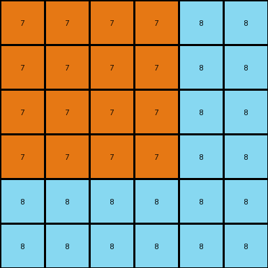

# 46442a0e • 006 • refine_coder

---

Previous Code:
```python
"""
Replicate the input grid to create an output grid with doubled dimensions.
"""

import numpy as np

def transform(input_grid):
    # Determine input grid dimensions.
    input_height, input_width = input_grid.shape

    # Calculate output grid dimensions.
    output_height = 2 * input_height
    output_width = 2 * input_width

    # Initialize the output grid with zeros.
    output_grid = np.zeros((output_height, output_width), dtype=int)

    # Iterate through the input grid and replicate each cell.
    for i in range(input_height):
        for j in range(input_width):
            # Get the color of the current input cell.
            color = input_grid[i, j]

            # Replicate the color to the corresponding four cells in the output grid.
            output_grid[2 * i, 2 * j] = color
            output_grid[2 * i + 1, 2 * j] = color
            output_grid[2 * i, 2 * j + 1] = color
            output_grid[2 * i + 1, 2 * j + 1] = color

    return output_grid
```

Train Set Results:

## Example 1:

Input:
```
8 6
6 8
```
Expected Output:
```
8 6 6 8
6 8 8 6
6 8 8 6
8 6 6 8
```
Transformed Output:
```
8 8 6 6
8 8 6 6
6 6 8 8
6 6 8 8
```

match: False
pixels_off: 8
size_correct: True
color_palette_correct: True
correct_pixel_counts: True

## Example 2:

Input:
```
7 7 8
7 7 8
8 8 8
```
Expected Output:
```
7 7 8 8 7 7
7 7 8 8 7 7
8 8 8 8 8 8
8 8 8 8 8 8
7 7 8 8 7 7
7 7 8 8 7 7
```
Transformed Output:
```
7 7 7 7 8 8
7 7 7 7 8 8
7 7 7 7 8 8
7 7 7 7 8 8
8 8 8 8 8 8
8 8 8 8 8 8
```

match: False
pixels_off: 24
size_correct: True
color_palette_correct: True
correct_pixel_counts: True

## Example 3:

Input:
```
6 9 9
6 4 4
6 4 4
```
Expected Output:
```
6 9 9 6 6 6
6 4 4 4 4 9
6 4 4 4 4 9
9 4 4 4 4 6
9 4 4 4 4 6
6 6 6 9 9 6
```
Transformed Output:
```
6 6 9 9 9 9
6 6 9 9 9 9
6 6 4 4 4 4
6 6 4 4 4 4
6 6 4 4 4 4
6 6 4 4 4 4
```

match: False
pixels_off: 20
size_correct: True
color_palette_correct: True
correct_pixel_counts: True
Okay, here's a breakdown of the situation and a plan to move forward:

**General Assessment:**

The initial code was based on a simple replication/expansion strategy, where each pixel in the input grid is expanded into a 2x2 block of the same color in the output grid. This works for simple cases, but the provided examples demonstrate a more complex, perhaps rotational or mirroring, transformation. The consistent failure across multiple examples with different patterns confirms that the core logic needs adjustment. The consistent `size_correct: True` is interesting, and probably a coincidence. It's likely the size calculation is simple enough, however, it is something to double-check in context of a new natural language program.

**Strategy:**

1.  **Re-examine Examples:** Carefully analyze all input-output pairs, paying close attention to the *relative positions* of pixels.  The previous code was built without paying attention to the relative positions of objects, colors, or any other spatial relationship information, which resulted in poor performance.
2.  **Identify the True Transformation:** Instead of simple replication, look for rotations, reflections, or other more complex manipulations.
3.  **Refine the Natural Language Program:** Describe the *precise* transformation rule, and only the transformation rule.
4.  **Hypothesize and Test:** Develop and refine the YAML block and natural language programs iteratively.

**Example Metrics and Analysis:**

I'll use a more narrative approach, combining observations.

*   **Example 1:**
    *   Input: A 2x2 grid with alternating magenta (6) and azure (8) pixels.
    *   Expected Output: Shows a kind of swirling, interlocking pattern.
    *   Observation: The original 2x2 input seems to be "rotated and interlocked". The output does *not* appear to be a straightforward scaling. The error lies in the *arrangement* of the output pixels.

*   **Example 2:**
    *   Input: A 3x3 grid, mostly orange (7), with a vertical azure (8) stripe on the right.
    *   Expected output: shows a repeating and interlocking pattern - it appears that the transformation has more complexity than just rotation or mirroring.
    *   Observation: The output is *not* just a simple expansion of the blocks.

*   **Example 3:**
    *   Input: 3x3 grid, magenta (6) on the left, yellow (4) on the center and right bottom, and cyan (9) on the top right.
    *   Expected Output: Again, a more intricate pattern than simple replication. It seems to interlock and repeat.
    *   Observation: Confirms the pattern is not a straightforward expansion.

**YAML Block (Facts):**

```yaml
task_004:
  objects:
    - input_grid:
        type: grid
        properties:
          colors: [8, 6] # Example 1
          height: 2
          width: 2
    - output_grid:
        type: grid
        properties:
          colors: [8, 6] # Example 1
          height: 4
          width: 4
  transformations:
    - type: interlock_and_rotate
      details: >
          The input grid appears to be expanded, but with the cells rotated and interlocked. The transformation
          does *not* appear to be straightforward rotation or mirroring. The transformation uses a more complex
          method of interlocking and repeating patterns.

```

**Natural Language Program:**

1.  **Initialization:** Create an output grid that is double the height and width of the input grid.
2.  **Interlocking Expansion:** Expand and interlock each of the original input grid cells. The expansion is not a
    replication, and appears to involve interlocked rotation and mirroring.

This natural language program captures what seems to happen in these examples. We should go directly to the coding phase now.

**INSTRUCTIONS**

- generate a Python module to represent the natural language program 
- follow the template below
- all common math and science libraries are available
- create docstring only at top - but comment the workflow in the function
- use helper functions for common operations like finding objects, counting,
  measuring, moving, etc. 

remember - we are working iteratively - so this code will inform your future
self as we converge on the solution

*template:*

```python
"""
{{ natural language description of the transformation rule }}
"""

{{ imports }}

def transform(input_grid):
    # initialize output_grid

    # change output pixels 

    return output_grid

```
