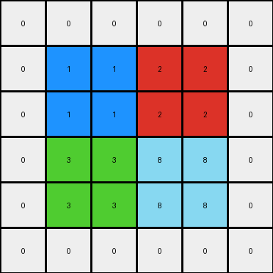
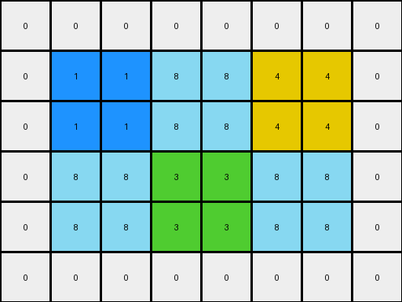

# 49d1d64f • 005 • refine_dreamer

---


Previous Code:
```python
"""
1.  **Initialization:** Create an output grid with dimensions two times the input grid's dimensions *plus* two (for one row/column of padding on each side): `(2 * input_height + 2, 2 * input_width + 2)`. Initialize all cells of the output grid to 0 (black).

2.  **Replication:** For each pixel in the input grid:
    *   Copy the pixel's value.
    *   Create a 2x2 block in the output grid.
    *   The top-left corner of this 2x2 block should be at position `(2 * row + 1, 2 * column + 1)` in the output grid, where `row` and `column` are the coordinates of the current input pixel.  This "+ 1" offsets into the output grid to account for the zero-padding.
    *   Fill all four cells of this 2x2 block with the copied pixel value.
"""

import numpy as np

def transform(input_grid):
    # initialize output_grid
    input_height, input_width = input_grid.shape
    output_height, output_width = 2 * input_height + 2, 2 * input_width + 2
    output_grid = np.zeros((output_height, output_width), dtype=int)

    # change output pixels
    for row in range(input_height):
        for col in range(input_width):
            # replication with offset for padding
            pixel_value = input_grid[row, col]
            output_grid[2*row+1:2*row+3, 2*col+1:2*col+3] = pixel_value

    return output_grid
```

Train Set Results:

## Example 1:

Input:
```
1 2
3 8
```
Expected Output:
```
0 1 2 0
1 1 2 2
3 3 8 8
0 3 8 0
```
Transformed Output:
```
0 0 0 0 0 0
0 1 1 2 2 0
0 1 1 2 2 0
0 3 3 8 8 0
0 3 3 8 8 0
0 0 0 0 0 0
```

match: False
pixels_off: None
size_correct: False
color_palette_correct: True
correct_pixel_counts: False

## Example 2:

Input:
```
1 8 4
8 3 8
```
Expected Output:
```
0 1 8 4 0
1 1 8 4 4
8 8 3 8 8
0 8 3 8 0
```
Transformed Output:
```
0 0 0 0 0 0 0 0
0 1 1 8 8 4 4 0
0 1 1 8 8 4 4 0
0 8 8 3 3 8 8 0
0 8 8 3 3 8 8 0
0 0 0 0 0 0 0 0
```

match: False
pixels_off: None
size_correct: False
color_palette_correct: True
correct_pixel_counts: False

## Example 3:

Input:
```
2 1 4
8 0 2
3 2 8
```
Expected Output:
```
0 2 1 4 0
2 2 1 4 4
8 8 0 2 2
3 3 2 8 8
0 3 2 8 0
```
Transformed Output:
```
0 0 0 0 0 0 0 0
0 2 2 1 1 4 4 0
0 2 2 1 1 4 4 0
0 8 8 0 0 2 2 0
0 8 8 0 0 2 2 0
0 3 3 2 2 8 8 0
0 3 3 2 2 8 8 0
0 0 0 0 0 0 0 0
```

match: False
pixels_off: None
size_correct: False
color_palette_correct: True
correct_pixel_counts: False

**INSTRUCTIONS**

The code above was generated based on observations from the first training
example

we have tested the transform function on each of the task example inputs and
compared with the expected output

review each of the examples provided and the results and consider how the
natural language program should be updated to accommodate this new knowledge

respond with the following deliverables:

- general assessment of the information provided and strategy for resolving the
  errors
- gather metrics about each of the examples and results - use code_execution to
  develop accurate reports on your assumptions
- a YAML block documenting facts - Focus on identifying objects, their properties, and the actions performed on them.
- a natural language program - Be as clear and concise as possible, providing a complete description of the transformation rule.


your responses should be considered as information in a report - not a
conversation
