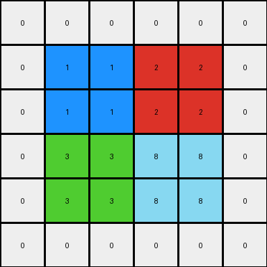
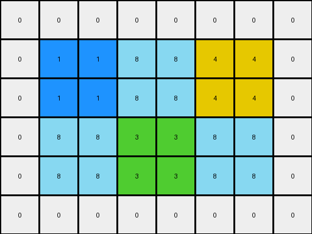
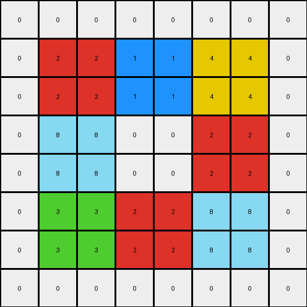

# 49d1d64f • 006 • refine_coder

---

Previous Code:
```python
"""
1.  **Initialization:** Create an output grid with dimensions two times the input grid's dimensions *plus* two (for one row/column of padding on each side): `(2 * input_height + 2, 2 * input_width + 2)`. Initialize all cells of the output grid to 0 (black).

2.  **Replication:** For each pixel in the input grid:
    *   Copy the pixel's value.
    *   Create a 2x2 block in the output grid.
    *   The top-left corner of this 2x2 block should be at position `(2 * row + 1, 2 * column + 1)` in the output grid, where `row` and `column` are the coordinates of the current input pixel.  This "+ 1" offsets into the output grid to account for the zero-padding.
    *   Fill all four cells of this 2x2 block with the copied pixel value.
"""

import numpy as np

def transform(input_grid):
    # initialize output_grid
    input_height, input_width = input_grid.shape
    output_height, output_width = 2 * input_height + 2, 2 * input_width + 2
    output_grid = np.zeros((output_height, output_width), dtype=int)

    # change output pixels
    for row in range(input_height):
        for col in range(input_width):
            # replication with offset for padding
            pixel_value = input_grid[row, col]
            output_grid[2*row+1:2*row+3, 2*col+1:2*col+3] = pixel_value

    return output_grid
```

Train Set Results:

## Example 1:

Input:
```
1 2
3 8
```
Expected Output:
```
0 1 2 0
1 1 2 2
3 3 8 8
0 3 8 0
```
Transformed Output:
```
0 0 0 0 0 0
0 1 1 2 2 0
0 1 1 2 2 0
0 3 3 8 8 0
0 3 3 8 8 0
0 0 0 0 0 0
```

match: False
pixels_off: None
size_correct: False
color_palette_correct: True
correct_pixel_counts: False

## Example 2:

Input:
```
1 8 4
8 3 8
```
Expected Output:
```
0 1 8 4 0
1 1 8 4 4
8 8 3 8 8
0 8 3 8 0
```
Transformed Output:
```
0 0 0 0 0 0 0 0
0 1 1 8 8 4 4 0
0 1 1 8 8 4 4 0
0 8 8 3 3 8 8 0
0 8 8 3 3 8 8 0
0 0 0 0 0 0 0 0
```

match: False
pixels_off: None
size_correct: False
color_palette_correct: True
correct_pixel_counts: False

## Example 3:

Input:
```
2 1 4
8 0 2
3 2 8
```
Expected Output:
```
0 2 1 4 0
2 2 1 4 4
8 8 0 2 2
3 3 2 8 8
0 3 2 8 0
```
Transformed Output:
```
0 0 0 0 0 0 0 0
0 2 2 1 1 4 4 0
0 2 2 1 1 4 4 0
0 8 8 0 0 2 2 0
0 8 8 0 0 2 2 0
0 3 3 2 2 8 8 0
0 3 3 2 2 8 8 0
0 0 0 0 0 0 0 0
```

match: False
pixels_off: None
size_correct: False
color_palette_correct: True
correct_pixel_counts: False
Okay, here's a breakdown of the situation, the results, and a revised natural language program:

**General Assessment:**

The initial natural language program and the generated code were on the right track conceptually but have a critical flaw in how the output grid dimensions are handled. The padding concept, while aiming for a border, is misapplied. The code *almost* correctly replicates each input pixel as a 2x2 block in the output, but the output grid is oversized (too large in both height and width). The provided examples do *not* have a border of zeros around the entire output. Instead, the output is exactly twice the size of the input in both dimensions, which is consistent with simply replicating each pixel into a 2x2 block.  The padding is causing the problems, by making the output too big, and adding rows/columns of `0` that aren't there.

**Strategy for Resolving Errors:**

The primary error is the incorrect output grid size. The "+ 2" in the output grid dimensions calculation needs to be removed. The offset of `+1` to account for padding should also be removed, and instead of adding padding to all four sides, we should not add any padding at all. The replication logic itself (creating a 2x2 block for each input pixel) is correct.

**Metrics and Reports:**

Here's an analysis of each example, focusing on clarifying *why* the current code fails:

*   **Example 1:**
    *   Input Shape: (2, 2)
    *   Expected Output Shape: (4, 4)
    *   Actual Output Shape: (6, 6)  - **Incorrect.** The output is oversized due to the padding.

*   **Example 2:**
    *   Input Shape: (2, 3)
    *   Expected Output Shape: (4, 6)
    *   Actual Output Shape: (6, 8)  - **Incorrect.** Oversized.

*   **Example 3:**
    *   Input Shape: (3, 3)
    *   Expected Output Shape: (6, 6)
    *   Actual Output Shape: (8, 8)  - **Incorrect.** Oversized.

**YAML Facts:**

```yaml
task_id: 004-py_02
objects:
  - input_grid:
      properties:
        shape: variable
        pixels: integers (0-9 representing colors)
  - output_grid:
      properties:
        shape: (2 * input_height, 2 * input_width)
        pixels: integers (0-9 representing colors)
actions:
  - replicate:
      input: single pixel from input_grid
      output: 2x2 block of pixels in output_grid, all with the same value as the input pixel
      location: output grid coordinates are twice the input grid coordinates
```

**Natural Language Program:**

1.  **Initialization:** Create an output grid with dimensions exactly two times the input grid's dimensions: `(2 * input_height, 2 * input_width)`.

2.  **Replication:** For each pixel in the input grid:
    *   Copy the pixel's value.
    *   Create a 2x2 block in the output grid.
    *   The top-left corner of this 2x2 block should be at position `(2 * row, 2 * column)` in the output grid, where `row` and `column` are the coordinates of the current input pixel.
    *   Fill all four cells of this 2x2 block with the copied pixel value.

This revised program removes the extraneous padding and clarifies the pixel replication process. The key change is in the initialization of the output grid and the positioning of the 2x2 blocks.

**INSTRUCTIONS**

- generate a Python module to represent the natural language program 
- follow the template below
- all common math and science libraries are available
- create docstring only at top - but comment the workflow in the function
- use helper functions for common operations like finding objects, counting,
  measuring, moving, etc. 

remember - we are working iteratively - so this code will inform your future
self as we converge on the solution

*template:*

```python
"""
{{ natural language description of the transformation rule }}
"""

{{ imports }}

def transform(input_grid):
    # initialize output_grid

    # change output pixels 

    return output_grid

```
