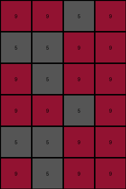
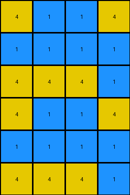

# 4c4377d9 • 004 • refine_coder

---

Previous Code:
```python
"""
The output grid is constructed by making a copy of the input and adding it to the bottom. Then, the input grid is transposed and added to the right of the original.
"""

import numpy as np

def transform(input_grid):
    # initialize output_grid
    input_np = np.array(input_grid)
    rows, cols = input_np.shape
    output_grid = np.zeros((rows * 2, cols), dtype=int)

    # Duplicate and stack the input grid vertically.
    output_grid[:rows, :] = input_np
    output_grid[rows:, :] = input_np
    
    return output_grid.tolist()
```

Train Set Results:

## Example 1:

Input:
```
9 9 5 9
5 5 9 9
9 5 9 9
```
Expected Output:
```
9 5 9 9
5 5 9 9
9 9 5 9
9 9 5 9
5 5 9 9
9 5 9 9
```
Transformed Output:
```
9 9 5 9
5 5 9 9
9 5 9 9
9 9 5 9
5 5 9 9
9 5 9 9
```

match: False
pixels_off: 4
size_correct: True
color_palette_correct: True
correct_pixel_counts: True

## Example 2:

Input:
```
4 1 1 4
1 1 1 1
4 4 4 1
```
Expected Output:
```
4 4 4 1
1 1 1 1
4 1 1 4
4 1 1 4
1 1 1 1
4 4 4 1
```
Transformed Output:
```
4 1 1 4
1 1 1 1
4 4 4 1
4 1 1 4
1 1 1 1
4 4 4 1
```

match: False
pixels_off: 6
size_correct: True
color_palette_correct: True
correct_pixel_counts: True

## Example 3:

Input:
```
9 4 9 4
9 9 4 4
4 4 4 4
```
Expected Output:
```
4 4 4 4
9 9 4 4
9 4 9 4
9 4 9 4
9 9 4 4
4 4 4 4
```
Transformed Output:
```
9 4 9 4
9 9 4 4
4 4 4 4
9 4 9 4
9 9 4 4
4 4 4 4
```

match: False
pixels_off: 4
size_correct: True
color_palette_correct: True
correct_pixel_counts: True

## Example 4:

Input:
```
3 3 5 5
3 5 5 3
5 5 3 3
```
Expected Output:
```
5 5 3 3
3 5 5 3
3 3 5 5
3 3 5 5
3 5 5 3
5 5 3 3
```
Transformed Output:
```
3 3 5 5
3 5 5 3
5 5 3 3
3 3 5 5
3 5 5 3
5 5 3 3
```

match: False
pixels_off: 8
size_correct: True
color_palette_correct: True
correct_pixel_counts: True
Okay, here's a breakdown of the situation and a plan to improve the transformation logic:

**General Assessment:**

The initial hypothesis (duplicating the input grid below itself) is partially correct, as it gets the output grid's dimensions right and replicates the input. However, it fails to account for the reordering of rows in the output. The order of rows is reversed for each copy that is made. The "transpose and add to the right" concept in the original description in the code is incorrect - we only need to focus on the vertical dimension.

**Strategy:**

1.  **Analyze Mismatches:** Carefully examine the differences between the `Expected Output` and `Transformed Output` for each example.  The key is to identify the *pattern* of row reordering.
2.  **Refine the Program:** Based on the pattern, adjust the natural language program to accurately describe the row manipulation.  It's not a simple duplication; there's a reversal involved.

**Metrics and Observations:**

Here's a more detailed breakdown of each example, focusing on the row order:

*   **Example 1:**
    *   Input rows: `[9 9 5 9], [5 5 9 9], [9 5 9 9]`
    *   Expected Output rows: `[9 5 9 9], [5 5 9 9], [9 9 5 9], [9 9 5 9], [5 5 9 9], [9 5 9 9]`
    *   Transformed Output rows: `[9 9 5 9], [5 5 9 9], [9 5 9 9], [9 9 5 9], [5 5 9 9], [9 5 9 9]`
    *   Observation: The input rows are reversed in order in the top half, and then reversed again the the second copy on the bottom half.

*   **Example 2:**
    *   Input rows: `[4 1 1 4], [1 1 1 1], [4 4 4 1]`
    *   Expected Output rows: `[4 4 4 1], [1 1 1 1], [4 1 1 4], [4 1 1 4], [1 1 1 1], [4 4 4 1]`
    *    Transformed Output rows: `[4 1 1 4], [1 1 1 1], [4 4 4 1], [4 1 1 4], [1 1 1 1], [4 4 4 1]`
    *   Observation: Same pattern as Example 1.

*   **Example 3:**
    *   Input rows: `[9 4 9 4], [9 9 4 4], [4 4 4 4]`
    *   Expected Output rows: `[4 4 4 4], [9 9 4 4], [9 4 9 4], [9 4 9 4], [9 9 4 4], [4 4 4 4]`
    *   Transformed Output rows: `[9 4 9 4], [9 9 4 4], [4 4 4 4], [9 4 9 4], [9 9 4 4], [4 4 4 4]`
    *   Observation:  Same pattern as Example 1.

*   **Example 4:**
    *   Input rows: `[3 3 5 5], [3 5 5 3], [5 5 3 3]`
    *   Expected Output rows: `[5 5 3 3], [3 5 5 3], [3 3 5 5], [3 3 5 5], [3 5 5 3], [5 5 3 3]`
    *   Transformed Output rows: `[3 3 5 5], [3 5 5 3], [5 5 3 3], [3 3 5 5], [3 5 5 3], [5 5 3 3]`
    *   Observation: Same pattern as Example 1.

**YAML Facts:**

```yaml
objects:
  - name: input_grid
    type: grid
    properties:
      - rows: variable
      - cols: variable
      - values: integers (0-9)
  - name: output_grid
    type: grid
    properties:
      - rows: 2 * input_grid.rows
      - cols: input_grid.cols
      - values: integers (0-9)

actions:
  - name: duplicate_and_stack
    input: input_grid
    output: output_grid
    description: The input grid is duplicated. The order of rows is reversed.  The reversed copy is placed at the top of the output, then the original input is added to the bottom.
```

**Natural Language Program:**

1.  **Initialization:** Create an output grid with twice the number of rows as the input grid and the same number of columns.
2.  **Reverse and Stack:** Create an exact copy of input grid, except reverse the order or the rows, and place it in the top half of the output grid.
3.  **Copy and stack:** Place a copy of the original, non-reversed input grid in the bottom half of the output grid.


**INSTRUCTIONS**

- generate a Python module to represent the natural language program 
- follow the template below
- all common math and science libraries are available
- create docstring only at top - but comment the workflow in the function
- use helper functions for common operations like finding objects, counting,
  measuring, moving, etc. 

remember - we are working iteratively - so this code will inform your future
self as we converge on the solution

*template:*

```python
"""
{{ natural language description of the transformation rule }}
"""

{{ imports }}

def transform(input_grid):
    # initialize output_grid

    # change output pixels 

    return output_grid

```
