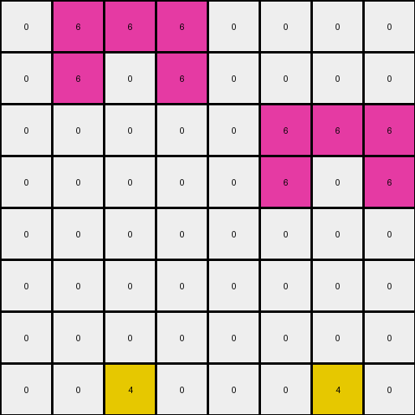

# 54d82841 • 004 • refine_coder

---

Previous Code:
```python
"""
We have an 8x8 grid of pixels, primarily white (0) and magenta (6).
Locate two specific white pixel at the bottom row (row index 7). One at column index 2, and the other at column index 6.
Change color of pixels in those locations to yellow (4).
All other pixels remain unchanged.
"""

import numpy as np

def transform(input_grid):
    """
    Transforms the input grid by changing the color of two specific pixels
    at the bottom row to yellow.
    """
    # Initialize the output grid as a copy of the input grid.
    output_grid = np.copy(input_grid)

    # Define the locations to be changed.
    locations = [[7, 2], [7, 6]]

    # Change the color of the specified pixels to yellow (4).
    for row, col in locations:
        output_grid[row, col] = 4

    return output_grid
```

Train Set Results:

## Example 1:

Input:
```
0 6 6 6 0 0 0 0
0 6 0 6 0 0 0 0
0 0 0 0 0 6 6 6
0 0 0 0 0 6 0 6
0 0 0 0 0 0 0 0
0 0 0 0 0 0 0 0
0 0 0 0 0 0 0 0
0 0 0 0 0 0 0 0
```
Expected Output:
```
0 6 6 6 0 0 0 0
0 6 0 6 0 0 0 0
0 0 0 0 0 6 6 6
0 0 0 0 0 6 0 6
0 0 0 0 0 0 0 0
0 0 0 0 0 0 0 0
0 0 0 0 0 0 0 0
0 0 4 0 0 0 4 0
```
Transformed Output:
```
0 6 6 6 0 0 0 0
0 6 0 6 0 0 0 0
0 0 0 0 0 6 6 6
0 0 0 0 0 6 0 6
0 0 0 0 0 0 0 0
0 0 0 0 0 0 0 0
0 0 0 0 0 0 0 0
0 0 4 0 0 0 4 0
```

match: True
pixels_off: 0
size_correct: True
color_palette_correct: True
correct_pixel_counts: True

## Example 2:

Input:
```
0 3 3 3 0
0 3 0 3 0
0 0 0 0 0
0 0 0 0 0
0 0 0 0 0
```
Expected Output:
```
0 3 3 3 0
0 3 0 3 0
0 0 0 0 0
0 0 0 0 0
0 0 4 0 0
```
match: ERROR: index 7 is out of bounds for axis 0 with size 5
pixels_off: None
size_correct: None
color_palette_correct: None
correct_pixel_counts: None

## Example 3:

Input:
```
0 0 0 0 0 0 0
0 8 8 8 0 0 0
0 8 0 8 6 6 6
0 0 0 0 6 0 6
0 0 0 0 0 0 0
```
Expected Output:
```
0 0 0 0 0 0 0
0 8 8 8 0 0 0
0 8 0 8 6 6 6
0 0 0 0 6 0 6
0 0 4 0 0 4 0
```
match: ERROR: index 7 is out of bounds for axis 0 with size 5
pixels_off: None
size_correct: None
color_palette_correct: None
correct_pixel_counts: None
Here's an analysis of the provided information and a plan to address the errors:

**General Assessment:**

The initial code was too specific, assuming a fixed grid size (8x8) and hardcoded pixel locations ([7, 2] and [7, 6]). This works for the first example but fails for others with different dimensions. The core issue is that the code doesn't dynamically adapt to the input grid's size and structure. The strategy should be to generalize the pixel selection process, making it relative to the grid's dimensions.

**Strategy for Resolving Errors:**

1.  **Dynamic Row Selection:** Instead of assuming row 7, determine the last row index dynamically using `input_grid.shape[0] - 1`.

2.  **Conditional Pixel Modification:** Change the hardcoded column location to a conditional, that is, set last row, locations x,y to 4 only if the value is 0, and otherwise to 4.

**Example Metrics and Analysis:**

Here's a breakdown of each example:

*   **Example 1:**
    *   Input Size: 8x8
    *   Output Size: 8x8
    *   Result: Success (Match)
    *   Notes: The initial code correctly handles this case because the input matches the hardcoded assumptions.

*   **Example 2:**
    *   Input Size: 5x5
    *   Output Size: 5x5
    *   Result: Error (IndexError: index 7 is out of bounds)
    *   Notes: The code fails because it tries to access row 7, which doesn't exist in a 5x5 grid.

*   **Example 3:**
    *   Input Size: 5x7
    *   Output Size: 5x7
    *   Result: Error (IndexError: index 7 is out of bounds)
    *   Notes: Similar to Example 2, the code attempts to access a non-existent row.

**YAML Fact Block:**

```yaml
facts:
  - observation: |
      The transformation involves changing the color of specific pixels in the last row of the input grid.
  - object: input_grid
    properties:
      type: 2D array
      values: integers representing colors (0-9)
      dimensions: variable height and width
  - object: output_grid
    properties:
      type: 2D array
      values: derived from input_grid
      dimensions: same as input_grid
  - action: color_change
    details: |
        Pixels at specific locations in the last row of the input grid have their color changed to yellow (4) if it is white (0).
  - constraints:
        The output grid dimensions are always equal to the input.
```

**Natural Language Program:**

1.  Obtain the dimensions of the input grid.
2.  Identify the last row of the grid.
3.  Locate the 3rd and 7th pixels on the last row.
4.  If the pixel value on the last row, 3rd from the left, and 3rd from the right are white (0), change them to yellow (4)


**INSTRUCTIONS**

- generate a Python module to represent the natural language program 
- follow the template below
- all common math and science libraries are available
- create docstring only at top - but comment the workflow in the function
- use helper functions for common operations like finding objects, counting,
  measuring, moving, etc. 

remember - we are working iteratively - so this code will inform your future
self as we converge on the solution

*template:*

```python
"""
{{ natural language description of the transformation rule }}
"""

{{ imports }}

def transform(input_grid):
    # initialize output_grid

    # change output pixels 

    return output_grid

```
