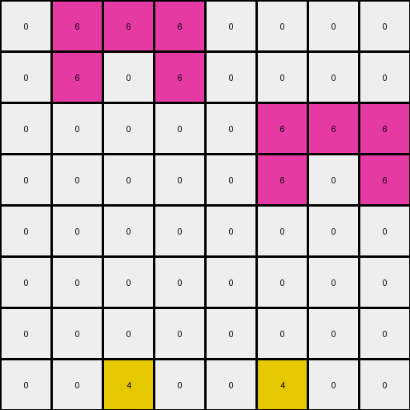
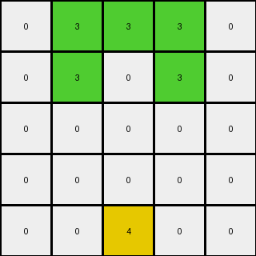
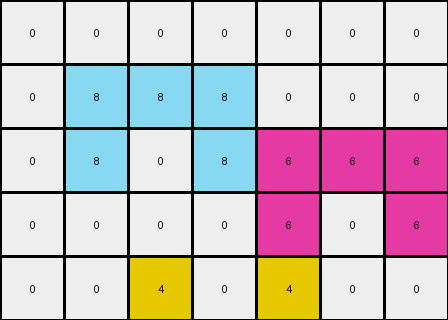

# 54d82841 • 005 • refine_dreamer

---


Previous Code:
```python
"""
The transformation involves changing the color of specific pixels in the last row of the input grid.
Pixels at specific locations in the last row of the input grid have their color changed to yellow (4) if it is white (0).
"""

import numpy as np

def transform(input_grid):
    # Initialize the output grid as a copy of the input grid.
    output_grid = np.copy(input_grid)

    # Get the index of the last row.
    last_row_index = input_grid.shape[0] - 1

    # Get the width of the grid
    width = input_grid.shape[1]

    # Define the column indices to check, ensuring they are within bounds.
    col_indices = []
    if width >= 3:
        col_indices.append(2)  # 3rd column (index 2)
    if width >= 7:
        col_indices.append(width -3)  # 3rd from last column

    # Change the color of the specified pixels to yellow (4) if they are white (0).
    for col_index in col_indices:
        if output_grid[last_row_index, col_index] == 0:
            output_grid[last_row_index, col_index] = 4

    return output_grid
```

Train Set Results:

## Example 1:

Input:
```
0 6 6 6 0 0 0 0
0 6 0 6 0 0 0 0
0 0 0 0 0 6 6 6
0 0 0 0 0 6 0 6
0 0 0 0 0 0 0 0
0 0 0 0 0 0 0 0
0 0 0 0 0 0 0 0
0 0 0 0 0 0 0 0
```
Expected Output:
```
0 6 6 6 0 0 0 0
0 6 0 6 0 0 0 0
0 0 0 0 0 6 6 6
0 0 0 0 0 6 0 6
0 0 0 0 0 0 0 0
0 0 0 0 0 0 0 0
0 0 0 0 0 0 0 0
0 0 4 0 0 0 4 0
```
Transformed Output:
```
0 6 6 6 0 0 0 0
0 6 0 6 0 0 0 0
0 0 0 0 0 6 6 6
0 0 0 0 0 6 0 6
0 0 0 0 0 0 0 0
0 0 0 0 0 0 0 0
0 0 0 0 0 0 0 0
0 0 4 0 0 4 0 0
```

match: False
pixels_off: 2
size_correct: True
color_palette_correct: True
correct_pixel_counts: True

## Example 2:

Input:
```
0 3 3 3 0
0 3 0 3 0
0 0 0 0 0
0 0 0 0 0
0 0 0 0 0
```
Expected Output:
```
0 3 3 3 0
0 3 0 3 0
0 0 0 0 0
0 0 0 0 0
0 0 4 0 0
```
Transformed Output:
```
0 3 3 3 0
0 3 0 3 0
0 0 0 0 0
0 0 0 0 0
0 0 4 0 0
```

match: True
pixels_off: 0
size_correct: True
color_palette_correct: True
correct_pixel_counts: True

## Example 3:

Input:
```
0 0 0 0 0 0 0
0 8 8 8 0 0 0
0 8 0 8 6 6 6
0 0 0 0 6 0 6
0 0 0 0 0 0 0
```
Expected Output:
```
0 0 0 0 0 0 0
0 8 8 8 0 0 0
0 8 0 8 6 6 6
0 0 0 0 6 0 6
0 0 4 0 0 4 0
```
Transformed Output:
```
0 0 0 0 0 0 0
0 8 8 8 0 0 0
0 8 0 8 6 6 6
0 0 0 0 6 0 6
0 0 4 0 4 0 0
```

match: False
pixels_off: 2
size_correct: True
color_palette_correct: True
correct_pixel_counts: True

**INSTRUCTIONS**

The code above was generated based on observations from the first training
example

we have tested the transform function on each of the task example inputs and
compared with the expected output

review each of the examples provided and the results and consider how the
natural language program should be updated to accommodate this new knowledge

respond with the following deliverables:

- general assessment of the information provided and strategy for resolving the
  errors
- gather metrics about each of the examples and results - use code_execution to
  develop accurate reports on your assumptions
- a YAML block documenting facts - Focus on identifying objects, their properties, and the actions performed on them.
- a natural language program - Be as clear and concise as possible, providing a complete description of the transformation rule.


your responses should be considered as information in a report - not a
conversation
