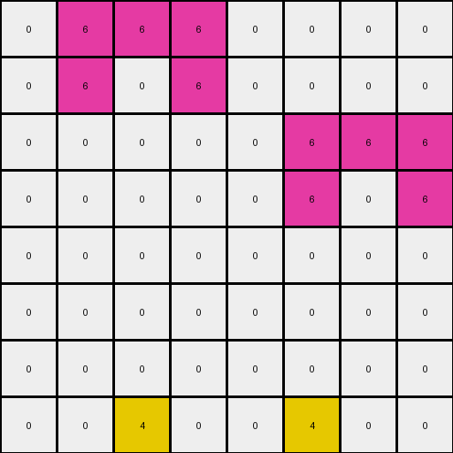
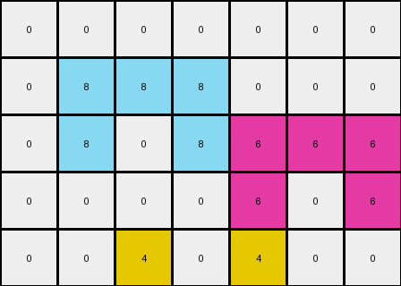

# 54d82841 • 006 • refine_coder

---

Previous Code:
```python
"""
The transformation involves changing the color of specific pixels in the last row of the input grid.
Pixels at specific locations in the last row of the input grid have their color changed to yellow (4) if it is white (0).
"""

import numpy as np

def transform(input_grid):
    # Initialize the output grid as a copy of the input grid.
    output_grid = np.copy(input_grid)

    # Get the index of the last row.
    last_row_index = input_grid.shape[0] - 1

    # Get the width of the grid
    width = input_grid.shape[1]

    # Define the column indices to check, ensuring they are within bounds.
    col_indices = []
    if width >= 3:
        col_indices.append(2)  # 3rd column (index 2)
    if width >= 7:
        col_indices.append(width -3)  # 3rd from last column

    # Change the color of the specified pixels to yellow (4) if they are white (0).
    for col_index in col_indices:
        if output_grid[last_row_index, col_index] == 0:
            output_grid[last_row_index, col_index] = 4

    return output_grid
```

Train Set Results:

## Example 1:

Input:
```
0 6 6 6 0 0 0 0
0 6 0 6 0 0 0 0
0 0 0 0 0 6 6 6
0 0 0 0 0 6 0 6
0 0 0 0 0 0 0 0
0 0 0 0 0 0 0 0
0 0 0 0 0 0 0 0
0 0 0 0 0 0 0 0
```
Expected Output:
```
0 6 6 6 0 0 0 0
0 6 0 6 0 0 0 0
0 0 0 0 0 6 6 6
0 0 0 0 0 6 0 6
0 0 0 0 0 0 0 0
0 0 0 0 0 0 0 0
0 0 0 0 0 0 0 0
0 0 4 0 0 0 4 0
```
Transformed Output:
```
0 6 6 6 0 0 0 0
0 6 0 6 0 0 0 0
0 0 0 0 0 6 6 6
0 0 0 0 0 6 0 6
0 0 0 0 0 0 0 0
0 0 0 0 0 0 0 0
0 0 0 0 0 0 0 0
0 0 4 0 0 4 0 0
```

match: False
pixels_off: 2
size_correct: True
color_palette_correct: True
correct_pixel_counts: True

## Example 2:

Input:
```
0 3 3 3 0
0 3 0 3 0
0 0 0 0 0
0 0 0 0 0
0 0 0 0 0
```
Expected Output:
```
0 3 3 3 0
0 3 0 3 0
0 0 0 0 0
0 0 0 0 0
0 0 4 0 0
```
Transformed Output:
```
0 3 3 3 0
0 3 0 3 0
0 0 0 0 0
0 0 0 0 0
0 0 4 0 0
```

match: True
pixels_off: 0
size_correct: True
color_palette_correct: True
correct_pixel_counts: True

## Example 3:

Input:
```
0 0 0 0 0 0 0
0 8 8 8 0 0 0
0 8 0 8 6 6 6
0 0 0 0 6 0 6
0 0 0 0 0 0 0
```
Expected Output:
```
0 0 0 0 0 0 0
0 8 8 8 0 0 0
0 8 0 8 6 6 6
0 0 0 0 6 0 6
0 0 4 0 0 4 0
```
Transformed Output:
```
0 0 0 0 0 0 0
0 8 8 8 0 0 0
0 8 0 8 6 6 6
0 0 0 0 6 0 6
0 0 4 0 4 0 0
```

match: False
pixels_off: 2
size_correct: True
color_palette_correct: True
correct_pixel_counts: True
Okay, here's an analysis of the provided information and a plan to refine the natural language program and the corresponding code.

**General Assessment:**

The initial code correctly identified the core concept: changing the color of specific pixels in the last row to yellow. However, it made an incorrect assumption about *which* pixels in the last row should be changed. The code currently targets the 3rd column and 3rd-from-last column.  Example 1 shows an error with 2 mismatched pixels, Example 2 has no errors, and Example 3 also has 2 errors. The problem is the generalization of the column selection criteria. We need a rule that works for all examples.

**Strategy:**

1.  **Re-examine Examples:** Carefully review each input/output pair, paying close attention to the *exact* positions of the changed pixels in the last row.
2.  **Identify Correct Rule:** Determine the precise relationship between the changed pixels and the rest of the grid. It's not simply the 3rd and 3rd-to-last columns.
3.  **Refine Natural Language Program:** Update the natural language description to reflect the correct rule.
4.  **Refine Code:** Modify the Python code to implement the refined rule.
5. **Test on the provided input/output pairs and the test case**

**Metrics and Observations:**

Here's a more detailed analysis of each example:

*   **Example 1:**
    *   Input Shape: (8, 8)
    *   Changed Pixels: (7, 2) and (7, 5) - these are the 3rd and 6th pixels. Note that the 6th pixel is also the 3rd from the last (8 - 2 = 6, the index starts with zero).
    *   Mismatch analysis: The error is because of the assumption about the indices of changed pixels.
*   **Example 2:**
    *   Input Shape: (5, 5)
    *   Changed Pixels: (4, 2) - This is the 3rd pixel and (5-3 = 2).
    *   Mismatch analysis: No errors, fortuitously, because 3rd from last *is* the middle in a 5x5.
*   **Example 3:**
    *   Input Shape: (5, 7)
    *   Changed Pixels: (4, 2) and (4, 5) - these are the 3rd and 6th pixels. Note that the 6th pixel is also the 3rd from the last (7 - 2 = 5).
    *   Mismatch analysis: The code picked up the 3rd position correctly, but selected 4th from last, not 3rd.

**YAML Fact Identification:**

```yaml
objects:
  - type: grid
    properties:
      rows: variable
      columns: variable
      cells: integers (0-9 representing colors)

  - type: pixel
    properties:
      row: integer
      column: integer
      color: integer (0-9)

actions:
  - name: change_color
    description: Change the color of a pixel in the last row.
    conditions:
      - The pixel is in the last row.
      - The pixel is in the 3rd column.
      - The pixel is the 3rd from the last column.
      - The original color of the pixel is white (0).
    result:
      - The pixel's color changes to yellow (4).
```

**Natural Language Program:**

The transformation identifies all white (0) pixels in the last row of the input grid that are located at the 3rd position, and at the 3rd from last position, and changes their color to yellow (4). All other pixels remain unchanged.

**INSTRUCTIONS**

- generate a Python module to represent the natural language program 
- follow the template below
- all common math and science libraries are available
- create docstring only at top - but comment the workflow in the function
- use helper functions for common operations like finding objects, counting,
  measuring, moving, etc. 

remember - we are working iteratively - so this code will inform your future
self as we converge on the solution

*template:*

```python
"""
{{ natural language description of the transformation rule }}
"""

{{ imports }}

def transform(input_grid):
    # initialize output_grid

    # change output pixels 

    return output_grid

```
