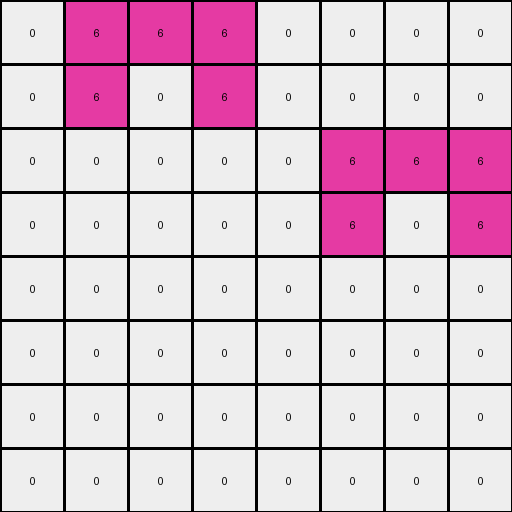
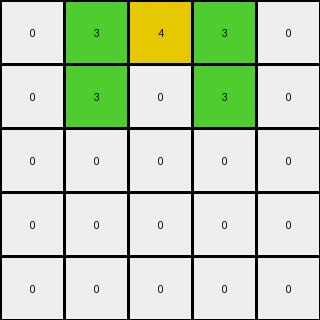
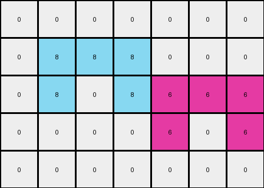

# 54d82841 • 009 • refine_dreamer

---


Previous Code:
```python
"""
1.  **Identify Input Objects:** Locate all cells in the input grid that are green (value 3).
2.  **Calculate Centroid:**
    *   Sum the row indices of all green cells.
    *   Sum the column indices of all green cells.
    *   Divide each sum by the number of green cells. If it is float use floor division.
3.  **Place Output Object:** In the output grid, change the cell at the calculated (row, column) coordinates to yellow (value 4).
4.  **Preserve Unchanged:** All other cells in the input grid remain unchanged in the output grid.
"""

import numpy as np

def find_green_cells(grid):
    # Find coordinates of green cells (value 3).
    green_cells = []
    for row_index, row in enumerate(grid):
        for col_index, cell_value in enumerate(row):
            if cell_value == 3:
                green_cells.append((row_index, col_index))
    return green_cells

def calculate_centroid(coords):
    # Calculate the centroid of a list of coordinates.
    if not coords:
        return None  # Handle the case where there are no green cells.

    sum_row = sum(coord[0] for coord in coords)
    sum_col = sum(coord[1] for coord in coords)
    centroid_row = sum_row // len(coords)
    centroid_col = sum_col // len(coords)
    return (centroid_row, centroid_col)

def transform(input_grid):
    # initialize output_grid
    output_grid = np.copy(input_grid)
    
    # find green cells
    green_cells = find_green_cells(input_grid)

    # calculate the centroid location
    centroid = calculate_centroid(green_cells)

    # if a centroid exists, set the color to yellow
    if centroid:
      output_grid[centroid[0], centroid[1]] = 4

    return output_grid
```

Train Set Results:

## Example 1:

Input:
```
0 6 6 6 0 0 0 0
0 6 0 6 0 0 0 0
0 0 0 0 0 6 6 6
0 0 0 0 0 6 0 6
0 0 0 0 0 0 0 0
0 0 0 0 0 0 0 0
0 0 0 0 0 0 0 0
0 0 0 0 0 0 0 0
```
Expected Output:
```
0 6 6 6 0 0 0 0
0 6 0 6 0 0 0 0
0 0 0 0 0 6 6 6
0 0 0 0 0 6 0 6
0 0 0 0 0 0 0 0
0 0 0 0 0 0 0 0
0 0 0 0 0 0 0 0
0 0 4 0 0 0 4 0
```
Transformed Output:
```
0 6 6 6 0 0 0 0
0 6 0 6 0 0 0 0
0 0 0 0 0 6 6 6
0 0 0 0 0 6 0 6
0 0 0 0 0 0 0 0
0 0 0 0 0 0 0 0
0 0 0 0 0 0 0 0
0 0 0 0 0 0 0 0
```

match: False
pixels_off: 2
size_correct: True
color_palette_correct: True
correct_pixel_counts: False

## Example 2:

Input:
```
0 3 3 3 0
0 3 0 3 0
0 0 0 0 0
0 0 0 0 0
0 0 0 0 0
```
Expected Output:
```
0 3 3 3 0
0 3 0 3 0
0 0 0 0 0
0 0 0 0 0
0 0 4 0 0
```
Transformed Output:
```
0 3 4 3 0
0 3 0 3 0
0 0 0 0 0
0 0 0 0 0
0 0 0 0 0
```

match: False
pixels_off: 2
size_correct: True
color_palette_correct: True
correct_pixel_counts: False

## Example 3:

Input:
```
0 0 0 0 0 0 0
0 8 8 8 0 0 0
0 8 0 8 6 6 6
0 0 0 0 6 0 6
0 0 0 0 0 0 0
```
Expected Output:
```
0 0 0 0 0 0 0
0 8 8 8 0 0 0
0 8 0 8 6 6 6
0 0 0 0 6 0 6
0 0 4 0 0 4 0
```
Transformed Output:
```
0 0 0 0 0 0 0
0 8 8 8 0 0 0
0 8 0 8 6 6 6
0 0 0 0 6 0 6
0 0 0 0 0 0 0
```

match: False
pixels_off: 2
size_correct: True
color_palette_correct: True
correct_pixel_counts: False

**INSTRUCTIONS**

The code above was generated based on observations from the first training
example

we have tested the transform function on each of the task example inputs and
compared with the expected output

review each of the examples provided and the results and consider how the
natural language program should be updated to accommodate this new knowledge

respond with the following deliverables:

- general assessment of the information provided and strategy for resolving the
  errors
- gather metrics about each of the examples and results - use code_execution to
  develop accurate reports on your assumptions
- a YAML block documenting facts - Focus on identifying objects, their properties, and the actions performed on them.
- a natural language program - Be as clear and concise as possible, providing a complete description of the transformation rule.


your responses should be considered as information in a report - not a
conversation
