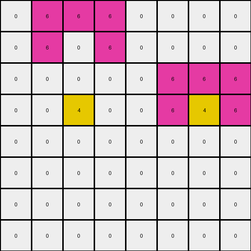
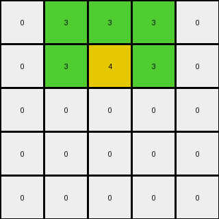
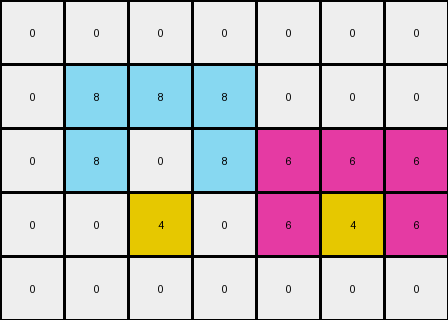

# 54d82841 • 011 • refine_dreamer

---


Previous Code:
```python
"""
1.  **Identify Input Objects:** Find all distinct objects in the input grid. A distinct object is a group of one or more contiguous cells of the same color.
2.  **Calculate Centroids:** For each distinct object found in the input, calculate its centroid. The centroid is the average of the row and column indices of all pixels belonging to that object.
3.  **Bottom Row Placement:**
    *   Find the centroid for each input object.
    *   The column location of the centroid defines the column that will change on output.
    *   The output change occurs only on the last row that contains a non-zero value.
    *   Change the last non-zero row's identified columns to yellow (value 4).
4.  **Preserve Unchanged (Except Bottom Row):** All other cells in the input grid remain unchanged in the output grid.
"""

import numpy as np

def find_objects(grid):
    # Find distinct objects in the grid.
    objects = []
    visited = set()

    def is_valid(row, col):
        return 0 <= row < grid.shape[0] and 0 <= col < grid.shape[1]

    def dfs(row, col, color, obj):
        if (row, col) in visited or not is_valid(row, col) or grid[row, col] != color:
            return
        visited.add((row, col))
        obj.append((row, col))
        # Explore adjacent cells (up, down, left, right)
        dfs(row + 1, col, color, obj)
        dfs(row - 1, col, color, obj)
        dfs(row, col + 1, color, obj)
        dfs(row, col - 1, color, obj)

    for row_index, row in enumerate(grid):
        for col_index, cell_value in enumerate(row):
            if (row_index, col_index) not in visited and cell_value != 0:
                obj = []
                dfs(row_index, col_index, cell_value, obj)
                objects.append(obj)
    return objects

def calculate_centroid(coords):
    # Calculate the centroid of a list of coordinates.
    if not coords:
        return None
    sum_row = sum(coord[0] for coord in coords)
    sum_col = sum(coord[1] for coord in coords)
    centroid_row = sum_row // len(coords)
    centroid_col = sum_col // len(coords)
    return (centroid_row, centroid_col)

def find_last_nonzero_row(grid):
    # Find the index of the last row that contains a non-zero value.
    for row_index in reversed(range(grid.shape[0])):
        if np.any(grid[row_index] != 0):
            return row_index
    return -1 # if no non-zero rows

def transform(input_grid):
    # initialize output_grid
    output_grid = np.copy(input_grid)

    # find distinct objects
    objects = find_objects(input_grid)

    # calculate centroid for each object
    centroids = [calculate_centroid(obj) for obj in objects]

    # find the last non-zero row
    last_row = find_last_nonzero_row(input_grid)
    
    # apply transformation based on centroid locations, if valid
    if last_row != -1:
        for centroid in centroids:
          if centroid:
            output_grid[last_row, centroid[1]] = 4

    return output_grid
```

Train Set Results:

## Example 1:

Input:
```
0 6 6 6 0 0 0 0
0 6 0 6 0 0 0 0
0 0 0 0 0 6 6 6
0 0 0 0 0 6 0 6
0 0 0 0 0 0 0 0
0 0 0 0 0 0 0 0
0 0 0 0 0 0 0 0
0 0 0 0 0 0 0 0
```
Expected Output:
```
0 6 6 6 0 0 0 0
0 6 0 6 0 0 0 0
0 0 0 0 0 6 6 6
0 0 0 0 0 6 0 6
0 0 0 0 0 0 0 0
0 0 0 0 0 0 0 0
0 0 0 0 0 0 0 0
0 0 4 0 0 0 4 0
```
Transformed Output:
```
0 6 6 6 0 0 0 0
0 6 0 6 0 0 0 0
0 0 0 0 0 6 6 6
0 0 4 0 0 6 4 6
0 0 0 0 0 0 0 0
0 0 0 0 0 0 0 0
0 0 0 0 0 0 0 0
0 0 0 0 0 0 0 0
```

match: False
pixels_off: 4
size_correct: True
color_palette_correct: True
correct_pixel_counts: True

## Example 2:

Input:
```
0 3 3 3 0
0 3 0 3 0
0 0 0 0 0
0 0 0 0 0
0 0 0 0 0
```
Expected Output:
```
0 3 3 3 0
0 3 0 3 0
0 0 0 0 0
0 0 0 0 0
0 0 4 0 0
```
Transformed Output:
```
0 3 3 3 0
0 3 4 3 0
0 0 0 0 0
0 0 0 0 0
0 0 0 0 0
```

match: False
pixels_off: 2
size_correct: True
color_palette_correct: True
correct_pixel_counts: True

## Example 3:

Input:
```
0 0 0 0 0 0 0
0 8 8 8 0 0 0
0 8 0 8 6 6 6
0 0 0 0 6 0 6
0 0 0 0 0 0 0
```
Expected Output:
```
0 0 0 0 0 0 0
0 8 8 8 0 0 0
0 8 0 8 6 6 6
0 0 0 0 6 0 6
0 0 4 0 0 4 0
```
Transformed Output:
```
0 0 0 0 0 0 0
0 8 8 8 0 0 0
0 8 0 8 6 6 6
0 0 4 0 6 4 6
0 0 0 0 0 0 0
```

match: False
pixels_off: 4
size_correct: True
color_palette_correct: True
correct_pixel_counts: True

**INSTRUCTIONS**

The code above was generated based on observations from the first training
example

we have tested the transform function on each of the task example inputs and
compared with the expected output

review each of the examples provided and the results and consider how the
natural language program should be updated to accommodate this new knowledge

respond with the following deliverables:

- general assessment of the information provided and strategy for resolving the
  errors
- gather metrics about each of the examples and results - use code_execution to
  develop accurate reports on your assumptions
- a YAML block documenting facts - Focus on identifying objects, their properties, and the actions performed on them.
- a natural language program - Be as clear and concise as possible, providing a complete description of the transformation rule.


your responses should be considered as information in a report - not a
conversation
