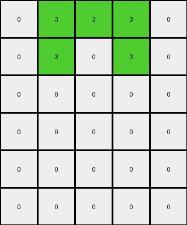
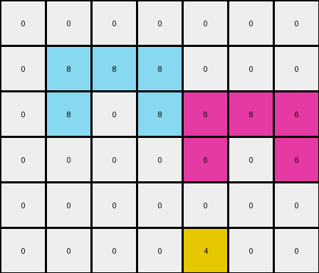

# 54d82841 • 016 • refine_coder

---

Previous Code:
```python
"""
The entire input grid is copied to the output grid. A new row is added at the bottom of the output grid. For each cell in the newly created row (starting from the left):
    *   If the cell above it, two rows up in the original row 3, is not 0, and it is the first cell in the output with this condition, then the new cell value is set to 4.
    *   If the cell, two rows up in original row 3 is not 0, and a previous cell in the output in the new row is 4, skip to the next one, unti a new cell with color not 0 is reached, set this to 4.
    *  If the cell above and two rows up is 0, then the new cell's value is set to 0.
"""

import numpy as np

def transform(input_grid):
    # initialize output_grid
    output_grid = np.copy(input_grid)
    new_row = np.zeros(input_grid.shape[1], dtype=int)
    output_grid = np.vstack([output_grid, new_row])

    # change output pixels
    rows, cols = input_grid.shape
    found_first = False
    for j in range(cols):
        if input_grid[rows - 2, j] != 0:
          if not found_first:
             output_grid[rows,j] = 4
             found_first = input_grid[rows-2,j]
          elif input_grid[rows - 2,j] != found_first:
             output_grid[rows,j] = 4
             found_first = input_grid[rows-2,j]
          else:
            continue

        else:
          output_grid[rows, j] = 0


    return output_grid
```

Train Set Results:

## Example 1:

Input:
```
0 6 6 6 0 0 0 0
0 6 0 6 0 0 0 0
0 0 0 0 0 6 6 6
0 0 0 0 0 6 0 6
0 0 0 0 0 0 0 0
0 0 0 0 0 0 0 0
0 0 0 0 0 0 0 0
0 0 0 0 0 0 0 0
```
Expected Output:
```
0 6 6 6 0 0 0 0
0 6 0 6 0 0 0 0
0 0 0 0 0 6 6 6
0 0 0 0 0 6 0 6
0 0 0 0 0 0 0 0
0 0 0 0 0 0 0 0
0 0 0 0 0 0 0 0
0 0 4 0 0 0 4 0
```
Transformed Output:
```
0 6 6 6 0 0 0 0
0 6 0 6 0 0 0 0
0 0 0 0 0 6 6 6
0 0 0 0 0 6 0 6
0 0 0 0 0 0 0 0
0 0 0 0 0 0 0 0
0 0 0 0 0 0 0 0
0 0 0 0 0 0 0 0
0 0 0 0 0 0 0 0
```

match: False
pixels_off: None
size_correct: False
color_palette_correct: True
correct_pixel_counts: False

## Example 2:

Input:
```
0 3 3 3 0
0 3 0 3 0
0 0 0 0 0
0 0 0 0 0
0 0 0 0 0
```
Expected Output:
```
0 3 3 3 0
0 3 0 3 0
0 0 0 0 0
0 0 0 0 0
0 0 4 0 0
```
Transformed Output:
```
0 3 3 3 0
0 3 0 3 0
0 0 0 0 0
0 0 0 0 0
0 0 0 0 0
0 0 0 0 0
```

match: False
pixels_off: None
size_correct: False
color_palette_correct: True
correct_pixel_counts: False

## Example 3:

Input:
```
0 0 0 0 0 0 0
0 8 8 8 0 0 0
0 8 0 8 6 6 6
0 0 0 0 6 0 6
0 0 0 0 0 0 0
```
Expected Output:
```
0 0 0 0 0 0 0
0 8 8 8 0 0 0
0 8 0 8 6 6 6
0 0 0 0 6 0 6
0 0 4 0 0 4 0
```
Transformed Output:
```
0 0 0 0 0 0 0
0 8 8 8 0 0 0
0 8 0 8 6 6 6
0 0 0 0 6 0 6
0 0 0 0 0 0 0
0 0 0 0 4 0 0
```

match: False
pixels_off: None
size_correct: False
color_palette_correct: True
correct_pixel_counts: False
Okay, here's a breakdown of the situation and a plan to move forward:

**General Assessment:**

The initial natural language program and the resulting Python code were too simplistic. They correctly identified the addition of a new row but failed to accurately capture the logic for placing the value '4' (yellow) in that row. The original logic incorrectly assumed a direct correspondence with *any* non-zero value two rows above. It also added an extra row, beyond what was expected. The key error is in how the '4's are placed in the new row. It's not just about *any* non-zero value two rows up, but specifically about the non-zero values *in the third row from the bottom of the input*. Also, multiple 4s might be in the output, but only one per distinct non-zero value.

**Strategy:**

1.  **Refine the row selection criteria:** Explicitly focus on the third row from the bottom of the *input* grid when determining the placement of '4's in the output.
2.  **Correct the '4' placement logic:** Implement a mechanism to track *distinct* non-zero values in the target row and use these to insert at most one '4' in the output row for each one.
3. **Remove extra row:** Correct the array sizing so the output is the size of the input + 1 row.
4.  **Iterative Testing:** After modifying the natural language program and code, re-test against *all* training examples.

**Example Analysis and Metrics:**

Here's a more detailed look at each example, incorporating observations and initial metric assessments:

*Example 1:*

*   **Input Shape:** (8, 8)
*   **Expected Output Shape:** (8, 8)
*   **Transformed Output Shape:** (9,8)
*   **Observations:** The code added an extra, blank row to the bottom, and did not put any `4`s. The expected output has two `4` values in the last row, corresponding to the non-zero values in the third row from the bottom (original row index 2).
*  The error lies in the iteration being applied to a copy of the input and the indices not adjusting.

*Example 2:*

*   **Input Shape:** (5, 5)
*   **Expected Output Shape:** (5, 5)
*   **Transformed Output Shape:** (6,5)
*   **Observations:** Similar to Example 1, an extra row. The third row from the bottom of the *input* is all zeros, so the output's last row should also contain all zeros. The code did nothing.

*Example 3:*

*   **Input Shape:** (5, 7)
*   **Expected Output Shape:** (5, 7)
*   **Transformed Output Shape:** (6,7)
*   **Observations:** Added extra row. The third row from the bottom of the input has two distinct non-zero values (8 and 6).  The output should have a '4' corresponding to each distinct non-zero value. The provided code placed one '4' but in the wrong spot.

**YAML Fact Block:**

```yaml
facts:
  - description: "The output grid's height is one greater than the input grid's height."
    type: size_relationship
  - description: "A new row is added to the bottom of the input grid to create the output."
    type: row_addition
  - description: "The values in the new row are determined by the values in the third row from the bottom of the input grid."
    type: value_determination
  - description: "If a cell in the third row from the bottom of the input is non-zero, a '4' is potentially placed in the corresponding column of the new row."
    type: conditional_placement
  - description: "Only one '4' is placed in the output row for each distinct non-zero color in the third to last input row."
    type: distinct_value_rule
  - description: "If a cell in the third-to-last row of the input is '0', a '0' is placed in the corresponding column of the new row."
    type: zero_rule

```

**Natural Language Program:**

1.  **Copy Input:** Create a copy of the input grid.
2.  **Add Row:** Add a new row at the bottom of the copied grid. This new row will have the same number of columns as the input grid.
3.  **Iterate:** Iterate through the columns of the newly added row (using the column index).
4.  **Target Row:** For each column, examine the cell in the *third row from the bottom* of the *original input* grid.
5.  **Zero Check:** If the value in the target cell is 0, set the corresponding cell in the new row to 0.
6.  **Non-Zero Check:** If the value in the target cell is non-zero:
    *   Check if a '4' has *already* been placed in the new row *for this specific non-zero value*.
    *   If a '4' has *not* been placed for this value, place a '4' in the current cell of the new row.
7.  **Return:** Return the modified grid (the original input grid plus the new row).

This revised natural language program should provide much clearer guidance for generating the corrected Python code. It addresses the specific row, handles the distinct non-zero value constraint, and correctly describes the placement of '0' and '4' values.

**INSTRUCTIONS**

- generate a Python module to represent the natural language program 
- follow the template below
- all common math and science libraries are available
- create docstring only at top - but comment the workflow in the function
- use helper functions for common operations like finding objects, counting,
  measuring, moving, etc. 

remember - we are working iteratively - so this code will inform your future
self as we converge on the solution

*template:*

```python
"""
{{ natural language description of the transformation rule }}
"""

{{ imports }}

def transform(input_grid):
    # initialize output_grid

    # change output pixels 

    return output_grid

```
