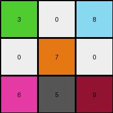
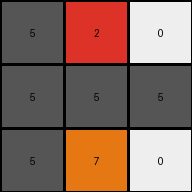

# 5614dbcf • 003 • refine_dreamer

---

Previous Code:
```python
"""
Divide the 9x9 input grid into nine 3x3 subgrids. For each subgrid, identify the color of the top-left pixel. 
Construct a 3x3 output grid and populate each cell with the color identified for the corresponding input subgrid.
"""

import numpy as np

def get_representative_color(subgrid):
    # Iterate through the subgrid to find the first non-white pixel.
    for row in range(subgrid.shape[0]):
        for col in range(subgrid.shape[1]):
            if subgrid[row, col] != 0:
                return subgrid[row, col]
    return 0  # Return white if the entire subgrid is white.

def transform(input_grid):
    # Initialize the output grid as a 3x3 array filled with zeros (white).
    output_grid = np.zeros((3, 3), dtype=int)

    # Iterate through the input grid, dividing it into 3x3 subgrids.
    for i in range(3):
        for j in range(3):
            # Extract the 3x3 subgrid.
            subgrid = input_grid[i*3:(i+1)*3, j*3:(j+1)*3]
            # Get the representative color of the subgrid.
            representative_color = get_representative_color(subgrid)
            # Set the corresponding pixel in the output grid.
            output_grid[i, j] = representative_color

    return output_grid
```

Train Set Results:

## Example 1:

Input:
```
3 3 3 0 0 0 8 8 8
3 3 3 0 0 0 8 5 8
3 3 3 0 0 0 8 8 8
0 0 0 7 5 7 0 0 0
0 0 0 7 7 7 0 0 0
0 0 0 7 7 7 0 0 0
6 6 6 0 0 5 9 9 9
6 6 6 0 0 0 9 9 9
6 5 6 0 5 0 9 9 5
```
Expected Output:
```
3 0 8
0 7 0
6 0 9
```
Transformed Output:
```
3 0 8
0 7 0
6 5 9
```

match: False
pixels_off: 1
size_correct: True
color_palette_correct: False
correct_pixel_counts: False

## Example 2:

Input:
```
0 0 0 2 2 2 0 0 0
0 5 0 2 2 2 0 0 0
0 0 0 2 2 2 0 0 0
5 0 0 0 0 0 0 0 0
0 0 0 5 0 0 0 5 0
0 0 0 0 0 0 0 0 0
0 5 0 7 7 7 0 0 0
0 0 0 7 7 5 0 0 0
0 0 0 7 7 7 0 0 0
```
Expected Output:
```
0 2 0
0 0 0
0 7 0
```
Transformed Output:
```
5 2 0
5 5 5
5 7 0
```

match: False
pixels_off: 5
size_correct: True
color_palette_correct: False
correct_pixel_counts: False
**INSTRUCTIONS**

The code above was generated based on observations from the first training
example

we have tested the transform function on each of the task example inputs and
compared with the expected output

review each of the examples provided and the results and consider how the
natural language program should be updated to accommodate this new knowledge

respond with the following deliverables:

- general assessment of the information provided and strategy for resolving the
  errors
- gather metrics about each of the examples and results - use code_execution to
  develop accurate reports on your assumptions
- a YAML block documenting facts - Focus on identifying objects, their properties, and the actions performed on them.
- a natural language program - Be as clear and concise as possible, providing a complete description of the transformation rule.


your responses should be considered as information in a report - not a
conversation
