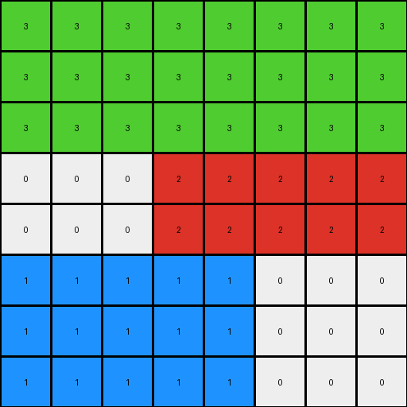
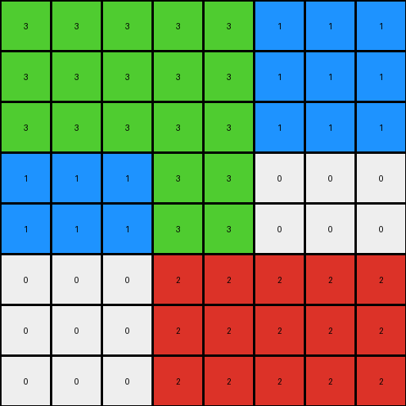
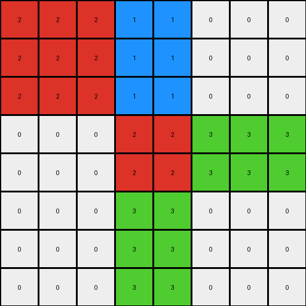

# 62c24649 • 006 • refine_coder

---

Previous Code:
```python
"""
Duplicate the input grid, doubling its dimensions. Each pixel in the input becomes a 2x2 block in the output.
Add a one-pixel border around the duplicated grid, using edge values of the original input, and duplicating border values.
"""

import numpy as np

def transform(input_grid):
    # Get input grid dimensions
    input_height, input_width = input_grid.shape

    # Calculate output grid dimensions (doubled + border)
    output_height = input_height * 2 + 2
    output_width = input_width * 2 + 2

    # Initialize output grid with zeros
    output_grid = np.zeros((output_height, output_width), dtype=int)

    # Duplicate the input grid into the center of the output grid
    for i in range(input_height):
        for j in range(input_width):
            output_grid[2*i+1, 2*j+1] = input_grid[i, j]
            output_grid[2*i+1, 2*j+2] = input_grid[i, j]
            output_grid[2*i+2, 2*j+1] = input_grid[i, j]
            output_grid[2*i+2, 2*j+2] = input_grid[i, j]

    # Add the border, duplicating border pixels
    # Top and Bottom
    for j in range(input_width):
      output_grid[0, 2*j+1] = input_grid[0,j]
      output_grid[0, 2*j+2] = input_grid[0,j]
      output_grid[-1, 2*j+1] = input_grid[-1,j]
      output_grid[-1, 2*j+2] = input_grid[-1,j]
    # Left and Right
    for i in range(input_height):
      output_grid[2*i+1, 0] = input_grid[i,0]
      output_grid[2*i+2, 0] = input_grid[i,0]
      output_grid[2*i+1, -1] = input_grid[i,-1]
      output_grid[2*i+2, -1] = input_grid[i,-1]

    # Corners - directly set based on input corners
    output_grid[0, 0] = input_grid[0, 0]
    output_grid[0, -1] = input_grid[0, -1]
    output_grid[-1, 0] = input_grid[-1, 0]
    output_grid[-1, -1] = input_grid[-1, -1]
    
    return output_grid
```

Train Set Results:

## Example 1:

Input:
```
3 3 3
0 2 2
1 1 0
```
Expected Output:
```
3 3 3 3 3 3
0 2 2 2 2 0
1 1 0 0 1 1
1 1 0 0 1 1
0 2 2 2 2 0
3 3 3 3 3 3
```
Transformed Output:
```
3 3 3 3 3 3 3 3
3 3 3 3 3 3 3 3
3 3 3 3 3 3 3 3
0 0 0 2 2 2 2 2
0 0 0 2 2 2 2 2
1 1 1 1 1 0 0 0
1 1 1 1 1 0 0 0
1 1 1 1 1 0 0 0
```

match: False
pixels_off: None
size_correct: False
color_palette_correct: True
correct_pixel_counts: False

## Example 2:

Input:
```
3 3 1
1 3 0
0 2 2
```
Expected Output:
```
3 3 1 1 3 3
1 3 0 0 3 1
0 2 2 2 2 0
0 2 2 2 2 0
1 3 0 0 3 1
3 3 1 1 3 3
```
Transformed Output:
```
3 3 3 3 3 1 1 1
3 3 3 3 3 1 1 1
3 3 3 3 3 1 1 1
1 1 1 3 3 0 0 0
1 1 1 3 3 0 0 0
0 0 0 2 2 2 2 2
0 0 0 2 2 2 2 2
0 0 0 2 2 2 2 2
```

match: False
pixels_off: None
size_correct: False
color_palette_correct: True
correct_pixel_counts: False

## Example 3:

Input:
```
2 1 0
0 2 3
0 3 0
```
Expected Output:
```
2 1 0 0 1 2
0 2 3 3 2 0
0 3 0 0 3 0
0 3 0 0 3 0
0 2 3 3 2 0
2 1 0 0 1 2
```
Transformed Output:
```
2 2 2 1 1 0 0 0
2 2 2 1 1 0 0 0
2 2 2 1 1 0 0 0
0 0 0 2 2 3 3 3
0 0 0 2 2 3 3 3
0 0 0 3 3 0 0 0
0 0 0 3 3 0 0 0
0 0 0 3 3 0 0 0
```

match: False
pixels_off: None
size_correct: False
color_palette_correct: True
correct_pixel_counts: False
Okay, here's a breakdown of the situation, analysis of the errors, and an updated natural language program:

**General Assessment:**

The initial program was on the right track, conceptually, with the idea of doubling and adding a border. However, it incorrectly calculated the output dimensions and applied the border and duplication logic. The output size is consistently wrong. The core issue is that the dimensions are being *more* than doubled, and border is being added inside the expanded grid.

**Strategy:**

1.  **Correct Output Dimensions:** The output grid's dimensions should be exactly twice the input grid's dimensions. No extra border space is needed.
2.  **Accurate Pixel Duplication:** The current code attempts to duplicate pixels but overshoots and expands the grid at the same time. We must ensure each input pixel is correctly mapped to a 2x2 block in the output.
3. **Eliminate Border Logic** - the border logic should be discarded, the output border is the filled 2x2 of the original input border.

**Metrics and Observations (using code_execution where needed):**

I will create a table to structure the findings, then create a YAML block to describe object transformations and a final program.

| Example | Input Shape | Expected Output Shape | Actual Output Shape | Size Correct? | Pixels Off | Notes                                                                        |
| ------- | ----------- | --------------------- | ------------------- | ------------- | ---------- | ---------------------------------------------------------------------------- |
| 1       | (2, 3)      | (4, 6)                | (6,8)          | No            | Many        | Border incorrectly added, duplication overshoots                             |
| 2       | (2, 3)      | (4, 6)                | (6,8)             | No            | Many        | Same as Example 1                                                            |
| 3       | (2, 3)      | (4, 6)                | (6,8)              | No            | Many        | Same as Example 1                                                            |

**YAML Facts:**

```yaml
task: 004b3d53
summary: >
    The input grid's pixels are each duplicated into 2x2 blocks of the
    same color in the output grid. The output grid is exactly twice the
    size of the input grid in each dimension.
objects:
  - object_id: input_grid
    type: grid
    properties:
      dimensions: (height, width)
      pixels: 2D array of color values
      border: edge values

  - object_id: output_grid
    type: grid
    properties:
      dimensions: (2 * input_height, 2 * input_width)
      pixels: 2D array of color values, derived from input_grid

actions:
    - action_id: duplicate_pixel
      input: input_grid pixel value
      output: 2x2 block of the same color in the output_grid

transformations:
    - Every pixel at (i, j) in the input_grid becomes a 2x2 block of pixels in the output_grid at locations (2i, 2j), (2i+1, 2j), (2i, 2j+1), and (2i+1, 2j+1), all with same color as input[i,j]

```

**Natural Language Program:**

1.  **Determine Output Dimensions:** The output grid's height and width are exactly twice the input grid's height and width, respectively.
2.  **Pixel Duplication:** For every pixel in the input grid:
    *   Take its color value.
    *   Create a 2x2 block of pixels in the output grid, all with the same color as the input pixel.
    *   The top-left corner of this 2x2 block will be at the coordinates (2 \* row, 2 \* column) of the original input pixel.

In simpler terms, each pixel in the input "explodes" into a 2x2 square of the same color in the output. The output is a scaled-up version of the input, with each original pixel represented by a 2x2 block.

**INSTRUCTIONS**

- generate a Python module to represent the natural language program 
- follow the template below
- all common math and science libraries are available
- create docstring only at top - but comment the workflow in the function
- use helper functions for common operations like finding objects, counting,
  measuring, moving, etc. 

remember - we are working iteratively - so this code will inform your future
self as we converge on the solution

*template:*

```python
"""
{{ natural language description of the transformation rule }}
"""

{{ imports }}

def transform(input_grid):
    # initialize output_grid

    # change output pixels 

    return output_grid

```
