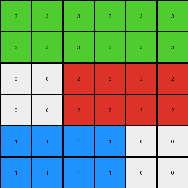
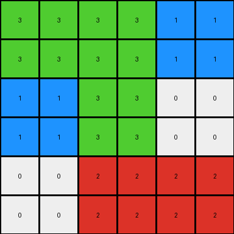
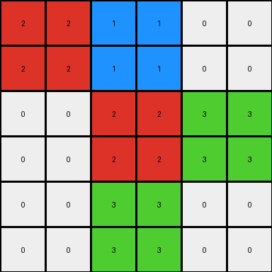

# 62c24649 • 009 • refine_dreamer

---


Previous Code:
```python
"""
The input grid is scaled up and mirrored to create the output grid. The output
grid has double the dimensions of the input grid (6x6 vs 3x3). The
transformation involves mirroring the input both horizontally and vertically,
while preserving the original colors. Each pixel in the input becomes a 2x2
block of the same color in the output.
"""

import numpy as np

def transform(input_grid):
    """
    Transforms the input grid by scaling and mirroring it.
    """
    input_array = np.array(input_grid)
    rows, cols = input_array.shape

    # Create an empty output array with double the dimensions
    output_array = np.zeros((rows * 2, cols * 2), dtype=int)

    # Scale up and mirror
    for i in range(rows):
        for j in range(cols):
            # Copy each element to a 2x2 block in the output array
            output_array[2*i:2*i+2, 2*j:2*j+2] = input_array[i, j]
            
    return output_array.tolist()
```

Train Set Results:

## Example 1:

Input:
```
3 3 3
0 2 2
1 1 0
```
Expected Output:
```
3 3 3 3 3 3
0 2 2 2 2 0
1 1 0 0 1 1
1 1 0 0 1 1
0 2 2 2 2 0
3 3 3 3 3 3
```
Transformed Output:
```
3 3 3 3 3 3
3 3 3 3 3 3
0 0 2 2 2 2
0 0 2 2 2 2
1 1 1 1 0 0
1 1 1 1 0 0
```

match: False
pixels_off: 29
size_correct: True
color_palette_correct: True
correct_pixel_counts: True

## Example 2:

Input:
```
3 3 1
1 3 0
0 2 2
```
Expected Output:
```
3 3 1 1 3 3
1 3 0 0 3 1
0 2 2 2 2 0
0 2 2 2 2 0
1 3 0 0 3 1
3 3 1 1 3 3
```
Transformed Output:
```
3 3 3 3 1 1
3 3 3 3 1 1
1 1 3 3 0 0
1 1 3 3 0 0
0 0 2 2 2 2
0 0 2 2 2 2
```

match: False
pixels_off: 30
size_correct: True
color_palette_correct: True
correct_pixel_counts: True

## Example 3:

Input:
```
2 1 0
0 2 3
0 3 0
```
Expected Output:
```
2 1 0 0 1 2
0 2 3 3 2 0
0 3 0 0 3 0
0 3 0 0 3 0
0 2 3 3 2 0
2 1 0 0 1 2
```
Transformed Output:
```
2 2 1 1 0 0
2 2 1 1 0 0
0 0 2 2 3 3
0 0 2 2 3 3
0 0 3 3 0 0
0 0 3 3 0 0
```

match: False
pixels_off: 25
size_correct: True
color_palette_correct: True
correct_pixel_counts: True

**INSTRUCTIONS**

The code above was generated based on observations from the first training
example

we have tested the transform function on each of the task example inputs and
compared with the expected output

review each of the examples provided and the results and consider how the
natural language program should be updated to accommodate this new knowledge

respond with the following deliverables:

- general assessment of the information provided and strategy for resolving the
  errors
- gather metrics about each of the examples and results - use code_execution to
  develop accurate reports on your assumptions
- a YAML block documenting facts - Focus on identifying objects, their properties, and the actions performed on them.
- a natural language program - Be as clear and concise as possible, providing a complete description of the transformation rule.


your responses should be considered as information in a report - not a
conversation
