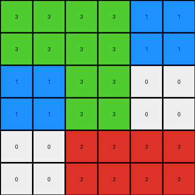
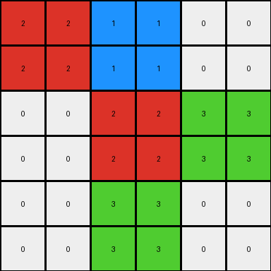

# 62c24649 • 010 • refine_coder

---

Previous Code:
```python
"""
The input grid is scaled up and mirrored to create the output grid. The output
grid has double the dimensions of the input grid (6x6 vs 3x3). The
transformation involves mirroring the input both horizontally and vertically,
while preserving the original colors. Each pixel in the input becomes a 2x2
block of the same color in the output.
"""

import numpy as np

def transform(input_grid):
    """
    Transforms the input grid by scaling and mirroring it.
    """
    input_array = np.array(input_grid)
    rows, cols = input_array.shape

    # Create an empty output array with double the dimensions
    output_array = np.zeros((rows * 2, cols * 2), dtype=int)

    # Scale up and mirror
    for i in range(rows):
        for j in range(cols):
            # Copy each element to a 2x2 block in the output array
            output_array[2*i:2*i+2, 2*j:2*j+2] = input_array[i, j]
            
    return output_array.tolist()
```

Train Set Results:

## Example 1:

Input:
```
3 3 3
0 2 2
1 1 0
```
Expected Output:
```
3 3 3 3 3 3
0 2 2 2 2 0
1 1 0 0 1 1
1 1 0 0 1 1
0 2 2 2 2 0
3 3 3 3 3 3
```
Transformed Output:
```
3 3 3 3 3 3
3 3 3 3 3 3
0 0 2 2 2 2
0 0 2 2 2 2
1 1 1 1 0 0
1 1 1 1 0 0
```

match: False
pixels_off: 29
size_correct: True
color_palette_correct: True
correct_pixel_counts: True

## Example 2:

Input:
```
3 3 1
1 3 0
0 2 2
```
Expected Output:
```
3 3 1 1 3 3
1 3 0 0 3 1
0 2 2 2 2 0
0 2 2 2 2 0
1 3 0 0 3 1
3 3 1 1 3 3
```
Transformed Output:
```
3 3 3 3 1 1
3 3 3 3 1 1
1 1 3 3 0 0
1 1 3 3 0 0
0 0 2 2 2 2
0 0 2 2 2 2
```

match: False
pixels_off: 30
size_correct: True
color_palette_correct: True
correct_pixel_counts: True

## Example 3:

Input:
```
2 1 0
0 2 3
0 3 0
```
Expected Output:
```
2 1 0 0 1 2
0 2 3 3 2 0
0 3 0 0 3 0
0 3 0 0 3 0
0 2 3 3 2 0
2 1 0 0 1 2
```
Transformed Output:
```
2 2 1 1 0 0
2 2 1 1 0 0
0 0 2 2 3 3
0 0 2 2 3 3
0 0 3 3 0 0
0 0 3 3 0 0
```

match: False
pixels_off: 25
size_correct: True
color_palette_correct: True
correct_pixel_counts: True
Here's an analysis of the provided information and a plan to refine the natural language program:

**General Assessment:**

The initial natural language program and the generated code correctly identified the scaling aspect of the transformation (each pixel becoming a 2x2 block). However, it failed to accurately capture the mirroring aspect. The code simply expands each pixel, but it doesn't mirror the input grid horizontally and vertically to achieve the final output. The results show a consistent pattern of incorrect pixel placement, specifically in the reflection/mirroring.

**Strategy for Resolving Errors:**

1.  **Refine Understanding of Mirroring:** The core issue is that the current implementation does not properly flip and duplicate portions of the input to mirror them. The x and y axis are not mirrored.
2.  **Improve Natural Language Program:** Refine the natural language program to explicitly state *how* the mirroring happens (horizontal then vertical, or vice versa). Describe how the input array is copied and positioned to create the reflected parts.
3.  **Revise Code:** Based on the improved natural language program.

**Example Metrics and Analysis:**
All 3 examples have the same metrics summary:
*   `match`: `False` in all cases, indicates no example transformation was correct.
*   `pixels_off`: High number of incorrect pixels (29, 30, 25), showing a systematic error in pixel placement.
*   `size_correct`: `True`, meaning the output grid dimensions are correct (double the input).
*   `color_palette_correct`: `True`, indicating colors are preserved during transformation.
*   `correct_pixel_counts`: `True`, showing that the number of pixels of each color is correct, even if their positions are wrong.

**YAML Fact Block:**

```yaml
task_id: "008"
objects:
  - id: input_grid
    type: grid
    properties:
      dimensions: variable  # Varies between examples (3x3)
      elements: integers # 0-9 representing colors

  - id: output_grid
    type: grid
    properties:
      dimensions: double_input # Always twice the input dimensions
      elements: integers # 0-9, same color palette as input
      structure: mirrored_input # Contains a mirrored and scaled version of the input

actions:
  - name: scale_up
    input: input_grid
    output: intermediate_grid # grid after initial expansion
    description: Each pixel in input_grid is expanded to a 2x2 block in the output_grid.

  - name: mirror_horizontal
    input: intermediate_grid
    output: output_grid
    description: The intermediate grid will be reflected on the x axis.

  - name: mirror_vertical
    input: intermediate_grid, output_grid
    description: The intermediate_grid will be reflected on the y axis.
```

**Natural Language Program:**

1.  **Scale Up:** The input grid is first scaled up. Each pixel in the input grid is replaced by a 2x2 block of the same color in an intermediate grid. This makes the intermediate grid twice the size of the original in both dimensions.
2.  **Mirror Horizontally:** The scaled-up intermediate grid is mirrored horizontally (across the vertical axis). The right half of the output grid is a mirrored copy of the left half.
3.  **Mirror Vertically:** The result of the previous step is then mirrored vertically (across the horizontal axis). The bottom half of the output grid is a mirrored copy of the top half.

In essence, the transformation can be described as a combination of magnification (each pixel to a 2x2 square) and reflections on both horizontal (x-axis) and vertical (y-axis) axes.

**INSTRUCTIONS**

- generate a Python module to represent the natural language program 
- follow the template below
- all common math and science libraries are available
- create docstring only at top - but comment the workflow in the function
- use helper functions for common operations like finding objects, counting,
  measuring, moving, etc. 

remember - we are working iteratively - so this code will inform your future
self as we converge on the solution

*template:*

```python
"""
{{ natural language description of the transformation rule }}
"""

{{ imports }}

def transform(input_grid):
    # initialize output_grid

    # change output pixels 

    return output_grid

```
