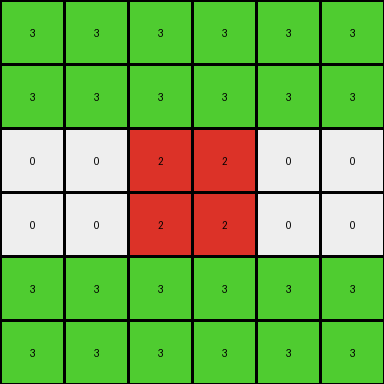
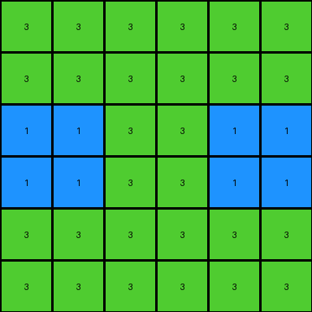
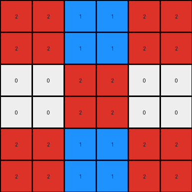

# 62c24649 • 011 • refine_dreamer

---

Previous Code:
```python
"""
1.  **Scale Up:** The input grid is first scaled up. Each pixel in the input grid is replaced by a 2x2 block of the same color in an intermediate grid. This makes the intermediate grid twice the size of the original in both dimensions.
2.  **Mirror Horizontally:** The scaled-up intermediate grid is mirrored horizontally (across the vertical axis). The right half of the output grid is a mirrored copy of the left half.
3.  **Mirror Vertically:** The result of the previous step is then mirrored vertically (across the horizontal axis). The bottom half of the output grid is a mirrored copy of the top half.

In essence, the transformation can be described as a combination of magnification (each pixel to a 2x2 square) and reflections on both horizontal (x-axis) and vertical (y-axis) axes.
"""

import numpy as np

def transform(input_grid):
    input_array = np.array(input_grid)
    rows, cols = input_array.shape

    # 1. Scale Up
    scaled_array = np.zeros((rows * 2, cols * 2), dtype=int)
    for i in range(rows):
        for j in range(cols):
            scaled_array[2*i:2*i+2, 2*j:2*j+2] = input_array[i, j]

    # 2. Mirror Horizontally and 3. Mirror Vertically (combined for efficiency)
    output_array = np.zeros((rows * 2, cols * 2), dtype=int)
    for i in range(rows * 2):
        for j in range(cols * 2):
            # Calculate mirrored indices
            mirrored_i = i
            mirrored_j = j
            if i >= rows:
                mirrored_i = 2 * rows - 1 - i
            if j >= cols:
                mirrored_j = 2 * cols - 1- j
            
            output_array[i,j] = scaled_array[mirrored_i, mirrored_j]


    return output_array.tolist()
```

Train Set Results:

## Example 1:

Input:
```
3 3 3
0 2 2
1 1 0
```
Expected Output:
```
3 3 3 3 3 3
0 2 2 2 2 0
1 1 0 0 1 1
1 1 0 0 1 1
0 2 2 2 2 0
3 3 3 3 3 3
```
Transformed Output:
```
3 3 3 3 3 3
3 3 3 3 3 3
0 0 2 2 0 0
0 0 2 2 0 0
3 3 3 3 3 3
3 3 3 3 3 3
```

match: False
pixels_off: 24
size_correct: True
color_palette_correct: True
correct_pixel_counts: False

## Example 2:

Input:
```
3 3 1
1 3 0
0 2 2
```
Expected Output:
```
3 3 1 1 3 3
1 3 0 0 3 1
0 2 2 2 2 0
0 2 2 2 2 0
1 3 0 0 3 1
3 3 1 1 3 3
```
Transformed Output:
```
3 3 3 3 3 3
3 3 3 3 3 3
1 1 3 3 1 1
1 1 3 3 1 1
3 3 3 3 3 3
3 3 3 3 3 3
```

match: False
pixels_off: 24
size_correct: True
color_palette_correct: True
correct_pixel_counts: False

## Example 3:

Input:
```
2 1 0
0 2 3
0 3 0
```
Expected Output:
```
2 1 0 0 1 2
0 2 3 3 2 0
0 3 0 0 3 0
0 3 0 0 3 0
0 2 3 3 2 0
2 1 0 0 1 2
```
Transformed Output:
```
2 2 1 1 2 2
2 2 1 1 2 2
0 0 2 2 0 0
0 0 2 2 0 0
2 2 1 1 2 2
2 2 1 1 2 2
```

match: False
pixels_off: 24
size_correct: True
color_palette_correct: True
correct_pixel_counts: False
**INSTRUCTIONS**

The code above was generated based on observations from the first training
example

we have tested the transform function on each of the task example inputs and
compared with the expected output

review each of the examples provided and the results and consider how the
natural language program should be updated to accommodate this new knowledge

respond with the following deliverables:

- general assessment of the information provided and strategy for resolving the
  errors
- gather metrics about each of the examples and results - use code_execution to
  develop accurate reports on your assumptions
- a YAML block documenting facts - Focus on identifying objects, their properties, and the actions performed on them.
- a natural language program - Be as clear and concise as possible, providing a complete description of the transformation rule.


your responses should be considered as information in a report - not a
conversation
