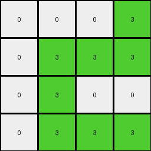
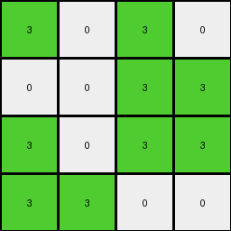

# 6430c8c4 • 003 • refine_dreamer

---


Previous Code:
```python
"""
1.  **Identify Region of Interest:** Focus on the top-left section within rows 0-3 and columns 0-3 of the input grid which is all the values of '7'. All other areas will be ignored.
2.  **Translate Color:** Replace all values in the top left region of '7' to a single color, '3' (green).
3. **Create Output Grid:** Create a new 4x4 grid, representing the focused section in the top left hand corner.
4.  **Populate Output:** Fill the corresponding cells to the area of interest in the output grid. Where color 7 existed in the input grid within the 4x4 section, put colour 3 in the output grid.
5. **Default Background**: If any output cell is outside of the area identified in step one, set the color to 0 (white).
"""

import numpy as np

def transform(input_grid):
    # Create a new 4x4 output grid filled with 0s (white).
    output_grid = np.zeros((4, 4), dtype=int)

    # Iterate through the top-left 4x4 region of the input grid.
    for i in range(min(4, input_grid.shape[0])):
        for j in range(min(4, input_grid.shape[1])):
            # If the input pixel is 7, set the corresponding output pixel to 3.
            if input_grid[i, j] == 7:
                output_grid[i, j] = 3

    return output_grid
```

Train Set Results:

## Example 1:

Input:
```
7 7 0 7
0 7 7 0
0 7 7 7
0 7 7 0
4 4 4 4
0 0 0 0
0 2 0 2
2 2 2 0
2 0 0 2
```
Expected Output:
```
0 0 3 0
3 0 0 0
0 0 0 0
0 0 0 0
```
Transformed Output:
```
3 3 0 3
0 3 3 0
0 3 3 3
0 3 3 0
```

match: False
pixels_off: 12
size_correct: True
color_palette_correct: True
correct_pixel_counts: False

## Example 2:

Input:
```
0 0 7 7
0 0 7 7
0 7 7 0
7 7 0 0
4 4 4 4
2 0 2 0
0 2 0 2
0 2 2 0
0 0 2 0
```
Expected Output:
```
0 3 0 0
3 0 0 0
3 0 0 3
0 0 0 3
```
Transformed Output:
```
0 0 3 3
0 0 3 3
0 3 3 0
3 3 0 0
```

match: False
pixels_off: 13
size_correct: True
color_palette_correct: True
correct_pixel_counts: False

## Example 3:

Input:
```
0 0 0 7
0 7 7 7
0 7 0 0
0 7 7 7
4 4 4 4
0 0 2 0
0 2 2 2
2 2 0 0
0 2 0 2
```
Expected Output:
```
3 3 0 0
3 0 0 0
0 0 3 3
3 0 0 0
```
Transformed Output:
```
0 0 0 3
0 3 3 3
0 3 0 0
0 3 3 3
```

match: False
pixels_off: 14
size_correct: True
color_palette_correct: True
correct_pixel_counts: False

## Example 4:

Input:
```
7 0 7 0
0 0 7 7
7 0 7 7
7 7 0 0
4 4 4 4
0 0 2 2
0 0 0 0
2 0 0 2
0 2 0 2
```
Expected Output:
```
0 3 0 0
3 3 0 0
0 3 0 0
0 0 3 0
```
Transformed Output:
```
3 0 3 0
0 0 3 3
3 0 3 3
3 3 0 0
```

match: False
pixels_off: 14
size_correct: True
color_palette_correct: True
correct_pixel_counts: False

**INSTRUCTIONS**

The code above was generated based on observations from the first training
example

we have tested the transform function on each of the task example inputs and
compared with the expected output

review each of the examples provided and the results and consider how the
natural language program should be updated to accommodate this new knowledge

respond with the following deliverables:

- general assessment of the information provided and strategy for resolving the
  errors
- gather metrics about each of the examples and results - use code_execution to
  develop accurate reports on your assumptions
- a YAML block documenting facts - Focus on identifying objects, their properties, and the actions performed on them.
- a natural language program - Be as clear and concise as possible, providing a complete description of the transformation rule.


your responses should be considered as information in a report - not a
conversation
