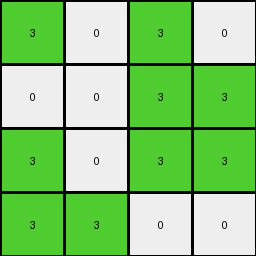

# 6430c8c4 • 005 • refine_dreamer

---


Previous Code:
```python
"""
1.  **Focus Area:** Consider only the top-left 4x4 section of the input grid.
2.  **Identify Source Pixels:**  Locate all pixels within this 4x4 section that have the value '7'.
3. **Determine Placement:** In the 4x4 output, replace any cell that *does not* contain a '7', with a '0'.
4. **Output Grid:** The output grid is always 4x4.
5. **Color Replacement:** The locations in the output are color '3' (green) if the corresponding location *in the input grid* is a '7'.
6.  **Background Color**: Any position *within the output grid* not occupied by the placement rule from Step 3 is set to '0' (white).
"""

import numpy as np

def transform(input_grid):
    # Initialize a 4x4 output grid filled with 0s (white).
    output_grid = np.zeros((4, 4), dtype=int)

    # Iterate through the top-left 4x4 region of the input grid.
    for i in range(min(4, input_grid.shape[0])):
        for j in range(min(4, input_grid.shape[1])):
            # If the input pixel is 7, set the corresponding output pixel to 3.
            if input_grid[i, j] == 7:
                output_grid[i, j] = 3

    return output_grid
```

Train Set Results:

## Example 1:

Input:
```
7 7 0 7
0 7 7 0
0 7 7 7
0 7 7 0
4 4 4 4
0 0 0 0
0 2 0 2
2 2 2 0
2 0 0 2
```
Expected Output:
```
0 0 3 0
3 0 0 0
0 0 0 0
0 0 0 0
```
Transformed Output:
```
3 3 0 3
0 3 3 0
0 3 3 3
0 3 3 0
```

match: False
pixels_off: 12
size_correct: True
color_palette_correct: True
correct_pixel_counts: False

## Example 2:

Input:
```
0 0 7 7
0 0 7 7
0 7 7 0
7 7 0 0
4 4 4 4
2 0 2 0
0 2 0 2
0 2 2 0
0 0 2 0
```
Expected Output:
```
0 3 0 0
3 0 0 0
3 0 0 3
0 0 0 3
```
Transformed Output:
```
0 0 3 3
0 0 3 3
0 3 3 0
3 3 0 0
```

match: False
pixels_off: 13
size_correct: True
color_palette_correct: True
correct_pixel_counts: False

## Example 3:

Input:
```
0 0 0 7
0 7 7 7
0 7 0 0
0 7 7 7
4 4 4 4
0 0 2 0
0 2 2 2
2 2 0 0
0 2 0 2
```
Expected Output:
```
3 3 0 0
3 0 0 0
0 0 3 3
3 0 0 0
```
Transformed Output:
```
0 0 0 3
0 3 3 3
0 3 0 0
0 3 3 3
```

match: False
pixels_off: 14
size_correct: True
color_palette_correct: True
correct_pixel_counts: False

## Example 4:

Input:
```
7 0 7 0
0 0 7 7
7 0 7 7
7 7 0 0
4 4 4 4
0 0 2 2
0 0 0 0
2 0 0 2
0 2 0 2
```
Expected Output:
```
0 3 0 0
3 3 0 0
0 3 0 0
0 0 3 0
```
Transformed Output:
```
3 0 3 0
0 0 3 3
3 0 3 3
3 3 0 0
```

match: False
pixels_off: 14
size_correct: True
color_palette_correct: True
correct_pixel_counts: False

**INSTRUCTIONS**

The code above was generated based on observations from the first training
example

we have tested the transform function on each of the task example inputs and
compared with the expected output

review each of the examples provided and the results and consider how the
natural language program should be updated to accommodate this new knowledge

respond with the following deliverables:

- general assessment of the information provided and strategy for resolving the
  errors
- gather metrics about each of the examples and results - use code_execution to
  develop accurate reports on your assumptions
- a YAML block documenting facts - Focus on identifying objects, their properties, and the actions performed on them.
- a natural language program - Be as clear and concise as possible, providing a complete description of the transformation rule.


your responses should be considered as information in a report - not a
conversation
