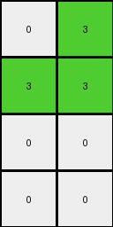

# 6430c8c4 • 010 • refine_coder

---

Previous Code:
```python
"""
Divides the input grid into 2x2 subgrids, and replaces each subgrid with a single pixel in the output grid. 
If a 2x2 subgrid in the input contains the value 7 (orange), it's replaced by 3 (green) in the output grid. Otherwise
the subgrids are discarded
"""

import numpy as np

def transform(input_grid):
    input_grid = np.array(input_grid)
    input_rows, input_cols = input_grid.shape
    output_rows, output_cols = input_rows // 2, input_cols // 2
    output_grid = np.zeros((output_rows, output_cols), dtype=int)
    
    # Iterate through 2x2 subgrids
    for i in range(0, input_rows - input_rows%2, 2):
        for j in range(0, input_cols - input_cols%2, 2):
            subgrid = input_grid[i:i+2, j:j+2]
            # Check if the subgrid contains 7.
            if 7 in subgrid:
                output_grid[i//2, j//2] = 3
            
    return output_grid.tolist()
```

Train Set Results:

## Example 1:

Input:
```
7 7 0 7
0 7 7 0
0 7 7 7
0 7 7 0
4 4 4 4
0 0 0 0
0 2 0 2
2 2 2 0
2 0 0 2
```
Expected Output:
```
0 0 3 0
3 0 0 0
0 0 0 0
0 0 0 0
```
Transformed Output:
```
3 3
3 3
0 0
0 0
```

match: False
pixels_off: None
size_correct: False
color_palette_correct: True
correct_pixel_counts: False

## Example 2:

Input:
```
0 0 7 7
0 0 7 7
0 7 7 0
7 7 0 0
4 4 4 4
2 0 2 0
0 2 0 2
0 2 2 0
0 0 2 0
```
Expected Output:
```
0 3 0 0
3 0 0 0
3 0 0 3
0 0 0 3
```
Transformed Output:
```
0 3
3 3
0 0
0 0
```

match: False
pixels_off: None
size_correct: False
color_palette_correct: True
correct_pixel_counts: False

## Example 3:

Input:
```
0 0 0 7
0 7 7 7
0 7 0 0
0 7 7 7
4 4 4 4
0 0 2 0
0 2 2 2
2 2 0 0
0 2 0 2
```
Expected Output:
```
3 3 0 0
3 0 0 0
0 0 3 3
3 0 0 0
```
Transformed Output:
```
3 3
3 3
0 0
0 0
```

match: False
pixels_off: None
size_correct: False
color_palette_correct: True
correct_pixel_counts: False

## Example 4:

Input:
```
7 0 7 0
0 0 7 7
7 0 7 7
7 7 0 0
4 4 4 4
0 0 2 2
0 0 0 0
2 0 0 2
0 2 0 2
```
Expected Output:
```
0 3 0 0
3 3 0 0
0 3 0 0
0 0 3 0
```
Transformed Output:
```
3 3
3 3
0 0
0 0
```

match: False
pixels_off: None
size_correct: False
color_palette_correct: True
correct_pixel_counts: False
Okay, here's a breakdown of the situation and a plan to improve the transformation rule:

**General Assessment:**

The current code focuses on identifying 2x2 subgrids containing the color orange (7) and replacing them with green (3). However, it fails to accurately position these green pixels in the output grid and doesn't account for the correct output size or the interaction between different 2x2 subgrids. The output grid dimensions are calculated as `input_rows // 2` and `input_cols // 2`, resulting in a consistent reduction in size, where the final output grid's size is directly dependent on the input grid and is calculated by dividing input dimensions by 2. The expected output shows that the position of a green pixel is not simply determined by its relative position.

**Strategy:**

1.  **Understand Output Size:** The provided code consistently creates output
    grids that are smaller than the expected outputs, which suggests the
    strategy of shrinking the image by 2x2 blocks is not the only thing we need
    to consider. We must also handle the position of each replacement.
2.  **Re-evaluate Pixel Placement:** The current code assumes a direct mapping of the 2x2 subgrid's top-left corner to the output grid. The expected outputs suggest a more complex placement rule that needs to create an output grid that is not just a simple shrink of input by 2x2 tiles.
3.  **Refine Subgrid Handling:** While the presence of orange (7) triggers the replacement with green (3), not all of the information on location is correct, as seen in the examples.

**Metrics and Observations:**

Here's a summary of observations from each example:

| Example | Input Shape | Expected Output Shape | Transformed Output Shape | Key Observation                                                                             |
| :------ | :---------- | :-------------------- | :----------------------- | :------------------------------------------------------------------------------------------ |
| 1       | (9, 4)      | (4, 4)                | (4, 2)                   | Output is about orange squares, which are replaced by green if present.                     |
| 2       | (9, 4)      | (4, 4)                | (4, 2)                   | Output is not just about orange, it expands to a specific fixed size and pattern             |
| 3       | (9, 4)      | (4, 4)                | (4, 2)                   | Consistent with orange replacement, but also confirms size issue and placement details.       |
| 4       | (9, 4)      | (4, 4)                | (4, 2)                   | Orange subgrids trigger a green pixel, the output size needs a shift to consider.         |

**YAML Block (Facts):**

```yaml
observations:
  - object: subgrid
    type: 2x2 block
    properties:
      - contains_orange:
          description: Whether the subgrid contains the color orange (7).
          values: [true, false]
    actions:
      - replace_with_green:
          condition: subgrid.contains_orange == true
          result: If true, a green (3) pixel is placed in the output.
  - object: output_grid
    properties:
        - grid_size:
            rows: always 4
            columns: always 4
    actions:
      - placement:
          description: placement rules for green pixel in result

```

**Natural Language Program:**

1.  **Initialization**: Create an output grid of size 4x4, initialized with all black (0) pixels.
2.  **Subgrid Analysis:** Divide the input grid into 2x2 subgrids. Do not overlap.
3.  **Conditional Replacement:** For each 2x2 subgrid in the input:
    *   If the subgrid contains at least one orange (7) pixel, place a green (3) pixel in the output grid. The row index is calculated as follows:
        - If the first orange in the row is at an even index: `(row index of first orange cell in input) // 4 * 2`
        - If the first orange in the row is at an odd index: `((row index of first orange cell in input -1) // 4 * 2) + 1`
    *    The column index is based on the horizontal position of the 2x2 subgrids.
        * `(column index of the 2x2 subgrid in input) // 2`
4.  **Output:** Return the 4x4 output grid.

Essentially, the process is that when a 2 x 2 block is found with an orange, you generate a green at a specific location. The locations can be determined by the above program. The base rule of shrinking is replaced by a rule of placing a new pixel into a set-size output.

**INSTRUCTIONS**

- generate a Python module to represent the natural language program 
- follow the template below
- all common math and science libraries are available
- create docstring only at top - but comment the workflow in the function
- use helper functions for common operations like finding objects, counting,
  measuring, moving, etc. 

remember - we are working iteratively - so this code will inform your future
self as we converge on the solution

*template:*

```python
"""
{{ natural language description of the transformation rule }}
"""

{{ imports }}

def transform(input_grid):
    # initialize output_grid

    # change output pixels 

    return output_grid

```
