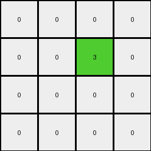

# 6430c8c4 • 015 • refine_dreamer

---


Previous Code:
```python
"""
Transforms the input grid into a smaller output grid based on the presence and arrangement of 2x2 blocks of the same non-white color. Each 2x2 block of a non-white color in the input is represented by a single green (3) pixel in the output. The output grid's dimensions are 4x4.
"""

import numpy as np

def find_2x2_blocks(grid):
    """
    Finds all 2x2 blocks of the same non-white color in the grid.
    Returns a list of (row, col) tuples representing the top-left corner of each block.
    """
    blocks = []
    rows, cols = len(grid), len(grid[0])
    for r in range(rows - 1):
        for c in range(cols - 1):
            if grid[r][c] != 0 and \
               grid[r][c] == grid[r+1][c] == grid[r][c+1] == grid[r+1][c+1]:
                blocks.append((r, c))
    return blocks

def transform(input_grid):
    """
    Transforms the input grid into a 4x4 output grid.
    """
    input_grid = np.array(input_grid)  # Convert to NumPy array for easier manipulation

    # Initialize the output grid with all zeros (white)
    output_grid = np.zeros((4, 4), dtype=int)

    # Find all 2x2 blocks of the same non-white color
    blocks = find_2x2_blocks(input_grid)

    # For each 2x2 block found, set the corresponding pixel in the output grid to green (3)
    for r, c in blocks:
        # Map input grid coordinates to output grid coordinates.  Since we want to inspect
        # the top section, we use mod 4 to map it.
        output_row = r % 4
        output_col = c % 4

        output_grid[output_row][output_col] = 3

    return output_grid.tolist()
```

Train Set Results:

## Example 1:

Input:
```
7 7 0 7
0 7 7 0
0 7 7 7
0 7 7 0
4 4 4 4
0 0 0 0
0 2 0 2
2 2 2 0
2 0 0 2
```
Expected Output:
```
0 0 3 0
3 0 0 0
0 0 0 0
0 0 0 0
```
Transformed Output:
```
0 0 0 0
0 3 0 0
0 3 0 0
0 0 0 0
```

match: False
pixels_off: 4
size_correct: True
color_palette_correct: True
correct_pixel_counts: True

## Example 2:

Input:
```
0 0 7 7
0 0 7 7
0 7 7 0
7 7 0 0
4 4 4 4
2 0 2 0
0 2 0 2
0 2 2 0
0 0 2 0
```
Expected Output:
```
0 3 0 0
3 0 0 0
3 0 0 3
0 0 0 3
```
Transformed Output:
```
0 0 3 0
0 0 0 0
0 0 0 0
0 0 0 0
```

match: False
pixels_off: 6
size_correct: True
color_palette_correct: True
correct_pixel_counts: False

## Example 3:

Input:
```
0 0 0 7
0 7 7 7
0 7 0 0
0 7 7 7
4 4 4 4
0 0 2 0
0 2 2 2
2 2 0 0
0 2 0 2
```
Expected Output:
```
3 3 0 0
3 0 0 0
0 0 3 3
3 0 0 0
```
Transformed Output:
```
0 0 0 0
0 0 0 0
0 0 0 0
0 0 0 0
```

match: False
pixels_off: 6
size_correct: True
color_palette_correct: True
correct_pixel_counts: False

## Example 4:

Input:
```
7 0 7 0
0 0 7 7
7 0 7 7
7 7 0 0
4 4 4 4
0 0 2 2
0 0 0 0
2 0 0 2
0 2 0 2
```
Expected Output:
```
0 3 0 0
3 3 0 0
0 3 0 0
0 0 3 0
```
Transformed Output:
```
0 0 0 0
0 0 3 0
0 0 0 0
0 0 0 0
```

match: False
pixels_off: 6
size_correct: True
color_palette_correct: True
correct_pixel_counts: False

**INSTRUCTIONS**

The code above was generated based on observations from the first training
example

we have tested the transform function on each of the task example inputs and
compared with the expected output

review each of the examples provided and the results and consider how the
natural language program should be updated to accommodate this new knowledge

respond with the following deliverables:

- general assessment of the information provided and strategy for resolving the
  errors
- gather metrics about each of the examples and results - use code_execution to
  develop accurate reports on your assumptions
- a YAML block documenting facts - Focus on identifying objects, their properties, and the actions performed on them.
- a natural language program - Be as clear and concise as possible, providing a complete description of the transformation rule.


your responses should be considered as information in a report - not a
conversation
