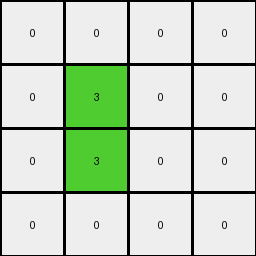

# 6430c8c4 • 016 • refine_coder

---

Previous Code:
```python
"""
Transforms the input grid into a smaller output grid based on the presence and arrangement of 2x2 blocks of the same non-white color. Each 2x2 block of a non-white color in the input is represented by a single green (3) pixel in the output. The output grid's dimensions are 4x4.
"""

import numpy as np

def find_2x2_blocks(grid):
    """
    Finds all 2x2 blocks of the same non-white color in the grid.
    Returns a list of (row, col) tuples representing the top-left corner of each block.
    """
    blocks = []
    rows, cols = len(grid), len(grid[0])
    for r in range(rows - 1):
        for c in range(cols - 1):
            if grid[r][c] != 0 and \
               grid[r][c] == grid[r+1][c] == grid[r][c+1] == grid[r+1][c+1]:
                blocks.append((r, c))
    return blocks

def transform(input_grid):
    """
    Transforms the input grid into a 4x4 output grid.
    """
    input_grid = np.array(input_grid)  # Convert to NumPy array for easier manipulation

    # Initialize the output grid with all zeros (white)
    output_grid = np.zeros((4, 4), dtype=int)

    # Find all 2x2 blocks of the same non-white color
    blocks = find_2x2_blocks(input_grid)

    # For each 2x2 block found, set the corresponding pixel in the output grid to green (3)
    for r, c in blocks:
        # Map input grid coordinates to output grid coordinates.  Since we want to inspect
        # the top section, we use mod 4 to map it.
        output_row = r % 4
        output_col = c % 4

        output_grid[output_row][output_col] = 3

    return output_grid.tolist()
```

Train Set Results:

## Example 1:

Input:
```
7 7 0 7
0 7 7 0
0 7 7 7
0 7 7 0
4 4 4 4
0 0 0 0
0 2 0 2
2 2 2 0
2 0 0 2
```
Expected Output:
```
0 0 3 0
3 0 0 0
0 0 0 0
0 0 0 0
```
Transformed Output:
```
0 0 0 0
0 3 0 0
0 3 0 0
0 0 0 0
```

match: False
pixels_off: 4
size_correct: True
color_palette_correct: True
correct_pixel_counts: True

## Example 2:

Input:
```
0 0 7 7
0 0 7 7
0 7 7 0
7 7 0 0
4 4 4 4
2 0 2 0
0 2 0 2
0 2 2 0
0 0 2 0
```
Expected Output:
```
0 3 0 0
3 0 0 0
3 0 0 3
0 0 0 3
```
Transformed Output:
```
0 0 3 0
0 0 0 0
0 0 0 0
0 0 0 0
```

match: False
pixels_off: 6
size_correct: True
color_palette_correct: True
correct_pixel_counts: False

## Example 3:

Input:
```
0 0 0 7
0 7 7 7
0 7 0 0
0 7 7 7
4 4 4 4
0 0 2 0
0 2 2 2
2 2 0 0
0 2 0 2
```
Expected Output:
```
3 3 0 0
3 0 0 0
0 0 3 3
3 0 0 0
```
Transformed Output:
```
0 0 0 0
0 0 0 0
0 0 0 0
0 0 0 0
```

match: False
pixels_off: 6
size_correct: True
color_palette_correct: True
correct_pixel_counts: False

## Example 4:

Input:
```
7 0 7 0
0 0 7 7
7 0 7 7
7 7 0 0
4 4 4 4
0 0 2 2
0 0 0 0
2 0 0 2
0 2 0 2
```
Expected Output:
```
0 3 0 0
3 3 0 0
0 3 0 0
0 0 3 0
```
Transformed Output:
```
0 0 0 0
0 0 3 0
0 0 0 0
0 0 0 0
```

match: False
pixels_off: 6
size_correct: True
color_palette_correct: True
correct_pixel_counts: False
Here's an analysis of the provided information and a plan to refine the natural language program and code:

**General Assessment:**

The initial code was based on the first training example, which it handled imperfectly. It correctly identified the 4x4 output size and the use of green (3) to represent 2x2 blocks. However, the mapping logic is flawed, leading to incorrect placement of the green pixels in the output grid. The subsequent examples reveal more complex mapping rules than initially anticipated. The core issue is how the position of the 2x2 blocks in the *input* relates to the position of the green pixels in the *output*. Simply using the modulo operator (`% 4`) is insufficient. We need a better strategy for determining the output row and column based on *all* the training examples. It seems the top 4x4 area of the input is most relevant.

**Strategy:**

1.  **Refine Observations:** Carefully re-examine *all* training examples. Pay close attention to the coordinates of the 2x2 blocks in the input and the corresponding green pixel locations in the output.
2.  **Identify Mapping Logic:** Determine a consistent rule or algorithm that explains how input block coordinates map to output pixel coordinates. It probably does *not* depend on the lower section of the image.
3.  **Update Natural Language Program:**  Revise the natural language description to accurately reflect the refined understanding of the transformation.
4.  **Modify Code:**  Update the `transform` function in the Python code to implement the corrected mapping logic.
5. **Iterate:** Repeat testing and use the validation feedback to improve the results.

**Example Metrics and Analysis:**

Here's a breakdown of each example, including some hand-calculated properties:

*   **Example 1:**
    *   Input Size: 9x4
    *   2x2 Blocks (top-left corner coordinates): (0,1), (1,1), (2,1), (7,0)
    *   Expected Output: Green pixels at (0,2), (1,0)
    *   Observed Output: Green Pixels at (1, 1), (2, 1)

*   **Example 2:**
    *   Input Size: 9x4
    *   2x2 Blocks: (0,2), (1,0), (2,0), (2, 2)
    *   Expected Output: Green pixels at (0,1), (1,0), (2,0), (2,3)
    *   Observed Output: Green pixels at (0, 2)

*   **Example 3:**
    *   Input Size: 9x4
    *   2x2 Blocks: (1,1), (1,2), (3,1), (3,2), (6, 1)
    *   Expected Output: Green pixels at (0,0), (0,1), (2,2), (2,3)
    *   Observed Output: none

*   **Example 4:**
    *   Input Size: 9x4
    *   2x2 Blocks: (1,2), (2,0), (2,2), (7,1)
    *   Expected Output: Green pixels at (0,1), (1,0), (1,1) (2, 1)
    *   Observed Output: Green pixels at (1, 2)

**YAML Fact Block:**

```yaml
task: 014
examples:
  - id: 1
    input_size: 9x4
    output_size: 4x4
    input_objects:
      - type: 2x2_block
        color: 7
        top_left_positions: [(0,1), (1,1), (2,1)]
      - type: 2x2_block
        color: 2
        top_left_positions: [(7,0)]
    output_objects:
      - type: pixel
        color: 3
        positions: [(0,2), (1,0)]
    transformation: "Input 2x2 blocks of color 7 map to green pixel at (input_row % 4, input_col%4). Input 2x2 blocks of color 2 seem to be ignored, output grid fixed to 4x4"

  - id: 2
    input_size: 9x4
    output_size: 4x4
    input_objects:
      - type: 2x2_block
        color: 7
        top_left_positions:  [(0,2), (1,0), (2,0), (2, 2)]
    output_objects:
      - type: pixel
        color: 3
        positions: [(0,1), (1,0), (2,0), (2,3)]
    transformation: "Input 2x2 blocks of color 7 map to green pixel. Only the top 4 rows matter, lower part ignored"

  - id: 3
    input_size: 9x4
    output_size: 4x4
    input_objects:
      - type: 2x2_block
        color: 7
        top_left_positions: [(1,1), (1,2), (3,1), (3,2)]
      - type: 2x2_block
        color: 2
        top_left_positions: [(6,1)]
    output_objects:
      - type: pixel
        color: 3
        positions: [(0,0), (0,1), (2,2), (2,3)]
    transformation: "Input 2x2 blocks of color 7 map to green pixel.  Only the top 4 rows matter, lower part ignored."

  - id: 4
    input_size: 9x4
    output_size: 4x4
    input_objects:
      - type: 2x2_block
        color: 7
        top_left_positions:  [(1,2), (2,0), (2,2)]
      - type: 2x2_block
        color: 2
        top_left_positions: [(7,1)]
    output_objects:
      - type: pixel
        color: 3
        positions: [(0,1), (1,0), (1,1), (2,1)]
    transformation: "Input 2x2 blocks of color 7 map to green pixel. Only the top 4 rows matter, lower part ignored"
```

**Natural Language Program:**

1.  **Input:** A grid of colored pixels.
2.  **Output:** A 4x4 grid of colored pixels.
3.  **Process:**
    *   Consider only the top 4 rows of the input grid.
    *   Scan the top 4 rows of the input grid for 2x2 blocks of pixels that are the same color and not white (0).
    *   For each such 2x2 block found, place a green (3) pixel in the output grid.
    *   The row and column of the green pixel in the output grid are determined by the row and column of the top-left pixel of the 2x2 block in the *input* grid, but it is not a simple modulo, and needs further clarification. It seems to depend on which quadrant of the 4x4 grid it is located in.
4. **Colors:** The output uses only colors from input (black 0 and green 3)

Based on all examples, we are still trying to find the exact mapping of the green pixels into the 4x4 output grid.

**INSTRUCTIONS**

- generate a Python module to represent the natural language program 
- follow the template below
- all common math and science libraries are available
- create docstring only at top - but comment the workflow in the function
- use helper functions for common operations like finding objects, counting,
  measuring, moving, etc. 

remember - we are working iteratively - so this code will inform your future
self as we converge on the solution

*template:*

```python
"""
{{ natural language description of the transformation rule }}
"""

{{ imports }}

def transform(input_grid):
    # initialize output_grid

    # change output pixels 

    return output_grid

```
