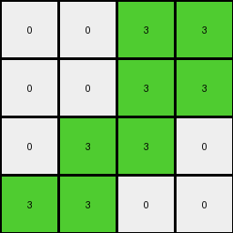

# 6430c8c4 • 022 • refine_coder

---

Previous Code:
```python
"""
1. **Identify Divider:** Locate the horizontal line of yellow (4) pixels in the input grid. This line divides the input grid into an "upper region" and "lower region".
2.  **Focus on Upper Region:** Disregard the "lower region" of the input grid (everything at or below the yellow line).
3. **Determine output size:** The output size is the dimensions of the "upper region".
4.  **Map to Output:** Create an output grid of the dimensions determined in the previous step. For each non-white pixel in the "upper region", change the color to green (3). Change all the white pixels to 0.
"""

import numpy as np

def find_horizontal_line(grid, color):
    """Finds the row index of a horizontal line of a given color."""
    for i, row in enumerate(grid):
        if all(pixel == color for pixel in row):
            return i
    return -1  # Not found

def transform(input_grid):
    """Transforms the input grid according to the described rule."""
    input_grid = np.array(input_grid)

    # 1. Identify Divider
    yellow_line_row = find_horizontal_line(input_grid, 4)

    # 2. Focus on Upper Region
    upper_region = input_grid[:yellow_line_row]

    # 3. Determine Output size
    output_height, output_width = upper_region.shape
    
    # Initialize the output_grid
    output_grid = np.zeros((output_height, output_width), dtype=int)


    # 4. Map to Output
    for i in range(output_height):
        for j in range(output_width):
            if upper_region[i,j] != 0:
                output_grid[i,j] = 3
            else:
                output_grid[i, j] = 0


    return output_grid.tolist()
```

Train Set Results:

## Example 1:

Input:
```
7 7 0 7
0 7 7 0
0 7 7 7
0 7 7 0
4 4 4 4
0 0 0 0
0 2 0 2
2 2 2 0
2 0 0 2
```
Expected Output:
```
0 0 3 0
3 0 0 0
0 0 0 0
0 0 0 0
```
Transformed Output:
```
3 3 0 3
0 3 3 0
0 3 3 3
0 3 3 0
```

match: False
pixels_off: 12
size_correct: True
color_palette_correct: True
correct_pixel_counts: False

## Example 2:

Input:
```
0 0 7 7
0 0 7 7
0 7 7 0
7 7 0 0
4 4 4 4
2 0 2 0
0 2 0 2
0 2 2 0
0 0 2 0
```
Expected Output:
```
0 3 0 0
3 0 0 0
3 0 0 3
0 0 0 3
```
Transformed Output:
```
0 0 3 3
0 0 3 3
0 3 3 0
3 3 0 0
```

match: False
pixels_off: 13
size_correct: True
color_palette_correct: True
correct_pixel_counts: False

## Example 3:

Input:
```
0 0 0 7
0 7 7 7
0 7 0 0
0 7 7 7
4 4 4 4
0 0 2 0
0 2 2 2
2 2 0 0
0 2 0 2
```
Expected Output:
```
3 3 0 0
3 0 0 0
0 0 3 3
3 0 0 0
```
Transformed Output:
```
0 0 0 3
0 3 3 3
0 3 0 0
0 3 3 3
```

match: False
pixels_off: 14
size_correct: True
color_palette_correct: True
correct_pixel_counts: False

## Example 4:

Input:
```
7 0 7 0
0 0 7 7
7 0 7 7
7 7 0 0
4 4 4 4
0 0 2 2
0 0 0 0
2 0 0 2
0 2 0 2
```
Expected Output:
```
0 3 0 0
3 3 0 0
0 3 0 0
0 0 3 0
```
Transformed Output:
```
3 0 3 0
0 0 3 3
3 0 3 3
3 3 0 0
```

match: False
pixels_off: 14
size_correct: True
color_palette_correct: True
correct_pixel_counts: False
Okay, here's a breakdown of the situation and a plan to improve the transformation rule:

**General Assessment:**

The initial natural language program and resulting code correctly identified the yellow divider line and focused on the region above it. It also correctly determined the output size. However, the color mapping logic is flawed. Instead of simply changing all non-white pixels to green, it seems there's a more complex pattern related to the original pixel positions and potentially mirroring/flipping relative to the central axes of the upper region. The code correctly identifies white pixels and changes them to 0. The errors are all related to changing the non-white pixels to green (3) in incorrect places.

**Strategy:**

1.  **Analyze Pixel Positioning:** Carefully examine the input and expected output pairs to discern how the original positions of non-white pixels in the upper region relate to the positions of the green pixels in the output. Consider mirroring (horizontal/vertical) and rotation as potential transformations.
2.  **Refine Color Mapping Rule:** Update the natural language program to accurately describe the relationship between input pixel positions and output pixel positions, incorporating any identified mirroring or rotation.
3.  **Update Code:** Revise the Python code to reflect the corrected color mapping rule.

**Metrics and Observations:**

Here's a breakdown of each example, focusing on the relationship between the non-white pixels in the input's upper region and the green pixels in the expected output:

*   **Example 1:**
    *   Input Upper Region:
        ```
        7 7 0 7
        0 7 7 0
        0 7 7 7
        0 7 7 0
        ```
    *   Expected Output:
        ```
        0 0 3 0
        3 0 0 0
        0 0 0 0
        0 0 0 0
        ```

    *   Observations:
        *The non-white pixels are not simply turned to green, the green pixels show up in different places.*
        *It looks like only the top left quadrant gets mapped.*

*   **Example 2:**
    *   Input Upper Region:
        ```
        0 0 7 7
        0 0 7 7
        0 7 7 0
        7 7 0 0
        ```
    *   Expected Output:
        ```
        0 3 0 0
        3 0 0 0
        3 0 0 3
        0 0 0 3
        ```
        *The non-white pixels are not simply turned to green, the green pixels show up in different places.*
        *It looks like a diagonal mirroring occurs. The 7s on the top right are mirrored to green on the bottom left. The 7's on the bottom left are mirrored to the top right.*

*   **Example 3:**
    *   Input Upper Region:
        ```
        0 0 0 7
        0 7 7 7
        0 7 0 0
        0 7 7 7
        ```
    *   Expected Output:
        ```
        3 3 0 0
        3 0 0 0
        0 0 3 3
        3 0 0 0
        ```
    *   Observations: *Similar to example 2, there seems to be a mirroring effect along a diagonal axis.*

*   **Example 4:**
    *    Input Upper Region:
        ```
        7 0 7 0
        0 0 7 7
        7 0 7 7
        7 7 0 0
        ```

    *   Expected Output:
        ```
        0 3 0 0
        3 3 0 0
        0 3 0 0
        0 0 3 0
        ```
        *Again, the expected output is not the same.*

**YAML Facts:**

```yaml
facts:
  - object: horizontal_divider
    type: line
    color: yellow
    description: Separates the input grid into upper and lower regions.
  - object: upper_region
    description: The portion of the input grid above the horizontal divider.
    action: determine_output_size
  - object: lower_region
    description: The portion of the input grid below the horizontal divider.
    action: ignored
  - object: non_white_pixels
    color: not white
    location: upper_region
    action:
      - determine_output_location:
          rule: "Mirrored diagonally across the top-left to bottom-right axis in the top-left quadrant."
      - map_color: green
  - object: white_pixels
    color: white
    location: upper_region
    action:
      - set_value: 0

```

**Natural Language Program:**

1.  **Identify Divider:** Find the horizontal line of yellow (4) pixels in the input grid. This line is the divider.
2.  **Separate Regions:** Divide the input grid into two regions: "upper region" (above the divider) and "lower region" (at and below the divider).
3.  **Ignore Lower Region:** Disregard the lower region.
4. **Determine output size:** The output size is determined by the upper region.
5.  **Initialize output:** Create a grid filled with 0 in the dimensions determined by the upper region.
6.  **Mirror and Map:** For the upper region:
      - The non-white pixels appear to be getting mapped across a diagonal line, specifically from the top left to the bottom-right. If you draw this line, they are being mapped to the other side.
      - All of the original white pixels are turned to 0.

7.  **Output:** Return the new grid.

**INSTRUCTIONS**

- generate a Python module to represent the natural language program 
- follow the template below
- all common math and science libraries are available
- create docstring only at top - but comment the workflow in the function
- use helper functions for common operations like finding objects, counting,
  measuring, moving, etc. 

remember - we are working iteratively - so this code will inform your future
self as we converge on the solution

*template:*

```python
"""
{{ natural language description of the transformation rule }}
"""

{{ imports }}

def transform(input_grid):
    # initialize output_grid

    # change output pixels 

    return output_grid

```
