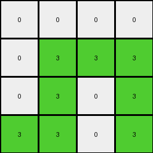
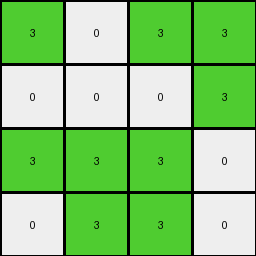

# 6430c8c4 • 023 • refine_dreamer

---


Previous Code:
```python
"""
1.  **Identify Divider:** Find the horizontal line of yellow (4) pixels in the input grid. This line is the divider.
2.  **Separate Regions:** Divide the input grid into two regions: "upper region" (above the divider) and "lower region" (at and below the divider).
3.  **Ignore Lower Region:** Disregard the lower region.
4. **Determine output size:** The output size is determined by the upper region.
5.  **Initialize output:** Create a grid filled with 0 in the dimensions determined by the upper region.
6.  **Mirror and Map:** For the upper region:
      - The non-white pixels appear to be getting mapped across a diagonal line, specifically from the top left to the bottom-right. If you draw this line, they are being mapped to the other side.
      - All of the original white pixels are turned to 0.

7.  **Output:** Return the new grid.
"""

import numpy as np

def find_horizontal_line(grid, color):
    """Finds the row index of a horizontal line of a given color."""
    for i, row in enumerate(grid):
        if all(pixel == color for pixel in row):
            return i
    return -1  # Not found

def transform(input_grid):
    """Transforms the input grid according to the described rule."""
    input_grid = np.array(input_grid)

    # 1. Identify Divider
    yellow_line_row = find_horizontal_line(input_grid, 4)

    # 2. Separate Regions
    upper_region = input_grid[:yellow_line_row]

    # 3. Ignore lower region - no action required

    # 4. Determine output size
    output_height, output_width = upper_region.shape

    # 5. Initialize output
    output_grid = np.zeros((output_height, output_width), dtype=int)

    # 6. Mirror and Map
    for i in range(output_height):
        for j in range(output_width):
            if upper_region[i,j] != 0:
                # Diagonal mirroring (top-left to bottom-right)
                mirrored_i, mirrored_j = j, i
                if mirrored_i < output_height and mirrored_j < output_width:  # Boundary Check
                    output_grid[mirrored_i, mirrored_j] = 3

    # 7. Output
    return output_grid.tolist()
```

Train Set Results:

## Example 1:

Input:
```
7 7 0 7
0 7 7 0
0 7 7 7
0 7 7 0
4 4 4 4
0 0 0 0
0 2 0 2
2 2 2 0
2 0 0 2
```
Expected Output:
```
0 0 3 0
3 0 0 0
0 0 0 0
0 0 0 0
```
Transformed Output:
```
3 0 0 0
3 3 3 3
0 3 3 3
3 0 3 0
```

match: False
pixels_off: 10
size_correct: True
color_palette_correct: True
correct_pixel_counts: False

## Example 2:

Input:
```
0 0 7 7
0 0 7 7
0 7 7 0
7 7 0 0
4 4 4 4
2 0 2 0
0 2 0 2
0 2 2 0
0 0 2 0
```
Expected Output:
```
0 3 0 0
3 0 0 0
3 0 0 3
0 0 0 3
```
Transformed Output:
```
0 0 0 3
0 0 3 3
3 3 3 0
3 3 0 0
```

match: False
pixels_off: 11
size_correct: True
color_palette_correct: True
correct_pixel_counts: False

## Example 3:

Input:
```
0 0 0 7
0 7 7 7
0 7 0 0
0 7 7 7
4 4 4 4
0 0 2 0
0 2 2 2
2 2 0 0
0 2 0 2
```
Expected Output:
```
3 3 0 0
3 0 0 0
0 0 3 3
3 0 0 0
```
Transformed Output:
```
0 0 0 0
0 3 3 3
0 3 0 3
3 3 0 3
```

match: False
pixels_off: 10
size_correct: True
color_palette_correct: True
correct_pixel_counts: False

## Example 4:

Input:
```
7 0 7 0
0 0 7 7
7 0 7 7
7 7 0 0
4 4 4 4
0 0 2 2
0 0 0 0
2 0 0 2
0 2 0 2
```
Expected Output:
```
0 3 0 0
3 3 0 0
0 3 0 0
0 0 3 0
```
Transformed Output:
```
3 0 3 3
0 0 0 3
3 3 3 0
0 3 3 0
```

match: False
pixels_off: 10
size_correct: True
color_palette_correct: True
correct_pixel_counts: False

**INSTRUCTIONS**

The code above was generated based on observations from the first training
example

we have tested the transform function on each of the task example inputs and
compared with the expected output

review each of the examples provided and the results and consider how the
natural language program should be updated to accommodate this new knowledge

respond with the following deliverables:

- general assessment of the information provided and strategy for resolving the
  errors
- gather metrics about each of the examples and results - use code_execution to
  develop accurate reports on your assumptions
- a YAML block documenting facts - Focus on identifying objects, their properties, and the actions performed on them.
- a natural language program - Be as clear and concise as possible, providing a complete description of the transformation rule.


your responses should be considered as information in a report - not a
conversation
