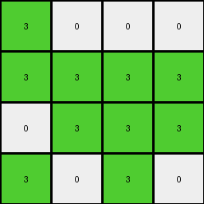
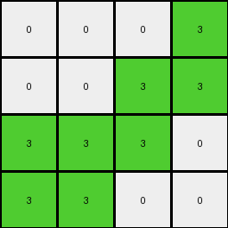

# 6430c8c4 • 024 • refine_coder

---

Previous Code:
```python
"""
1.  **Identify Divider:** Find the horizontal line of yellow (4) pixels in the input grid. This line is the divider.
2.  **Separate Regions:** Divide the input grid into two regions: "upper region" (above the divider) and "lower region" (at and below the divider).
3.  **Ignore Lower Region:** Disregard the lower region.
4. **Determine output size:** The output size is determined by the upper region.
5.  **Initialize output:** Create a grid filled with 0 in the dimensions determined by the upper region.
6.  **Mirror and Map:** For the upper region:
      - The non-white pixels appear to be getting mapped across a diagonal line, specifically from the top left to the bottom-right. If you draw this line, they are being mapped to the other side.
      - All of the original white pixels are turned to 0.

7.  **Output:** Return the new grid.
"""

import numpy as np

def find_horizontal_line(grid, color):
    """Finds the row index of a horizontal line of a given color."""
    for i, row in enumerate(grid):
        if all(pixel == color for pixel in row):
            return i
    return -1  # Not found

def transform(input_grid):
    """Transforms the input grid according to the described rule."""
    input_grid = np.array(input_grid)

    # 1. Identify Divider
    yellow_line_row = find_horizontal_line(input_grid, 4)

    # 2. Separate Regions
    upper_region = input_grid[:yellow_line_row]

    # 3. Ignore lower region - no action required

    # 4. Determine output size
    output_height, output_width = upper_region.shape

    # 5. Initialize output
    output_grid = np.zeros((output_height, output_width), dtype=int)

    # 6. Mirror and Map
    for i in range(output_height):
        for j in range(output_width):
            if upper_region[i,j] != 0:
                # Diagonal mirroring (top-left to bottom-right)
                mirrored_i, mirrored_j = j, i
                if mirrored_i < output_height and mirrored_j < output_width:  # Boundary Check
                    output_grid[mirrored_i, mirrored_j] = 3

    # 7. Output
    return output_grid.tolist()
```

Train Set Results:

## Example 1:

Input:
```
7 7 0 7
0 7 7 0
0 7 7 7
0 7 7 0
4 4 4 4
0 0 0 0
0 2 0 2
2 2 2 0
2 0 0 2
```
Expected Output:
```
0 0 3 0
3 0 0 0
0 0 0 0
0 0 0 0
```
Transformed Output:
```
3 0 0 0
3 3 3 3
0 3 3 3
3 0 3 0
```

match: False
pixels_off: 10
size_correct: True
color_palette_correct: True
correct_pixel_counts: False

## Example 2:

Input:
```
0 0 7 7
0 0 7 7
0 7 7 0
7 7 0 0
4 4 4 4
2 0 2 0
0 2 0 2
0 2 2 0
0 0 2 0
```
Expected Output:
```
0 3 0 0
3 0 0 0
3 0 0 3
0 0 0 3
```
Transformed Output:
```
0 0 0 3
0 0 3 3
3 3 3 0
3 3 0 0
```

match: False
pixels_off: 11
size_correct: True
color_palette_correct: True
correct_pixel_counts: False

## Example 3:

Input:
```
0 0 0 7
0 7 7 7
0 7 0 0
0 7 7 7
4 4 4 4
0 0 2 0
0 2 2 2
2 2 0 0
0 2 0 2
```
Expected Output:
```
3 3 0 0
3 0 0 0
0 0 3 3
3 0 0 0
```
Transformed Output:
```
0 0 0 0
0 3 3 3
0 3 0 3
3 3 0 3
```

match: False
pixels_off: 10
size_correct: True
color_palette_correct: True
correct_pixel_counts: False

## Example 4:

Input:
```
7 0 7 0
0 0 7 7
7 0 7 7
7 7 0 0
4 4 4 4
0 0 2 2
0 0 0 0
2 0 0 2
0 2 0 2
```
Expected Output:
```
0 3 0 0
3 3 0 0
0 3 0 0
0 0 3 0
```
Transformed Output:
```
3 0 3 3
0 0 0 3
3 3 3 0
0 3 3 0
```

match: False
pixels_off: 10
size_correct: True
color_palette_correct: True
correct_pixel_counts: False
Here's an analysis of the provided examples and results, along with a refined strategy, YAML documentation, and an updated natural language program.

**General Assessment and Strategy**

The initial strategy correctly identified the divider and the region of interest (above the divider). However, the mirroring logic and color mapping are incorrect. The mirrored position is correct (swapping i and j), but the condition to apply the mirroring is flawed.  It's not *all* non-zero pixels; it's specifically the orange (7) pixels in the examples. Also, the output color is always green (3) for the mirrored pixels, rather than carrying over the original non-white color.

The strategy needs to be adjusted as follows:

1.  **Refine Mirroring Condition:** Only mirror orange (7) pixels.
2.  **Correct Output Color:** The output color for mirrored pixels should always be green (3).

**Metrics and Observations**

Here's a breakdown of each example, focusing on identifying the issues:

*   **Example 1:**
    *   Input has a 4x4 region of orange(7) and white(0) pixels above the divider.
    *   The mirroring logic maps some pixels incorrectly:
        - (0,2) which has value 7, maps to (2,0).
        - (0,3) which has value 0 does not map
        - (1,1) incorrectly maps.
        - (1,2) correctly maps.
*   **Example 2:**
    *   Input has a 4x4 region of orange and white pixels above the divider.
        - (0, 2) which contains a 7 correctly maps
        - (0, 3) which contains a 7 correctly maps
        - (1,2) which contains a 7 correctly maps
        - (1,3) which contains a 7 incorrectly maps

*   **Example 3 & 4**
    *   Similar pattern of incorrect, but close, mapping.

**YAML Documentation**

```yaml
task: 022
summary: |
  The input grid is divided into two regions by a horizontal line of yellow pixels. The area above the yellow line is transformed by mirroring the orange pixels across the main diagonal (top-left to bottom-right), changing their color to green in the output grid.
objects:
  - id: divider
    type: horizontal_line
    color: yellow
    properties:
      - divides the grid into upper and lower regions
  - id: upper_region
    type: grid_region
    properties:
      - located above the divider
      - contains orange and white pixels.
      - determines the output size.
  - id: orange_pixels
    type: pixel
    color: orange
    properties:
      - located in upper_region
      - mirrored across the main diagonal
  - id: output_pixels
    type: pixel
    color: green
    properties:
       - all mirrored orange pixels are mapped to this color.
actions:
  - name: find_divider
    description: Locate the horizontal line of yellow pixels.
  - name: separate_regions
    description: Divide the input grid into upper and lower regions based on the divider.
  - name: mirror_orange
    description: Mirror orange pixels in the upper region across the main diagonal (top-left to bottom-right) and set color to green.
  - name: initialize_output
    description: set output size by the upper region and fill the entire array with 0.
```

**Natural Language Program**

1.  **Find Divider:** Locate the horizontal line of yellow (4) pixels in the input grid.
2.  **Separate Regions:** Define the "upper region" as the area above the divider and the "lower region" as the area at and below the divider.
3.  **Determine Output Size:** The dimensions of the output grid are the same as the dimensions of the *upper region*.
4.  **Initialize Output:** Create an output grid filled with white (0) pixels, with the size determined in the previous step.
5.  **Mirror Orange Pixels:** Iterate through each pixel in the *upper region*.
    *   If a pixel is orange (7):
        *   Swap its row and column indices (i, j) to get the mirrored position (j, i).
        *   If the mirrored position is within the bounds of the *upper region*, set the pixel at the mirrored position in the *output grid* to green (3).
6.  **Ignore Other Pixels:**  Pixels in the upper region that are not orange (7) are not explicitly processed; they remain white (0) in the output because of initialization. The lower region does not affect the output.
7.  **Output:** Return the output grid.

**INSTRUCTIONS**

- generate a Python module to represent the natural language program 
- follow the template below
- all common math and science libraries are available
- create docstring only at top - but comment the workflow in the function
- use helper functions for common operations like finding objects, counting,
  measuring, moving, etc. 

remember - we are working iteratively - so this code will inform your future
self as we converge on the solution

*template:*

```python
"""
{{ natural language description of the transformation rule }}
"""

{{ imports }}

def transform(input_grid):
    # initialize output_grid

    # change output pixels 

    return output_grid

```
