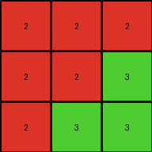

# 662c240a • 011 • refine_dreamer

---

Previous Code:
```python
"""
Extracts a 3x3 sub-grid from the input grid. The sub-grid is selected based on
the highest similarity score among all possible 3x3 sub-grids.  Similarity
is calculated by counting the number of adjacent, same-color pixel pairs
within the sub-grid. The top-most, left-most sub-grid is chosen in case
of ties.
"""

import numpy as np

def calculate_similarity(subgrid):
    """Calculates the similarity score of a 3x3 subgrid.

    Args:
        subgrid: A 3x3 NumPy array.

    Returns:
        An integer representing the similarity score.  Higher is more similar.
    """
    count = 0
    # Check horizontal adjacency
    for i in range(3):
        for j in range(2):
            if subgrid[i, j] == subgrid[i, j+1]:
                count += 1
    # Check vertical adjacency
    for i in range(2):
        for j in range(3):
            if subgrid[i, j] == subgrid[i+1, j]:
                count += 1
    return count

def transform(input_grid):
    # Convert the input grid to a NumPy array.
    input_array = np.array(input_grid)
    rows, cols = input_array.shape

    # Initialize variables to track the best subgrid and its score.
    best_subgrid = None
    max_similarity = -1

    # Iterate through all possible 3x3 subgrids.
    for i in range(rows - 2):
        for j in range(cols - 2):
            subgrid = input_array[i:i+3, j:j+3]
            similarity = calculate_similarity(subgrid)

            # Update best_subgrid if a higher similarity is found.
            if similarity > max_similarity:
                max_similarity = similarity
                best_subgrid = subgrid

    # Convert the NumPy array back to a list of lists.
    output_grid = best_subgrid.tolist()

    return output_grid
```

Train Set Results:

## Example 1:

Input:
```
8 9 8
9 8 8
8 8 8
2 2 1
2 2 1
1 1 2
4 4 4
4 4 3
3 3 3
```
Expected Output:
```
4 4 4
4 4 3
3 3 3
```
Transformed Output:
```
4 4 4
4 4 3
3 3 3
```

match: True
pixels_off: 0
size_correct: True
color_palette_correct: True
correct_pixel_counts: True

## Example 2:

Input:
```
1 5 5
5 1 1
5 1 1
3 3 3
3 6 3
3 6 6
7 7 7
7 2 2
7 2 2
```
Expected Output:
```
3 3 3
3 6 3
3 6 6
```
Transformed Output:
```
7 7 7
7 2 2
7 2 2
```

match: False
pixels_off: 9
size_correct: True
color_palette_correct: False
correct_pixel_counts: False

## Example 3:

Input:
```
2 2 2
2 2 3
2 3 3
5 7 7
7 5 5
7 5 5
8 8 1
1 8 1
1 8 1
```
Expected Output:
```
8 8 1
1 8 1
1 8 1
```
Transformed Output:
```
2 2 2
2 2 3
2 3 3
```

match: False
pixels_off: 9
size_correct: True
color_palette_correct: False
correct_pixel_counts: False

## Example 4:

Input:
```
8 8 4
4 4 4
4 4 8
1 1 3
1 3 3
3 3 1
6 2 2
2 2 2
2 2 6
```
Expected Output:
```
8 8 4
4 4 4
4 4 8
```
Transformed Output:
```
6 2 2
2 2 2
2 2 6
```

match: False
pixels_off: 9
size_correct: True
color_palette_correct: False
correct_pixel_counts: False
**INSTRUCTIONS**

The code above was generated based on observations from the first training
example

we have tested the transform function on each of the task example inputs and
compared with the expected output

review each of the examples provided and the results and consider how the
natural language program should be updated to accommodate this new knowledge

respond with the following deliverables:

- general assessment of the information provided and strategy for resolving the
  errors
- gather metrics about each of the examples and results - use code_execution to
  develop accurate reports on your assumptions
- a YAML block documenting facts - Focus on identifying objects, their properties, and the actions performed on them.
- a natural language program - Be as clear and concise as possible, providing a complete description of the transformation rule.


your responses should be considered as information in a report - not a
conversation
