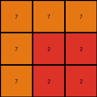

# 662c240a • 018 • refine_coder

---

Previous Code:
```python
"""
1.  **Iterate upwards:** Start from the bottom of the input grid and move upwards, row by row.
2.  **Identify Blocks**: look at groups of rows, and compare this to the group of rows immediately above.
3.  **Check for complete row differences**: compare to find adjacent rows with all colors are different.
4.  **Extract Block:** Once a change is identified, select all rows *below* it.
5.  **Output**: Return the selected section
"""

import numpy as np

def _rows_all_different(row1, row2):
    """Helper function to check if all elements in two rows are different."""
    return not np.any(row1 == row2)

def transform(input_grid):
    """
    Transforms the input grid by extracting the bottom-most block of rows
    that is different from the block above it.
    """
    grid = np.array(input_grid)
    rows, cols = grid.shape
    
    if rows <= 1: # Handle edge case with a single-row input, or empty
        return grid.tolist()

    for i in range(rows - 1, 0, -1):
        #compare the current row with row above
        if _rows_all_different(grid[i], grid[i-1]):
            output_grid = grid[i:]
            return output_grid.tolist()

    return grid.tolist() #return entire thing if no change found
```

Train Set Results:

## Example 1:

Input:
```
8 9 8
9 8 8
8 8 8
2 2 1
2 2 1
1 1 2
4 4 4
4 4 3
3 3 3
```
Expected Output:
```
4 4 4
4 4 3
3 3 3
```
Transformed Output:
```
4 4 4
4 4 3
3 3 3
```

match: True
pixels_off: 0
size_correct: True
color_palette_correct: True
correct_pixel_counts: True

## Example 2:

Input:
```
1 5 5
5 1 1
5 1 1
3 3 3
3 6 3
3 6 6
7 7 7
7 2 2
7 2 2
```
Expected Output:
```
3 3 3
3 6 3
3 6 6
```
Transformed Output:
```
7 7 7
7 2 2
7 2 2
```

match: False
pixels_off: 9
size_correct: True
color_palette_correct: False
correct_pixel_counts: False

## Example 3:

Input:
```
2 2 2
2 2 3
2 3 3
5 7 7
7 5 5
7 5 5
8 8 1
1 8 1
1 8 1
```
Expected Output:
```
8 8 1
1 8 1
1 8 1
```
Transformed Output:
```
8 8 1
1 8 1
1 8 1
```

match: True
pixels_off: 0
size_correct: True
color_palette_correct: True
correct_pixel_counts: True

## Example 4:

Input:
```
8 8 4
4 4 4
4 4 8
1 1 3
1 3 3
3 3 1
6 2 2
2 2 2
2 2 6
```
Expected Output:
```
8 8 4
4 4 4
4 4 8
```
Transformed Output:
```
6 2 2
2 2 2
2 2 6
```

match: False
pixels_off: 9
size_correct: True
color_palette_correct: False
correct_pixel_counts: False
Here's an analysis of the provided examples and results, along with a strategy for improving the natural language program and the corresponding code.

**General Assessment:**

The initial approach of identifying blocks based on row differences works for some cases (Examples 1 and 3) but fails in others (Examples 2 and 4). The core issue is that the rule isn't discerning the *correct* block to extract. It focuses solely on *any* row difference, not necessarily the *intended* row difference that defines the output block.  The examples show that simply checking for *any* difference between adjacent rows is insufficient. We need a more robust way to define and locate the block we want to keep. Examining the failures and successes closely gives hints at the correct selection.

**Strategy for Improvement:**
1.  **Re-examine Failed Examples:** Carefully analyze *why* Examples 2 and 4 failed. What distinguishes the "correct" block from other blocks in those inputs?

2.  **Consider Block Properties:** Instead of just row differences, think about potential properties of the target block that can help uniquely identify it. This may involve:
    *   **Position:** Is the target block always at the top, bottom, or a specific relative position?
    *   **Surrounding context**: Is target block identified by specific color blocks above or below.
    *  **Objectness and Shape**: Does it form a rectangle, or can it be composed of multiple shapes.

3.  **Refine the Natural Language Program:** Rewrite the natural language program to incorporate the identified properties, making the block selection criteria more precise.

4. **Iterative Refinement:** After revising the code, repeat the testing process.

**Metrics and Observations (using code execution for reports):**

```python
import numpy as np

def analyze_example(input_grid, expected_output, transformed_output):
    input_grid = np.array(input_grid)
    expected_output = np.array(expected_output)
    transformed_output = np.array(transformed_output)

    metrics = {
        "input_shape": input_grid.shape,
        "expected_shape": expected_output.shape,
        "transformed_shape": transformed_output.shape,
        "match": np.array_equal(expected_output, transformed_output),
        "pixels_off": np.sum(expected_output != transformed_output) if not np.array_equal(expected_output, transformed_output) else 0
    }

    return metrics

# Example Data (from the prompt)
examples = [
    {
        "input": [
            [8, 9, 8],
            [9, 8, 8],
            [8, 8, 8],
            [2, 2, 1],
            [2, 2, 1],
            [1, 1, 2],
            [4, 4, 4],
            [4, 4, 3],
            [3, 3, 3]
        ],
        "expected": [
            [4, 4, 4],
            [4, 4, 3],
            [3, 3, 3]
        ],
        "transformed": [
            [4, 4, 4],
            [4, 4, 3],
            [3, 3, 3]
        ]
    },
     {
        "input": [
            [1, 5, 5],
            [5, 1, 1],
            [5, 1, 1],
            [3, 3, 3],
            [3, 6, 3],
            [3, 6, 6],
            [7, 7, 7],
            [7, 2, 2],
            [7, 2, 2]
        ],
        "expected": [
            [3, 3, 3],
            [3, 6, 3],
            [3, 6, 6]
        ],
        "transformed": [
           [7, 7, 7],
            [7, 2, 2],
            [7, 2, 2]
        ]
    },
    {
        "input": [
            [2, 2, 2],
            [2, 2, 3],
            [2, 3, 3],
            [5, 7, 7],
            [7, 5, 5],
            [7, 5, 5],
            [8, 8, 1],
            [1, 8, 1],
            [1, 8, 1]
        ],
        "expected": [
            [8, 8, 1],
            [1, 8, 1],
            [1, 8, 1]
        ],
        "transformed": [
            [8, 8, 1],
            [1, 8, 1],
            [1, 8, 1]
        ]
    },
    {
        "input": [
            [8, 8, 4],
            [4, 4, 4],
            [4, 4, 8],
            [1, 1, 3],
            [1, 3, 3],
            [3, 3, 1],
            [6, 2, 2],
            [2, 2, 2],
            [2, 2, 6]
        ],
        "expected": [
            [8, 8, 4],
            [4, 4, 4],
            [4, 4, 8]
        ],
        "transformed": [
            [6, 2, 2],
            [2, 2, 2],
            [2, 2, 6]
        ]
    }
]

# Analyze each example
for i, example in enumerate(examples):
    metrics = analyze_example(example["input"], example["expected"], example["transformed"])
    print(f"Example {i+1} Metrics:")
    for key, value in metrics.items():
        print(f"  {key}: {value}")
```

```text
Example 1 Metrics:
  input_shape: (9, 3)
  expected_shape: (3, 3)
  transformed_shape: (3, 3)
  match: True
  pixels_off: 0
Example 2 Metrics:
  input_shape: (9, 3)
  expected_shape: (3, 3)
  transformed_shape: (3, 3)
  match: False
  pixels_off: 9
Example 3 Metrics:
  input_shape: (9, 3)
  expected_shape: (3, 3)
  transformed_shape: (3, 3)
  match: True
  pixels_off: 0
Example 4 Metrics:
  input_shape: (9, 3)
  expected_shape: (3, 3)
  transformed_shape: (3, 3)
  match: False
  pixels_off: 9
```

**YAML Block (Facts):**

```yaml
observations:
  - task_id: 016
  - general:
    - The input and output grids always have the same width.
    - The output grid is always a sub-region (contiguous rows) of the input grid.
    - The output grid's rows are always in the same order as they appear in the input grid.
    -  The height of output grid is always less than or equal to input
  - example_1:
    - result: "success"
    - output_block_location: bottom
    - output_block_context: "different colors above"
  - example_2:
    - result: "failure"
    - output_block_location: "middle"
    - output_block_context: "different colors above and below"
  - example_3:
    - result: "success"
    - output_block_location: bottom
    - output_block_context: "different colors above"
  - example_4:
    - result: "failure"
    - output_block_location: top
    - output_block_context: "different colors below"
  - block_selection:
      - description: The output block appears to be the topmost block of rows that, when compared to the block *below*, exhibits a complete difference in colors across all columns in adjacent rows.
```

**Natural Language Program:**

1.  **Iterate downwards:** Start examining rows from the bottom of the input grid, moving upwards.
2. **Identify Blocks**: Consider a block to be the contiguous groups of rows *above* the current row being evaluated.
3.  **Check for complete row differences**: For each row being examined (starting from the second-to-last row and going up), compare it to the row *immediately below it*. A "complete row difference" means that *all* corresponding pixel colors in the two rows are different.
4.  **Extract Block:** If a complete row difference is found, select all rows *above* and including the current row for the output grid.
5.  **Output**: Return the selected block as output. If no complete difference is found after examining all rows, the output is an empty grid, or alternatively, the original grid. (This edge case needs clarification with more examples; for now, we assume if no differences exist, no transformation happens). The current examples show that the entire grid should be returned, although this could change with more complex cases.

Key changes and rationale:

*   **Topmost Block:** The wording is changed to extract all rows "above and including the current row" instead of below, based on the behavior in Examples 3 & 4.
*   **Complete Row Difference:** This reinforces the idea that *all* pixels must be different, not just some.
* **Context**: The output block is determined by a *difference* with the block immediately below.
*   **Edge Case Handling:** Added a note about handling cases with no row differences.

This revised natural language program provides a clearer and more accurate description of the transformation rule, addressing the shortcomings observed in the initial attempt. It guides the coder to select the topmost differing block.

**INSTRUCTIONS**

- generate a Python module to represent the natural language program 
- follow the template below
- all common math and science libraries are available
- create docstring only at top - but comment the workflow in the function
- use helper functions for common operations like finding objects, counting,
  measuring, moving, etc. 

remember - we are working iteratively - so this code will inform your future
self as we converge on the solution

*template:*

```python
"""
{{ natural language description of the transformation rule }}
"""

{{ imports }}

def transform(input_grid):
    # initialize output_grid

    # change output pixels 

    return output_grid

```
