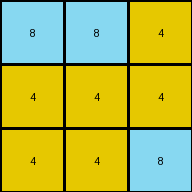

# 662c240a • 021 • refine_dreamer

---


Previous Code:
```python
"""
The output is a direct copy of the upper-left 3x3 portion (the top three rows) of the input grid.
"""

import numpy as np

def transform(input_grid):
    """
    Extracts the top 3x3 subgrid from the input grid.
    """
    # Convert the input grid to a NumPy array for easier manipulation.
    input_array = np.array(input_grid)

    # Extract the top 3x3 subgrid.
    output_array = input_array[:3, :3]

    # Convert the NumPy array back to a list of lists.
    output_grid = output_array.tolist()

    return output_grid
```

Train Set Results:

## Example 1:

Input:
```
8 9 8
9 8 8
8 8 8
2 2 1
2 2 1
1 1 2
4 4 4
4 4 3
3 3 3
```
Expected Output:
```
4 4 4
4 4 3
3 3 3
```
Transformed Output:
```
8 9 8
9 8 8
8 8 8
```

match: False
pixels_off: 9
size_correct: True
color_palette_correct: False
correct_pixel_counts: False

## Example 2:

Input:
```
1 5 5
5 1 1
5 1 1
3 3 3
3 6 3
3 6 6
7 7 7
7 2 2
7 2 2
```
Expected Output:
```
3 3 3
3 6 3
3 6 6
```
Transformed Output:
```
1 5 5
5 1 1
5 1 1
```

match: False
pixels_off: 9
size_correct: True
color_palette_correct: False
correct_pixel_counts: False

## Example 3:

Input:
```
2 2 2
2 2 3
2 3 3
5 7 7
7 5 5
7 5 5
8 8 1
1 8 1
1 8 1
```
Expected Output:
```
8 8 1
1 8 1
1 8 1
```
Transformed Output:
```
2 2 2
2 2 3
2 3 3
```

match: False
pixels_off: 9
size_correct: True
color_palette_correct: False
correct_pixel_counts: False

## Example 4:

Input:
```
8 8 4
4 4 4
4 4 8
1 1 3
1 3 3
3 3 1
6 2 2
2 2 2
2 2 6
```
Expected Output:
```
8 8 4
4 4 4
4 4 8
```
Transformed Output:
```
8 8 4
4 4 4
4 4 8
```

match: True
pixels_off: 0
size_correct: True
color_palette_correct: True
correct_pixel_counts: True

**INSTRUCTIONS**

The code above was generated based on observations from the first training
example

we have tested the transform function on each of the task example inputs and
compared with the expected output

review each of the examples provided and the results and consider how the
natural language program should be updated to accommodate this new knowledge

respond with the following deliverables:

- general assessment of the information provided and strategy for resolving the
  errors
- gather metrics about each of the examples and results - use code_execution to
  develop accurate reports on your assumptions
- a YAML block documenting facts - Focus on identifying objects, their properties, and the actions performed on them.
- a natural language program - Be as clear and concise as possible, providing a complete description of the transformation rule.


your responses should be considered as information in a report - not a
conversation
